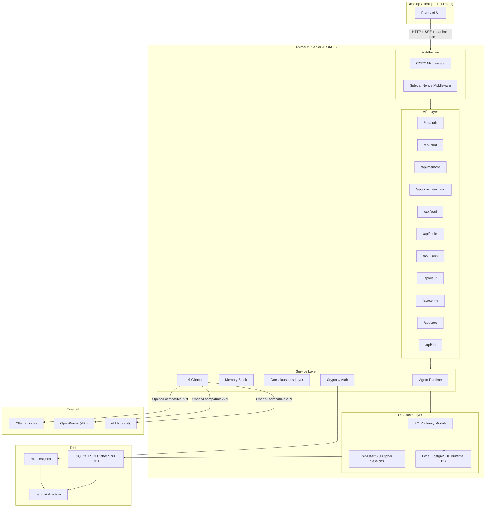

# AnimaOS Architecture Documentation

AnimaOS is a privacy-first, portable AI companion system. It wraps the agent's durable identity, long-term memory, emotional state, and consciousness inside a single encrypted `.anima/` directory backed by SQLite + SQLCipher. High-churn runtime state such as active messages, runs, pending memory work, and pgvector retrieval caches lives in a local PostgreSQL runtime store, started through embedded `pgserver` by default unless `ANIMA_RUNTIME_DATABASE_URL` is configured. The system runs as a local FastAPI server (Python) that communicates with open LLM providers (Ollama, OpenRouter, vLLM) and exposes a REST/SSE API consumed by a Tauri desktop frontend.

The core design thesis is **"portable encrypted AI"**: copy the `.anima/` directory to a USB drive, plug it into a new machine, enter your passphrase, and the AI wakes up with its durable memories and identity intact. Runtime PostgreSQL is local operational state and can be rebuilt, replayed, or promoted from SQLCipher and transcript sources depending on the table. There is no cloud database and no Docker requirement.

The server is structured as a classic three-layer application: **API routes (FastAPI) -> Service layer (agent services) -> Persistence (SQLAlchemy + SQLCipher soul DB + PostgreSQL runtime DB)**. On top of this foundation sits a sophisticated consciousness system with self-model, emotional intelligence, intentional agency, and inner monologue capabilities.

## Document Index

### System Architecture (`system/`)
| Document | Contents |
|----------|----------|
| [Directory Structure](system/directory-structure.md) | Top-level folder layout and purpose of each directory |
| [API Routes](system/api-routes.md) | All REST endpoints grouped by router, dependency injection |
| [Services](system/services.md) | Agent runtime, memory stack, consciousness layer, LLM clients |
| [Database Schema](system/database-schema.md) | All 19 tables, ER diagram, column details |
| [Data Flow](system/data-flow.md) | End-to-end message flow, call chains, sequence diagrams |
| [Configuration & Startup](system/configuration.md) | Settings, env vars, boot sequence |
| [Cross-Cutting Concerns](system/cross-cutting.md) | Context window management, background tasks, gotchas, test coverage |

### Agent Runtime (`agent/`)
| Document | Contents |
|----------|----------|
| [Agent Runtime](agent/agent-runtime.md) | Deep dive into the cognitive loop, step execution, tool orchestration, compaction, approval flow |
| [Agent Tools](agent/agent-tools.md) | The 17 tools available to the LLM agent |

### Memory Architecture (`memory/`)
| Document | Contents |
|----------|----------|
| [Memory System](memory/memory-system.md) | Full memory lifecycle: write paths, retrieval scoring, consolidation, embeddings, claims, episodic memory, self-model |
| [Memory Implementation Plan](memory/memory-implementation-plan.md) | Detailed engineering spec for F1-F6: function signatures, schemas, test plans, organized by workstream |
| [Memory Repo Analysis](memory/memory-repo-analysis.md) | Comparative source-code analysis of Letta, Mem0, Nemori, MemOS, MemoryOS |

### Crypto & Auth (`crypto/`)
| Document | Contents |
|----------|----------|
| [Crypto & Auth](crypto/crypto-auth.md) | Two-layer encryption, session management, key derivation |

### Planning & Research
| Document | Contents |
|----------|----------|
| [PRDs](../prds/README.md) | All product requirement documents, organized by domain |
| [Competitor Analysis](../thesis/competitor-analysis.md) | Source-code-level comparison of 5 competitors vs AnimaOS thesis |
| [Thesis & Research](../thesis/) | Whitepaper, inner-life, roadmap, research reports |

## High-Level Architecture Diagram

## Key Design Decisions

1. **Single-thread-per-user model**: Per-user asyncio locks serialize conversation turns, preventing race conditions at the cost of queuing concurrent requests from the same user.
2. **AnimaCompanion as cache layer**: The runtime is stateless; `AnimaCompanion` caches memory blocks and history between turns, invalidating via a version counter.
3. **Tool-driven agent architecture**: The agent uses structured tools with inline `thinking` kwargs and usually ends with `send_message`. `ToolRulesSolver` enforces ordering and approval rules. Max 6 steps per turn.
4. **Supersession instead of mutation**: Memory items are never deleted; updates create new rows and set `superseded_by` on the old one.
5. **Dual local stores**: Each user gets an encrypted SQLCipher soul database for durable identity and memory, while the local PostgreSQL runtime DB handles active messages, queues, and rebuildable retrieval caches.
6. **Field-level encryption with domain DEKs**: Data segmented into 5 cryptographic domains for fine-grained access control.
7. **Hybrid search**: Combines vector similarity (cosine on embeddings) with keyword matching using adaptive filtering.
