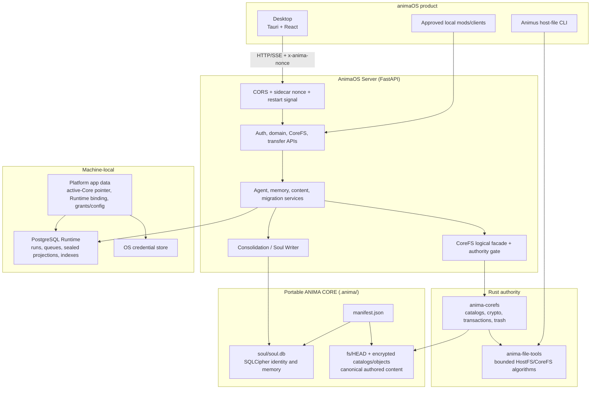

# AnimaOS Architecture Documentation

AnimaOS is a privacy-first, portable AI companion system. ANIMA CORE is one encrypted `.anima/` directory containing SQLCipher Soul identity/memory plus authenticated CoreFS catalogs and objects for canonical authored content. High-churn execution, queues, approvals, sealed/rebuildable projections, checkpoints, and retrieval indexes live in machine-local PostgreSQL outside the Core, started through embedded `pgserver` by default unless `ANIMA_RUNTIME_DATABASE_URL` is configured. The local FastAPI server exposes REST/SSE APIs to a Tauri desktop frontend and can use local or explicitly configured remote LLM providers.

The core design thesis is **"portable encrypted AI"**: export or restore a verified full ANIMA CORE, unlock it on another machine, and the AI wakes with its identity, memories, conversation history, diary, sources, and other canonical content intact. Runtime PostgreSQL, device configuration, installed-client grants, and OS credentials are excluded and rebuild or require reapproval. There is no cloud database and no Docker requirement.

The server is structured as **API routes (FastAPI) → domain/agent services → explicit persistence authorities (SQLCipher Soul, native CoreFS, or machine-local Runtime PostgreSQL)**. A path or ORM model does not choose authority implicitly; migrated product families commit through authenticated CoreFS transactions, while Soul promotion remains gated by consolidation.

## Document Index

### System Architecture (`system/`)
| Document | Contents |
|----------|----------|
| [Directory Structure](system/directory-structure.md) | Top-level folder layout and purpose of each directory |
| [ANIMA CORE Filesystem Architecture](system/anima-core-filesystem.md) | Implemented topology and gated first-release flows for Soul, CoreFS, Runtime, tools, permissions, indexing, cutover, and local transfer |
| [Gateway + Runtime Boundary](system/gateway-runtime-boundary.md) | Product boundary for single-user local-first, gateway-auth split, and future multi-device extensions |
| [External Integration Boundary](system/external-integration-boundary.md) | Difference between server-side capability modules and `apps/anima-mod` integrations |
| [Local Runtime Daemon](system/local-runtime-daemon.md) | Background runtime supervisor so Anima can keep running after the desktop UI closes |
| [API Routes](system/api-routes.md) | All REST endpoints grouped by router, dependency injection |
| [Services](system/services.md) | Agent runtime, memory stack, consciousness layer, LLM clients |
| [Database Schema](system/database-schema.md) | All 19 tables, ER diagram, column details |
| [Data Flow](system/data-flow.md) | End-to-end message flow, call chains, sequence diagrams |
| [Configuration & Startup](system/configuration.md) | Settings, env vars, boot sequence |
| [Cross-Cutting Concerns](system/cross-cutting.md) | Context window management, background tasks, gotchas, test coverage |

### Agent Runtime (`agent/`)
| Document | Contents |
|----------|----------|
| [Agent Runtime](agent/agent-runtime.md) | Deep dive into the cognitive loop, step execution, tool orchestration, compaction, approval flow |
| [Brain System](agent/brain-system.md) | Required agent runtime and state machine that hosts capability modules |
| [Agent Capability Modules](agent/capability-modules/README.md) | Module standard plus optional bolt-on modules for perception, voice, action, presence, and governed body systems |
| [Body System Doctrine](agent/capability-modules/body-system-doctrine.md) | One self with modular governed body systems |
| [Body System Diagrams](agent/capability-modules/body-system-diagrams.md) | Mermaid diagrams for Brain System, governed body systems, bridges, retention, and lifecycle |
| [Upgrade And Compatibility Model](agent/capability-modules/upgrade-and-compatibility.md) | Versioned Brain System and Capability Module upgrades around the portable Core |
| [Capability Module Contract](agent/capability-modules/module-contract.md) | Manifest, config, tool, bridge, memory, and audit contract for server-side capability modules |
| [Capability Runtime Flow](agent/capability-modules/runtime-flow.md) | How manifests become status, tools, bridge calls, audit events, and memory candidates |
| [Capability Data Boundaries](agent/capability-modules/data-boundaries.md) | Retention, audit, and durable memory boundaries for module outputs |
| [Capability Lifecycle](agent/capability-modules/lifecycle-and-gating.md) | Enabled/configured/available/degraded states and tool visibility rules |
| [Desktop Bridges](agent/capability-modules/desktop-bridges.md) | How hardware-backed modules use desktop-controlled camera, mic, screen, and local surfaces |
| [Perception Modules](agent/capability-modules/perception.md) | Governed senses such as camera, screen, window, and media perception |
| [Voice Core Module](agent/capability-modules/voice-core.md) | Optional STT/TTS, voice sessions, audio bridges, and retention policy |
| [Local Action Module](agent/capability-modules/action-local.md) | Governed local execution, automation, approval rings, and audit |
| [Presence Core Module](agent/capability-modules/presence-core.md) | Ambient awareness, follow-ups, nudges, quiet hours, and proactive policy |
| [Camera Perception Module](agent/capability-modules/perception-camera.md) | First concrete perception module for consented one-frame webcam sight |
| [Document Processing](agent/document-processing.md) | CoreFS PDF originals, checkpointed Runtime parsing/index projections, pgvector RAG, grounding, and citations |
| [Source Ingestion](agent/source-ingestion.md) | CoreFS source authority, Runtime artifacts/spans, OKF concepts, compilation, search, linting, and Soul-promotion boundary |
| [Agent Tools](agent/agent-tools.md) | The 17 tools available to the LLM agent |

### Memory Architecture (`memory/`)
| Document | Contents |
|----------|----------|
| [Memory System](memory/memory-system.md) | Full memory lifecycle: write paths, retrieval scoring, consolidation, embeddings, claims, episodic memory, self-model |
| [Single-User Temporal Memory v2 Baseline Audit](memory/single-user-temporal-memory-v2-baseline-audit.md) | SUM-001 live code-path audit and baseline probe summary for the memory v2 initiative |
| [Memory Core Boundary](memory/memory-core-boundary.md) | Durable memory authority, status, and promotion boundary for module outputs |
| [Memory Implementation Plan](memory/memory-implementation-plan.md) | Detailed engineering spec for F1-F6: function signatures, schemas, test plans, organized by workstream |
| [Memory Repo Analysis](memory/memory-repo-analysis.md) | Comparative source-code analysis of Letta, Mem0, Nemori, MemOS, MemoryOS |

### Crypto & Auth (`crypto/`)
| Document | Contents |
|----------|----------|
| [Crypto & Auth](crypto/crypto-auth.md) | Two-layer encryption, session management, key derivation |

### Planning & Research
| Document | Contents |
|----------|----------|
| [PRDs](../prds/README.md) | All product requirement documents, organized by domain |
| [Competitor Analysis](../thesis/competitor-analysis.md) | Source-code-level comparison of 5 competitors vs AnimaOS thesis |
| [Thesis & Research](../thesis/) | Whitepaper, inner-life, roadmap, research reports |

## High-Level Architecture Diagram

```mermaid
flowchart TD
    subgraph Product["animaOS product"]
        Desktop["Desktop<br/>Tauri + React"]
        Animus["Animus host-file CLI"]
        Mod["Approved local mods/clients"]
    end

    subgraph Server["AnimaOS Server (FastAPI)"]
        Middleware["CORS + sidecar nonce + restart signal"]
        API["Auth, domain, CoreFS, transfer APIs"]
        Services["Agent, memory, content, migration services"]
        SoulWriter["Consolidation / Soul Writer"]
        CoreFacade["CoreFS logical facade + authority gate"]
    end

    subgraph Native["Rust authority"]
        CoreEngine["anima-corefs<br/>catalogs, crypto, transactions, trash"]
        FileTools["anima-file-tools<br/>bounded HostFS/CoreFS algorithms"]
    end

    subgraph Portable["Portable ANIMA CORE (.anima/)"]
        Manifest["manifest.json"]
        Soul["soul/soul.db<br/>SQLCipher identity and memory"]
        CoreFS["fs/HEAD + encrypted catalogs/objects<br/>canonical authored content"]
    end

    subgraph Local["Machine-local"]
        Runtime["PostgreSQL Runtime<br/>runs, queues, sealed projections, indexes"]
        Device["Platform app data<br/>active-Core pointer, Runtime binding, grants/config"]
        Credentials["OS credential store"]
    end

    Desktop -->|"HTTP/SSE + x-anima-nonce"| Middleware
    Middleware --> API
    API --> Services
    Services --> CoreFacade
    CoreFacade --> CoreEngine
    CoreEngine --> CoreFS
    CoreEngine --> FileTools
    Services --> Runtime
    SoulWriter --> Soul
    Services --> SoulWriter
    Manifest --> Soul
    Manifest --> CoreFS
    Device --> Runtime
    Device --> Credentials
    Mod --> API
    Animus --> FileTools
```

## Key Design Decisions

1. **Per-thread turn coordination**: thread-scoped locks serialize one visible conversation while allowing independent runtime work without sharing canonical mutation state.
2. **Runtime as projection, not authority**: process caches and PostgreSQL rows may be discarded; canonical visible content is re-read from CoreFS and durable identity/memory from Soul.
3. **Tool-driven agent architecture**: The agent uses structured tools with inline `thinking` kwargs and usually ends with `send_message`. `ToolRulesSolver` enforces ordering and approval rules. Max 6 steps per turn.
4. **Supersession instead of mutation**: Memory items are never deleted; updates create new rows and set `superseded_by` on the old one.
5. **Three explicit authorities**: SQLCipher Soul owns durable identity/memory; native CoreFS owns portable authored content; machine-local PostgreSQL owns only operational coordination and rebuildable projections.
6. **Independent key hierarchy**: Soul and CoreFS roots use separate wrapped generations; domain/object DEKs and archive keys remain purpose-bound.
7. **Hybrid search**: Combines vector similarity (cosine on embeddings) with keyword matching using adaptive filtering.
