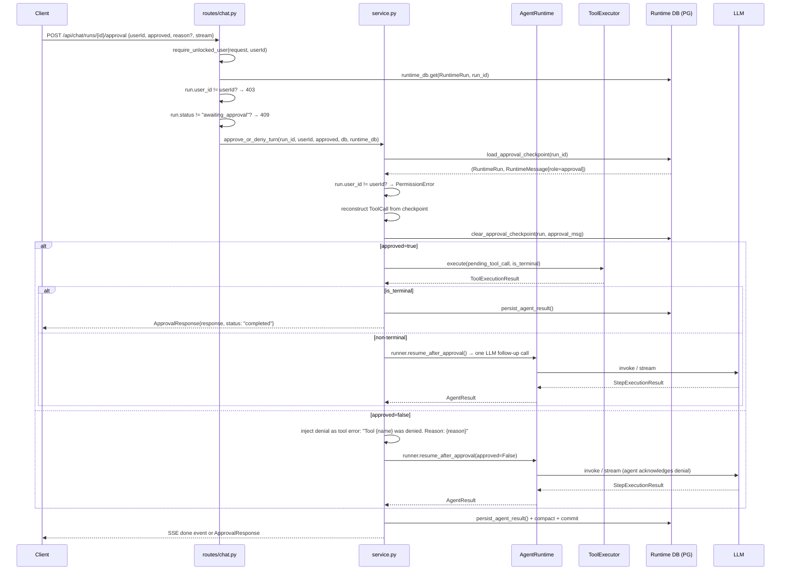
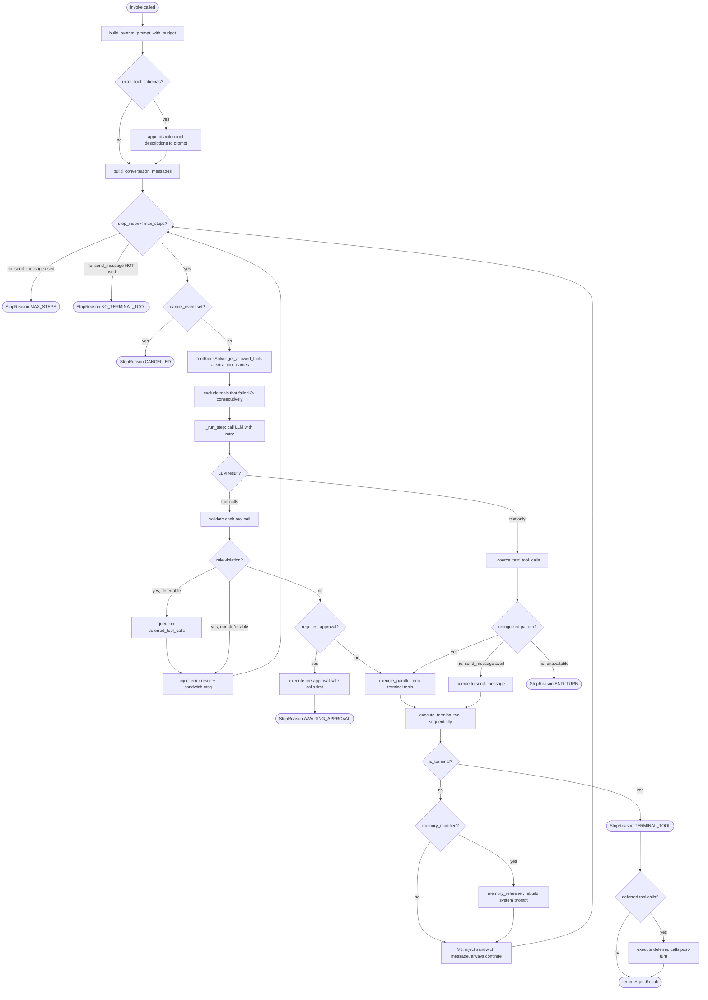

# Agent Runtime Deep Dive

[Back to Index](README.md)

This document traces a user message through the agent runtime end-to-end, explaining every layer, data structure, and decision point. It complements [Data Flow](data-flow.md) (high-level call chain) and [Services](services.md) (file-level reference) with the _why_ behind each stage.

---

## Table of Contents

1. [Architecture Overview](#architecture-overview)
2. [Layer 1: HTTP Entry Point](#layer-1-http-entry-point)
3. [Layer 2: Service Orchestrator](#layer-2-service-orchestrator)
4. [Layer 3: AnimaCompanion (Cache Layer)](#layer-3-animacompanion-cache-layer)
5. [Layer 4: AgentRuntime (Cognitive Loop)](#layer-4-agentruntime-cognitive-loop)
6. [Layer 5: LLM Adapter](#layer-5-llm-adapter)
7. [Layer 6: Tool Execution](#layer-6-tool-execution)
8. [Inner Thoughts via `thinking` Kwarg](#inner-thoughts-via-thinking-kwarg)
9. [V3-Style Loop Continuation](#v3-style-loop-continuation)
10. [Tool Orchestration Rules](#tool-orchestration-rules)
11. [Context Window Management](#context-window-management)
12. [Approval Flow](#approval-flow)
13. [Cancellation](#cancellation)
14. [Multi-Thread Support](#multi-thread-support)
15. [Dual Database Architecture](#dual-database-architecture)
16. [Soul Writer Pipeline](#soul-writer-pipeline)
17. [Eager Consolidation & Thread Lifecycle](#eager-consolidation--thread-lifecycle)
18. [Transcript Archive](#transcript-archive)
19. [Post-Turn Background Work](#post-turn-background-work)
20. [Memory Correction Mechanism](#memory-correction-mechanism)
21. [Episode Merging](#episode-merging)
22. [Knowledge Graph API](#knowledge-graph-api)
23. [Tool Delegation (Animus CLI)](#tool-delegation-animus-cli)
24. [Health Observability](#health-observability)
25. [Error Handling & Recovery](#error-handling--recovery)
26. [Key Data Structures](#key-data-structures)
27. [Security Findings](#security-findings)

---

## Architecture Overview

The runtime follows a layered, stateless-core design with a dual-database architecture:

```
HTTP Request
    |
    v
+--------------------+
|  routes/chat.py    |  FastAPI endpoint (SSE or JSON)
|  routes/threads.py |  Multi-thread management
+--------+-----------+
         |
         v
+--------------------+
|  service.py        |  Orchestrator: per-thread locks, context
|                    |  assembly, persistence, post-turn hooks
+--------+-----------+
         |
    +----+----+
    |         |
    v         v
+--------+ +------------------+
| Soul   | | Runtime          |
| DB     | | DB (PostgreSQL)  |
| SQLCipher| Messages, runs,  |
| Memory,| | threads, pending |
| self-  | | ops, candidates  |
| model  | +------------------+
+--------+
         |
         v
+--------------------+
|  AnimaCompanion    |  Process-resident per-user cache
|  (companion.py)    |  memory blocks, history, thread_id
+--------+-----------+
         | feeds cached state
         v
+--------------------+
|  AgentRuntime      |  STATELESS cognitive loop
|  (runtime.py)      |  prompt build -> step loop -> result
+--------+-----------+
         |
    +----+----+
    |         |
    v         v
+--------+ +--------------+
| LLM    | | ToolExecutor |
| Adapter| | (executor.py)|
+--------+ +--------------+
         |
         v
+--------------------+
|  Soul Writer       |  PG → SQLCipher promotion pipeline
|  (soul_writer.py)  |  PendingOps + Candidates → soul DB
+--------------------+
```

Key principle: **the runtime is stateless**. It receives history, memory blocks, and tool definitions as arguments and returns an `AgentResult`. All state management (caching, persistence, compaction) lives in the layers above it. The **dual-database** split places ephemeral runtime data (messages, threads, runs) in PostgreSQL and permanent identity data (memories, self-model, soul) in per-user encrypted SQLCipher files.

---

## Full Turn Flow (Mermaid)

```mermaid
sequenceDiagram
    participant C as Client
    participant R as routes/chat.py
    participant S as service.py
    participant TC as turn_coordinator.py
    participant CP as AnimaCompanion
    participant RT as AgentRuntime
    participant LLM as LLM Adapter
    participant EX as ToolExecutor
    participant RDB as Runtime DB (PG)
    participant SDB as Soul DB (SQLCipher)
    participant SW as Soul Writer

    C->>R: POST /api/chat {message, userId, threadId?, stream}
    R->>R: require_unlocked_user(request, userId)
    note over R: Validates x-anima-unlock token + user_id match

    alt stream=true
        R->>R: ensure_agent_ready()
        R-->>C: StreamingResponse (SSE)
        R->>S: stream_agent(message, userId, db, runtime_db, thread_id?)
        S->>S: asyncio.Queue(maxsize=256)
        S->>S: asyncio.create_task(worker)
    else stream=false
        R->>S: run_agent(message, userId, db, runtime_db, thread_id?)
    end

    alt thread_id provided
        S->>TC: get_thread_lock(thread_id)
        TC-->>S: asyncio.Lock (per-thread, LRU cache of 512)
    else no thread_id
        S->>TC: get_user_creation_lock(userId)
        S->>RDB: get_or_create_thread(userId) → resolved_thread_id
        S->>TC: get_thread_lock(resolved_thread_id)
    end
    S->>S: async with thread_lock (serializes concurrent turns)

    rect rgb(240, 248, 255)
        note over S: Stage 1 — Prepare Turn Context
        S->>CP: get_or_build_companion(runtime, userId)
        CP-->>S: AnimaCompanion (singleton per user)
        S->>RDB: get_or_create_thread(userId) or get thread by id
        alt thread is inactive/archived
            S->>S: reactivate_thread_if_needed() [rehydrate from JSONL]
        end
        S->>S: maybe_set_thread_title(thread, user_message)
        S->>CP: ensure_history_loaded(runtime_db)
        CP-->>S: list[StoredMessage] (from cache or RDB)
        S->>RDB: create_run(thread_id, userId, provider, model, mode)
        RDB-->>S: RuntimeRun
        S->>RDB: reserve_message_sequences(count=1)
        S->>RDB: append_user_message(thread, run_id, content)

        note over S: Pre-turn Soul Writer check
        S->>SW: run_soul_writer(userId) if eligible candidates queued
        SW->>RDB: process PendingMemoryOps + MemoryCandidates
        SW->>SDB: promote to soul DB (idempotent, journal-tracked)

        S->>SDB: hybrid_search(userId, query=message, limit=15, threshold=0.25)
        SDB-->>S: semantic MemoryItems + query_embedding
        S->>S: build_runtime_memory_blocks(userId, thread_id, semantic_results)
        note over S: Reads from both SDB (soul blocks) and RDB (pending ops, session notes)
        S->>S: collect_feedback_signals(userId, message)
        S->>S: _inject_memory_pressure_warning() if >80% context
    end

    rect rgb(240, 255, 240)
        note over S: Stage 1b — Proactive Compaction (if needed)
        S->>S: estimate_tokens = (block_chars + history_chars) // 4
        alt estimated > max_tokens * trigger_ratio
            S->>RDB: compact_thread_context(thread, keep_last_N)
            RDB-->>S: CompactionResult
            S->>SW: run_soul_writer(userId) [promote before rebuild]
            S->>CP: invalidate_history()
            S->>CP: ensure_history_loaded(runtime_db)
        end
    end

    rect rgb(255, 248, 240)
        note over S: Stage 2 — Invoke Runtime
        S->>CP: create_cancel_event(run.id)
        S->>S: set_tool_context(ToolContext{db, runtime_db, userId, thread_id, run_id})
        S->>RT: runner.invoke(message, userId, history, memory_blocks, extra_tool_schemas?, tool_executor?)

        loop for step_index in range(max_steps=6)
            RT->>RT: check cancel_event.is_set()
            RT->>RT: ToolRulesSolver.get_allowed_tools() ∪ extra_tool_names
            RT->>LLM: adapter.invoke(LLMRequest) OR adapter.stream(LLMRequest)

            alt streaming
                loop per token
                    LLM-->>RT: StepStreamEvent{content_delta}
                    RT-->>C: SSE chunk event
                    RT->>RT: check cancel_event between chunks
                end
                LLM-->>RT: StepStreamEvent{result: StepExecutionResult}
            else blocking
                LLM-->>RT: StepExecutionResult
            end

            alt LLM returned tool calls
                RT->>RT: ToolRulesSolver.validate_tool_call()
                alt rule violation (deferrable)
                    RT->>RT: queue tool call in deferred_tool_calls
                    RT-->>RT: inject error result, continue loop
                else rule violation (non-deferrable)
                    RT-->>RT: inject error result, continue loop
                else requires_approval
                    RT-->>RT: StopReason.AWAITING_APPROVAL, break
                else normal execution
                    RT->>EX: execute_parallel(non_terminal_calls)
                    RT->>EX: execute(terminal_call) [sequential, last]
                    EX->>EX: unpack_inner_thoughts_from_kwargs(thinking)
                    EX->>EX: _validate_tool_arguments()
                    EX->>EX: asyncio.wait_for(invoke_tool(), timeout=30s)
                    EX-->>RT: ToolExecutionResult{output, is_terminal, memory_modified, inner_thinking}
                    RT-->>C: SSE tool_call + tool_return + thought events
                    alt memory_modified
                        RT->>S: memory_refresher() → fresh blocks
                        RT->>RT: rebuild system prompt, replace messages[0]
                    end
                    alt is_terminal (send_message)
                        RT-->>RT: StopReason.TERMINAL_TOOL, break
                    else non-terminal (V3-style always continue)
                        RT->>RT: inject sandwich message, continue loop
                    end
                end
            else LLM returned plain text
                RT->>RT: _coerce_text_tool_calls() [regex + function tag parse]
                alt recognized tool pattern
                    RT->>EX: execute(synthetic_tool_call)
                else no pattern
                    RT->>EX: execute(send_message{message: full_text})
                end
                RT-->>RT: StopReason.TERMINAL_TOOL (or END_TURN), break
            end
        end

        note over RT: Execute deferred tool calls (if turn ended with TERMINAL_TOOL)
        RT-->>S: AgentResult{response, stop_reason, step_traces, ...}
        S->>S: clear_tool_context()
        S->>CP: clear_cancel_event(run.id)
    end

    alt stop_reason == CANCELLED
        S->>RDB: cancel_run(run.id)
        S-->>C: SSE cancelled event
    else stop_reason == AWAITING_APPROVAL
        S->>RDB: persist_agent_result() + save_approval_checkpoint()
        S-->>C: SSE approval_pending{runId, toolName, toolArguments}
    else success
        rect rgb(255, 240, 255)
            note over S: Stage 3 — Persist Result
            S->>RDB: persist_agent_result(thread, run, result)
            S->>RDB: commit()
            S->>LLM: compact_thread_context_with_llm() [best-effort LLM summary]
            S->>RDB: compact_thread_context() [fallback text summary]
            S->>RDB: commit()
            S->>CP: invalidate + reload history
        end
        rect rgb(255, 255, 240)
            note over S: Stage 4 — Post-Turn Hooks (fire-and-forget)
            S->>S: schedule_background_memory_consolidation()
            note over S: regex + LLM extraction → MemoryCandidates (PG), episodes, daily log, corrections
            S->>S: schedule_reflection()
            note over S: quick monologue + deep self-model reflection (delayed ~5min)
        end
        S-->>C: SSE usage + done events (or JSON ChatResponse)
    end
```



---

## Approval Resume Flow



---

## Cognitive Loop Step Detail



---

## Layer 1: HTTP Entry Point

**File**: `api/routes/chat.py`

```python
@router.post("", response_model=ChatResponse)
async def send_message(payload: ChatRequest, request: Request, db: Session):
```

Two modes:
- **`stream=false`**: Calls `run_agent()`, blocks until complete, returns `ChatResponse` with `response`, `model`, `provider`, `toolsUsed`.
- **`stream=true`**: Calls `ensure_agent_ready()` (validates LLM config), then opens an SSE stream via `stream_agent()`. Each event is formatted as `event: <type>\ndata: <json>\n\n`.

The chat endpoint now accepts an optional `thread_id` parameter to route messages to a specific conversation thread.

Error handling at this layer catches `LLMConfigError`, `LLMInvocationError`, and `PromptTemplateError`, returning HTTP 503.

### Other Chat Endpoints

| Endpoint | Purpose |
|----------|---------|
| `GET /api/chat/history` | Load past messages (decrypted) |
| `DELETE /api/chat/history` | Clear thread |
| `POST /api/chat/reset` | Close current thread, rotate to a new one |
| `POST /api/chat/dry-run` | Assemble full prompt without calling LLM |
| `POST /api/chat/runs/{id}/cancel` | Cancel a running turn |
| `POST /api/chat/runs/{id}/approval` | Approve/deny a pending tool call |
| `GET /api/chat/brief` | Static context brief (no LLM) |
| `GET /api/chat/greeting` | LLM-generated personalized greeting |
| `GET /api/chat/nudges` | Proactive nudge suggestions |
| `GET /api/chat/home` | Home dashboard data |
| `POST /api/chat/consolidate` | Trigger memory consolidation |
| `POST /api/chat/sleep` | Trigger sleep-time maintenance |
| `POST /api/chat/reflect` | Trigger deep inner monologue |

### Thread Endpoints (`routes/threads.py`)

| Endpoint | Purpose |
|----------|---------|
| `GET /api/threads` | List user's threads (active + closed) |
| `POST /api/threads` | Create a new thread |
| `GET /api/threads/{id}/messages` | Load messages for a specific thread |
| `POST /api/threads/{id}/close` | Close and archive a thread |

### Knowledge Graph Endpoints

| Endpoint | Purpose |
|----------|---------|
| `GET /api/graph/{userId}/overview` | Graph statistics (entity/relation counts) |
| `GET /api/graph/{userId}/entities` | List entities with mention counts |
| `GET /api/graph/{userId}/entities/{id}` | Entity detail with relations |
| `GET /api/graph/{userId}/relations` | List relations with mention counts |
| `GET /api/graph/{userId}/search` | Search entities by name |
| `GET /api/graph/{userId}/paths` | Find paths between two entities |

### Health Endpoints (`routes/health.py`)

| Endpoint | Purpose |
|----------|---------|
| `GET /api/health/detailed` | Full health report (DB, LLM, background tasks) |
| `GET /api/health/check/{name}` | Run a specific health check |
| `GET /api/health/logs` | Structured health event log |
| `GET /api/health/logs/summary` | Aggregated health event summary |

---

## Layer 2: Service Orchestrator

**File**: `services/agent/service.py`

This is the largest file in the runtime (~1100 lines). It manages the full turn lifecycle in four stages.

### Turn Entry: `run_agent()` / `stream_agent()`

Both delegate to `_execute_agent_turn()`, which acquires a **per-thread async lock** (via `turn_coordinator.py`) to serialize concurrent requests for the same conversation thread. This replaces the earlier per-user lock, enabling concurrent turns on different threads for the same user.

```python
async def _execute_agent_turn(user_message, user_id, db, runtime_db, *,
                              thread_id=None, event_callback=None):
    if thread_id is not None:
        thread_lock = get_thread_lock(thread_id)
        async with thread_lock:
            return await _execute_agent_turn_locked(...)
    else:
        # Hold user creation lock through thread lock acquisition
        # to prevent race on get_or_create_thread()
        async with get_user_creation_lock(user_id):
            resolved_thread_id = _resolve_thread_id(user_id, runtime_db)
            thread_lock = get_thread_lock(resolved_thread_id)
            async with thread_lock:
                return await _execute_agent_turn_locked(...)
```

Both functions now accept dual DB sessions: `db` (soul/SQLCipher) and `runtime_db` (PostgreSQL).

### Stage 1: Prepare Turn Context (`_prepare_turn_context`)

This is the most complex preparation stage. It assembles everything the runtime needs:

1. **Get AnimaCompanion** -- `_get_companion(user_id)` returns the cached companion or creates one
2. **Resolve thread** -- if `thread_id` is provided, look it up; if thread is archived/closed, `reactivate_thread_if_needed()` rehydrates from JSONL archive. Otherwise, `get_or_create_thread(runtime_db, user_id)` creates a new thread.
3. **Set thread title** -- `maybe_set_thread_title(thread, user_message)` sets from first message if not already set (truncated to 60 chars)
4. **Track thread switch** -- if companion's thread_id changed, invalidate history cache
5. **Load history** -- `companion.ensure_history_loaded(runtime_db)` returns cached conversation window or loads from runtime DB (PostgreSQL)
6. **Create run record** -- `persistence.create_run()` writes a `RuntimeRun` row (status, provider, model, mode)
7. **Reserve sequences** -- `sequencing.reserve_message_sequences()` allocates monotonic message IDs
8. **Persist user message** -- `persistence.append_user_message()` writes to `runtime_messages`
9. **Pre-turn Soul Writer** -- `count_eligible_candidates()` checks for pending promotions; if any, `run_soul_writer(user_id)` promotes PendingMemoryOps and MemoryCandidates from PG to SQLCipher before building memory blocks
10. **Semantic retrieval** -- `embeddings.hybrid_search()`:
    - Embeds the user message
    - Cosine similarity search against stored `MemoryItem.embedding_json`
    - Similarity threshold 0.25, limit 15 results
    - `adaptive_filter()` further ranks/filters results
11. **Build memory blocks** -- uses companion-cached static blocks, rebuilds with semantic results if available. `build_runtime_memory_blocks()` assembles 15+ block types:
    - Soul biography, persona, human core, user directive
    - Self-model (5 sections: identity, values, inner_state, working_memory, growth_log)
    - Emotional context
    - Semantic results (query-dependent)
    - Facts, preferences, goals, tasks, relationships
    - Current focus, thread summary, episodes, session notes
    - Merged blocks read from both soul DB and runtime DB pending ops
12. **Feedback signals** -- `feedback_signals.collect_feedback_signals()` detects re-asks and corrections
13. **Memory pressure warning** -- injects a warning block if estimated tokens exceed 80% of context window

Returns a `_TurnContext(history, conversation_turn_count, memory_blocks)`.

### Stage 1b: Proactive Compaction (`_proactive_compact_if_needed`)

Before calling the LLM, estimates total context tokens:

```python
estimated_tokens = (block_chars + history_chars) // 4
```

If over `agent_max_tokens * agent_compaction_trigger_ratio`, runs `compact_thread_context()` to summarize older messages _before_ the first LLM call. This prevents oversized prompts from being rejected by the provider.

### Stage 2: Invoke Runtime (`_invoke_turn_runtime`)

1. Sets `ToolContext` (contextvar) so tools can access `db` (soul), `runtime_db` (PG), `user_id`, `thread_id`, `run_id`
2. Creates a **memory refresher callback** for inter-step memory updates
3. Optionally wraps a `ToolExecutor` with a `delegate` callback and `extra_tool_schemas` for client-side action tools (Animus CLI)
4. Calls `runner.invoke()` on the `AgentRuntime`, passing `extra_tool_schemas` and `tool_executor` if present
5. On context overflow: runs `_emergency_compact()` (aggressive settings: keep fewer messages, no reserved tokens), then `run_soul_writer()` (promote pending candidates), and retries once
6. On failure: marks run failed, removes orphaned user message from active context
7. Always clears `ToolContext` in `finally` block

### Stage 3: Persist Result (`_persist_turn_result`)

1. Counts result messages, reserves sequence IDs
2. `persist_agent_result()` writes assistant + tool messages to `runtime_messages`
3. Commits to runtime DB
4. Tries LLM-powered compaction (richer summaries) -- best-effort
5. Falls back to fast text-based compaction
6. Commits again
7. Refreshes companion history cache (invalidate + reload)

### Stage 4: Post-Turn Hooks (`_run_post_turn_hooks`)

Schedules two fire-and-forget background tasks:
- **Memory consolidation** -- extracts facts, preferences, emotions from the conversation; writes MemoryCandidates to runtime DB; applies memory corrections; episode creation with topic-based merging
- **Reflection** -- delayed self-model update and inner monologue

Inner thoughts extracted from the agent's `thinking` kwargs are prepended to the consolidation input so the extraction pipeline can learn from the agent's own reasoning:

```python
inner_thoughts = _extract_inner_thoughts(result)
enriched_response = (
    f"[Agent's inner reasoning]\n{inner_thoughts}\n\n"
    f"[Agent's response to user]\n{result.response}"
)
```

The `_extract_inner_thoughts()` function reads from `ToolExecutionResult.inner_thinking` (primary) with a fallback to `tool_call.arguments["thinking"]` for synthetic tool calls.

---

## Layer 3: AnimaCompanion (Cache Layer)

**File**: `services/agent/companion.py`

The `AnimaCompanion` is a process-resident, per-user singleton that caches state between turns. The runtime is stateless; the companion feeds it cached state.

### What it caches

| Cache | Invalidation | Reload trigger |
|-------|-------------|----------------|
| Static memory blocks | Version counter (`_memory_version` vs `_cache_version`) | `ensure_memory_loaded()` when stale |
| Conversation window | Cleared on compaction, reset, or thread switch | `ensure_history_loaded()` when empty |
| System prompt | Cleared when memory invalidated | Rebuilt by runtime per-turn |
| Emotional state | Set by consolidation callback | N/A |
| `thread_id` | Set per-turn by service layer | History invalidated when thread changes |

### Version-counter cache pattern

```python
def invalidate_memory(self):
    self._memory_version += 1  # bump version
    # does NOT clear _memory_cache -- in-flight turn continues
    # next cache read sees version mismatch and reloads

@property
def memory_stale(self) -> bool:
    return self._cache_version < self._memory_version
```

This design allows an in-flight turn to complete with its starting data while ensuring the _next_ turn picks up changes.

### Conversation window trimming

The window is bounded by `agent_compaction_keep_last_messages`. When it overflows, `_trim_at_turn_boundary()` finds a safe cut point (user or assistant message, not tool) to avoid orphaning tool results from their paired assistant message.

### Lifecycle

- **`warm(db)`** -- pre-populates caches at startup or first request
- **`reset()`** -- clears everything on thread reset
- **`invalidate_memory()`** -- bumps version counter (tools call this when they modify memory)

### Singleton management

```python
_companions: dict[int, AnimaCompanion] = {}  # keyed by user_id

def get_or_build_companion(runtime, user_id) -> AnimaCompanion:
    # thread-safe with _companion_lock
```

---

## Layer 4: AgentRuntime (Cognitive Loop)

**File**: `services/agent/runtime.py`

This is the heart of the system -- a stateless step loop that runs the agent's cognitive cycle.

### Construction: `build_loop_runtime()`

```python
def build_loop_runtime() -> AgentRuntime:
    tools = get_tools()       # 17 tools (6 core + 11 extensions), with thinking injected
    return AgentRuntime(
        adapter=build_adapter(),          # OpenAI-compatible LLM client
        tools=tools,
        tool_rules=get_tool_rules(tools),  # only TerminalToolRule(send_message)
        tool_summaries=get_tool_summaries(tools),
        tool_executor=ToolExecutor(tools),
        max_steps=settings.agent_max_steps,  # default: 6
    )
```

The runtime is cached as a module-level singleton (`_cached_runner`) and rebuilt only when `invalidate_agent_runtime_cache()` is called.

### `invoke()` -- Main Entry Point

```python
async def invoke(self, user_message, user_id, history, *,
                 conversation_turn_count=None, memory_blocks,
                 event_callback, cancel_event, memory_refresher,
                 extra_tool_schemas=(), tool_executor=None) -> AgentResult:
```

**Phase 1: Prompt Assembly**
1. `build_system_prompt_with_budget(memory_blocks)`:
   - Calls `split_prompt_memory_blocks()` to extract dynamic identity and persona
   - `plan_prompt_budget()` allocates token budget across blocks
   - Renders Jinja2 templates: `system_prompt.md.j2`, `system_rules.md.j2`, `guardrails.md.j2`
   - Injects: persona, dynamic identity (from self-model), tool summaries, serialized memory blocks
2. If `extra_tool_schemas` provided (client action tools), append their descriptions to the system prompt
3. `build_conversation_messages(history, user_message, system_prompt)`:
   - Builds the message array: `[system, ...history, user_message]`

**Phase 2: Step Loop**

```
for step_index in range(max_steps):    # default: 6
    1. Check cancellation event
    2. Snapshot messages for tracing
    3. Compute allowed tools via ToolRulesSolver ∪ extra_tool_names
    4. Exclude tools that failed twice consecutively
    5. _run_step() -> call LLM
    6. Process response:
       a. No tool calls? -> try coercion, or end turn
       b. Has tool calls? -> validate (defer if blocked),
          execute non-terminal in parallel, terminal sequentially
    7. Refresh memory if tools modified it
    8. V3-style: always continue after non-terminal tools
       (inject sandwich message and loop); break only on terminal/approval
```

**Phase 2b: Deferred Tool Calls**

After the main loop, if the turn ended with `TERMINAL_TOOL`, any deferred tool calls (non-terminal tools that were blocked by rule violations during the loop) are executed. This preserves the model's intent when it calls tools out of order. Tool calls already executed during the turn are skipped.

**Phase 3: Result Construction**

Returns `AgentResult` with:
- `response` -- final text to the user
- `model`, `provider` -- which LLM was used
- `stop_reason` -- why the loop stopped (`end_turn`, `terminal_tool`, `max_steps`, `awaiting_approval`, `cancelled`, `empty_response`)
- `tools_used` -- list of tool names invoked
- `step_traces` -- detailed per-step diagnostics
- `prompt_budget` -- token allocation trace

### `_run_step()` -- Single LLM Invocation

Each step:
1. Creates a `StepContext` for timing/progression tracking
2. Builds an `LLMRequest` with messages, tools, force_tool_call flag
3. Calls `_invoke_llm_with_retry()`:
   - **Non-streaming**: `adapter.invoke(request)` wrapped in `asyncio.wait_for(timeout)`
   - **Streaming**: iterates `adapter.stream(request)`, emits chunk events, checks cancel between chunks
4. Appends assistant message to the message list
5. Returns `(StepExecutionResult, streamed_flag, StepContext)`

### Stop Reasons

| StopReason | Trigger | What happens |
|------------|---------|-------------|
| `END_TURN` | LLM returns text without tool calls | Response = assistant text |
| `TERMINAL_TOOL` | `send_message` tool executed | Response = tool output |
| `MAX_STEPS` | Loop exhausted `max_steps` and `send_message` was used | Default message returned |
| `NO_TERMINAL_TOOL` | Loop exhausted `max_steps` without `send_message` | Default message returned |
| `AWAITING_APPROVAL` | Tool requires user approval | Checkpoint persisted, SSE event emitted |
| `CANCELLED` | Cancel event set | Empty response, run marked cancelled |
| `EMPTY_RESPONSE` | LLM returned empty with forced tool call | Recovery message returned |

### Text Tool Call Coercion

Smaller models sometimes emit tool calls as plain text instead of structured calls. The runtime detects and executes these patterns:

```
send_message("hello user")                 -> parsed and executed
tool_name {"key": "value"}                 -> parsed and executed
tool_name({"key": "value"})                -> parsed and executed
<function=tool_name>content</function>     -> Letta/MemGPT-style function tags
```

The `<function=name>` pattern handles Qwen 3.5 and other models that emit tool calls as XML-like tags. `_parse_function_tag_tool_calls()` handles multiple blocks, multiline content, missing closing tags, and JSON content inside tags.

If no recognized pattern is found but `send_message` is available, the entire text is coerced into a `send_message` call. This keeps the cognitive loop intact regardless of model capability.

### Sandwich Messages

When the loop continues between steps (V3-style), a system-as-user message is injected to give the model context:

```python
# After tool error:
"Tool call failed (tool_name). You may retry with corrected arguments or respond to the user."

# After successful non-terminal tool(s):
"Continue with your next tool call or send_message when ready."

# After rule violation:
"Tool rule violation — the tool was not allowed at this point. Check allowed tools and try again."
```

### Consecutive Failure Exclusion

If the same tool fails twice in a row, it is excluded from the allowed tool set for the next step (as long as there are other tools available). This prevents the model from getting stuck in a retry loop.

### Memory Refresh Between Steps

When a tool sets `memory_modified=True` (detected via `ToolContext` contextvar), the runtime calls the `memory_refresher` callback between steps:

```python
if any(tr.memory_modified for tr in tool_results):
    fresh_blocks = await memory_refresher()
    if fresh_blocks is not None:
        system_prompt = rebuild_system_prompt(fresh_blocks)
        messages[0] = make_system_message(system_prompt)  # replace system message
```

This ensures that if the agent saves a memory in step 2, its system prompt in step 3 already reflects the change.

---

## Layer 5: LLM Adapter

**File**: `services/agent/adapters/`

```
adapters/
  base.py               # BaseLLMAdapter ABC
  openai_compatible.py   # Main adapter (Ollama, OpenRouter, vLLM)
  scaffold.py            # Test/mock adapter
  __init__.py            # build_adapter() factory
```

### `BaseLLMAdapter` Interface

```python
class BaseLLMAdapter(ABC):
    provider: str
    model: str

    def prepare(self) -> None: ...           # validate config
    async def invoke(self, request: LLMRequest) -> StepExecutionResult: ...
    async def stream(self, request: LLMRequest) -> AsyncGenerator[StepStreamEvent]: ...
```

The adapter normalizes provider-specific responses into `StepExecutionResult`:
- `assistant_text` -- the model's text output
- `tool_calls` -- structured tool call requests (parsed into `ToolCall` dataclass)
- `usage` -- token usage statistics
- `reasoning_content` / `reasoning_signature` -- extended thinking (if supported)
- `ttft_ms` -- time-to-first-token metric (streaming only)

### Empty Response Recovery

When models (e.g. Qwen 3.5 via Ollama) receive `tool_choice="required"` but return a completely empty response (zero text, zero tool calls), the adapter implements a three-tier fallback:

1. Retry with `tool_choice="auto"` (relaxes the constraint)
2. Retry without tools entirely (lets the model respond freely)
3. Return the empty result for the runtime to handle via `EMPTY_RESPONSE` stop reason

### Retry Logic

`_invoke_llm_with_retry()` implements exponential backoff for transient errors:

| Error type | Retryable? |
|-----------|-----------|
| Timeout (`asyncio.TimeoutError`) | Yes |
| Rate limit (429) | Yes |
| Server errors (500, 502, 503, 504) | Yes |
| Context overflow (`ContextWindowOverflowError`) | No |
| Config errors | No |
| Already streamed content | No (would cause duplicate output) |

Retry limit and backoff are configurable via `agent_llm_retry_limit`, `agent_llm_retry_backoff_factor`, `agent_llm_retry_max_delay`.

---

## Layer 6: Tool Execution

**File**: `services/agent/executor.py`

### `ToolExecutor`

Maintains a name-to-tool registry. Supports optional **tool delegation** for client-side action tools.

```python
class ToolExecutor:
    def __init__(self, tools, *, delegate=None, delegated_tool_names=frozenset()):
```

For each tool call:

1. **Unpack thinking** -- `unpack_inner_thoughts_from_kwargs()` pops the `thinking` arg (stored in result) — done first so it's never echoed in errors
2. **Delegation check** -- if `delegate` is set and tool name is in `delegated_tool_names`, forward to the client delegate (Animus CLI). This happens **before** local tool lookup, so client-registered action tools (bash, read_file, etc.) that aren't in the server registry are forwarded correctly.
3. **Lookup** -- find tool by name in local registry, return error if unknown
4. **Parse check** -- if `tool_call.parse_error` is set (malformed JSON from LLM), return error without executing; `thinking` is redacted from raw_arguments
5. **Argument validation** -- `_validate_tool_arguments()` checks that required parameters (excluding `thinking`) are present
6. **Set tool call ID** -- stamps `ToolContext.current_tool_call_id` for pending op tracking
7. **Invoke** with timeout (`agent_tool_timeout`):
   - `ainvoke(payload)` if async
   - `invoke(payload)` if sync (LangChain-style)
   - `tool(**arguments)` via `run_in_executor` for plain functions (runs in thread pool with `contextvars.copy_context()`)
8. **Memory flag check** -- reads `ToolContext.memory_modified` after execution (checks both main and copied context for thread pool workers)
9. **Output formatting** -- terminal tools return raw output; non-terminal tools get a JSON envelope (`{"status": "OK", "message": "...", "time": "..."}`)
10. **Return** `ToolExecutionResult` with output, error flag, terminal flag, memory_modified flag, inner_thinking

### ToolContext (contextvar)

```python
@dataclass(slots=True)
class ToolContext:
    db: Session          # soul session (SQLCipher)
    runtime_db: Session  # runtime session (PostgreSQL)
    user_id: int
    thread_id: int
    run_id: int | None = None
    current_tool_call_id: str | None = None
    memory_modified: bool = False  # set by tools that change memory
```

Set before the runtime loop, cleared in `finally`. Tools access it via `get_tool_context()`. The dual-session design allows tools to:
- Write pending memory ops to `runtime_db` (PG) for later Soul Writer promotion
- Read canonical memory state from `db` (SQLCipher)
- Track which tool call triggered a pending op via `current_tool_call_id`

When a tool modifies memory, it sets `ctx.memory_modified = True`, which triggers the memory refresh callback between steps.

### Parallel Execution

`execute_parallel()` runs multiple independent tool calls concurrently via `asyncio.gather()`. The main loop uses this for **non-terminal** tool calls within a single step — they execute in parallel, while terminal tools (`send_message`) execute sequentially after all non-terminal tools complete. Single tool calls bypass `gather()` for efficiency.

---

## Inner Thoughts via `thinking` Kwarg

The agent's private reasoning is implemented through an injected `thinking` parameter on every tool schema, rather than a separate `inner_thought` tool. This is a Letta-style approach where the model must reason with every action.

### How it works

1. **Schema injection** (`tools.py`): `inject_inner_thoughts_into_tools()` deep-copies each tool's schema and prepends a required `thinking` string parameter:
   ```python
   {"type": "string", "description": "Deep inner monologue, private to you only. Use this to reason about the current situation."}
   ```

2. **Executor stripping** (`executor.py`): Before invoking any tool, `unpack_inner_thoughts_from_kwargs()` pops the `thinking` key from the arguments dict. The tool function never sees this parameter.

3. **Result propagation**: The extracted thought is stored in `ToolExecutionResult.inner_thinking` and flows through the system:
   - Emitted as an SSE `thought` event to the client
   - Included in `StepTrace.tool_results` for diagnostics
   - Extracted by `_extract_inner_thoughts()` in the service layer and prepended to the consolidation input

4. **System prompt instruction** (`system_prompt.md.j2`):
   ```
   Cognitive Loop:
   Every turn follows this pattern — no exceptions:
   1. ACT: Call tools as needed — every tool call includes a `thinking` argument with your private reasoning.
   2. RESPOND: Call send_message with your final reply to the user (include `thinking` with your reasoning).
   ```

5. **Privacy**: The `thinking` content is redacted from client-facing SSE events (tool_call arguments) and raw_arguments strings in `streaming.py`.

### Why not a separate `inner_thought` tool?

The `thinking` kwarg approach eliminates the need for `InitToolRule` enforcement and reduces the step count per turn. Previously the model was required to call `inner_thought` first (3-step: THINK→ACT→RESPOND), now it reasons inline with every action (2-step: ACT-with-thinking→RESPOND).

---

## V3-Style Loop Continuation

The cognitive loop uses a **V3-style always-continue** strategy: after executing any non-terminal tool, the loop always continues to give the model another step. This replaces the earlier heartbeat-based approach where an explicit `request_heartbeat` parameter controlled continuation.

### How it works

After each set of non-terminal tool calls:

1. **Error case**: If any tool errored, a sandwich message is injected: `"Tool call failed ({names}). You may retry with corrected arguments or respond to the user."`
2. **Success case**: A continuation sandwich message is injected: `"Continue with your next tool call or send_message when ready."`
3. The loop **always continues** — the model decides when to call `send_message` (the terminal tool) to end the turn.

### Why V3-style?

The heartbeat approach required models to correctly set an optional boolean parameter, which smaller/weaker models often failed to do (forgetting to set `request_heartbeat=true` or emitting it as a string). The V3 approach removes this friction — the loop continues automatically, and the model signals completion by calling `send_message`.

### Loop termination

The loop exits only on:
- `send_message` called (TERMINAL_TOOL)
- `max_steps` reached (MAX_STEPS or NO_TERMINAL_TOOL)
- Approval required (AWAITING_APPROVAL)
- Cancellation (CANCELLED)
- LLM returns text without tool calls (END_TURN, after coercion attempt)

---

## Tool Orchestration Rules

**File**: `services/agent/rules.py`

The `ToolRulesSolver` enforces Letta-style orchestration rules that control tool availability and sequencing within a turn.

### Rule Types

| Rule | Effect |
|------|--------|
| `InitToolRule(tool_name)` | Tool must be called first in the turn. Only init tools are available at step 0. |
| `TerminalToolRule(tool_name)` | Tool ends the turn when executed (e.g., `send_message`). |
| `ChildToolRule(tool_name, children)` | After calling this tool, only the listed children are available next. |
| `PrerequisiteToolRule(prerequisite, dependent)` | Dependent tool is unavailable until prerequisite has been called. |
| `RequiresApprovalToolRule(tool_name)` | Tool call pauses the turn and waits for user approval. |
| `ConditionalToolRule(tool_name, output_mapping)` | Routes to different child tools based on the tool's output value. |

### Default Rules (from `build_default_tool_rules`)

The default configuration is minimal:

```python
def build_default_tool_rules(tool_names):
    rules = []
    if "send_message" in normalized_tools:
        rules.append(TerminalToolRule(tool_name="send_message"))
    return tuple(rules)
```

Only `send_message` is terminal. There is **no `InitToolRule`** -- the model is free to call any tool at step 0. The `thinking` kwarg on every tool replaces the old `inner_thought` InitToolRule-enforced pattern.

### Deferred Tool Calls

When a tool call is blocked by a rule violation (e.g., calling a non-init tool at step 0 when init rules exist), the tool call is deferred rather than permanently lost -- **if** the tool is:
- Not terminal (not `send_message`)
- Not an init tool (would bypass sequencing)
- Registered in the tool registry

Deferred calls execute after the main loop completes, only on `TERMINAL_TOOL` stop reason. On abnormal exits (`MAX_STEPS`, `CANCELLED`, `EMPTY_RESPONSE`) they are logged and skipped. Tool calls already executed during the turn are deduplicated.

### Force Tool Call

When `force_tool_call=True`, the LLM is instructed to always return a tool call (never plain text). This is active when `send_message` is in the allowed tools, ensuring the agent uses the structured `send_message` tool rather than emitting raw text.

---

## Context Window Management

The system uses a three-tier compaction strategy to prevent context overflow:

### Tier 1: Proactive Compaction (Pre-Turn)

**When**: Before the first LLM call, if estimated context exceeds `agent_max_tokens * agent_compaction_trigger_ratio`.

**How**: `compact_thread_context()` summarizes older messages into a thread summary, marks them `is_in_context=False`, and keeps the `agent_compaction_keep_last_messages` most recent messages.

### Tier 2: Emergency Compaction (Mid-Turn)

**When**: The LLM returns a `ContextWindowOverflowError`.

**How**: `_emergency_compact()` uses aggressive settings (keep half the normal messages, no reserved tokens) and retries the LLM call once.

### Tier 3: Post-Turn Compaction

**When**: After every successful turn.

**How**: First tries `compact_thread_context_with_llm()` (LLM-powered summarization for richer summaries), falls back to `compact_thread_context()` (fast text-based).

### Memory Pressure Warning

At 80% of context capacity, a `memory_pressure_warning` block is injected into the system prompt:

> "Your conversation context is getting full. Consider using save_to_memory to persist important facts..."

This fires only once per pressure window (resets after compaction).

### Token Estimation

All estimates use the heuristic `len(text) // 4` (approximately 4 characters per token). The `PromptBudgetTrace` tracks exact allocations:
- System prompt tokens
- Dynamic identity tokens
- Per-block token counts
- Conversation history tokens

---

## Approval Flow

Some tools can require user approval before execution (configured via `RequiresApprovalToolRule`).

### Flow

```
1. Agent requests tool call
2. ToolRulesSolver.requires_approval(tool_name) -> True
3. Runtime injects error: "Approval required before running tool: {name}"
4. Runtime stops with StopReason.AWAITING_APPROVAL
5. service.py persists an approval checkpoint:
   - The step traces so far
   - The pending ToolCall (name, id, arguments)
   - Run status set to "awaiting_approval"
6. SSE event: approval_pending {runId, toolName, toolCallId, toolArguments}
7. Client shows approval UI
```

### Resume

```
POST /api/chat/runs/{id}/approval  {approved: true/false, reason?: string}

If approved:
  -> ToolExecutor.execute(pending_tool_call)
  -> If terminal: return result immediately
  -> If non-terminal: one follow-up LLM call for response

If denied:
  -> Inject tool error: "Tool {name} was denied by user. Reason: {reason}"
  -> One follow-up LLM call so agent can acknowledge
```

Approval checkpoints are persisted as a `role='approval'` message in `runtime_messages`, allowing recovery across server restarts.

---

## Cancellation

### How it works

1. `POST /api/chat/runs/{id}/cancel` calls `cancel_agent_run()`
2. Sets `asyncio.Event` on the companion: `companion.set_cancel(run_id)`
3. The runtime checks `cancel_event.is_set()` at:
   - **Step boundaries** -- between loop iterations
   - **During streaming** -- between chunks from the LLM
4. When detected, the loop breaks with `StopReason.CANCELLED`
5. The run is marked cancelled in the DB

### Mid-stream cancellation

If the cancel event fires while streaming LLM output, `_CancelledDuringStream` is raised internally, which breaks out of the stream loop cleanly.

---

## Multi-Thread Support

**Files**: `services/agent/thread_manager.py`, `api/routes/threads.py`, `services/agent/persistence.py`

Users can have multiple conversation threads open simultaneously. Each thread is an independent conversation with its own message history, compaction state, and thread-level lock.

### Thread Lifecycle

```
create → active → closed → archived (JSONL)
                     ↑          |
                     +----------+
                   reactivate (on user request)
```

1. **Creation**: `POST /api/threads` or implicit via first message. `get_or_create_thread()` returns the active thread or creates one.
2. **Active**: Messages are stored in `runtime_messages` (PostgreSQL). The thread has a `next_message_sequence` counter for monotonic ordering.
3. **Close**: `POST /api/threads/{id}/close` or `POST /api/chat/reset`. Triggers `on_thread_close()` — Soul Writer promotion, episode generation, and transcript archival.
4. **Archive**: After transcript export, `is_archived=True`. Runtime messages may be pruned after `message_ttl_days`.
5. **Reactivation**: When a user sends a message to a closed/archived thread, `reactivate_thread_if_needed()`:
   - If PG messages still exist (within TTL): flip status to active
   - If messages are gone: rehydrate from encrypted JSONL archive + insert summary system message

### Thread Title

`maybe_set_thread_title()` sets the title from the first user message (truncated to 60 chars with "..." suffix). Only set once per thread.

### Display Messages

`get_thread_messages_for_display()` returns messages for UI display:
- Active threads: query `runtime_messages`, filtering out internal tool rows (keeping only `send_message` tool results as "assistant" role)
- Archived threads: read from JSONL archive

---

## Dual Database Architecture

The system splits data across two databases per user:

| Database | Engine | Purpose | Data |
|----------|--------|---------|------|
| **Soul DB** | SQLCipher (per-user) | Permanent identity | MemoryItems, SelfModelBlocks, MemoryEpisodes, EmotionalSignals, Claims, Tasks, Intentions |
| **Runtime DB** | PostgreSQL (shared) | Ephemeral runtime | RuntimeThreads, RuntimeRuns, RuntimeMessages, PendingMemoryOps, MemoryCandidates, PromotionJournal, SessionNotes |

### Why the split?

- **Portability**: The soul DB (`.anima/` directory) is the AI's entire being — copy to USB, move to another machine
- **Performance**: PostgreSQL handles high-frequency message writes without SQLite locking contention
- **Encryption boundary**: Soul data is encrypted at rest per-user; runtime data has lower sensitivity

### Write Boundary

Tools that modify the AI's permanent state (soul, persona, human core) do **not** write directly to SQLCipher. Instead, they create `PendingMemoryOps` in the runtime DB, which the Soul Writer promotes to SQLCipher asynchronously.

```
core_memory_append("human", "likes dogs")
  → PendingMemoryOp(op_type="append", target_block="human", content="likes dogs") [in PG]
  → Soul Writer promotes to SelfModelBlock in SQLCipher
```

This prevents mid-conversation SQLCipher contention and enables idempotent promotion with content-hash deduplication.

### Session Factory Pattern

The service layer creates DB factories for background tasks:
- `_build_db_factory(db)` — clones the soul session's engine/config
- `_build_runtime_db_factory()` — returns the runtime session factory

Background tasks (consolidation, reflection, Soul Writer) open and close their own sessions per-phase to minimize lock holding.

---

## Soul Writer Pipeline

**File**: `services/agent/soul_writer.py`

The Soul Writer is a serialized, per-user promotion pipeline that moves data from PostgreSQL (runtime DB) to SQLCipher (soul DB).

### When it runs

| Trigger | Context |
|---------|---------|
| **Pre-turn** | If eligible candidates are queued, promote before building memory blocks |
| **Post-compaction** | After proactive or emergency compaction, promote before rebuilding context |
| **Thread close** | Via `on_thread_close()` — promote all pending work before archival |
| **Inactivity sweep** | Via `eager_consolidation.inactivity_sweep()` |

### Pipeline phases

1. **Phase 1: PendingMemoryOps** — Process pending `append`, `replace`, `full_replace` operations on soul blocks (human, persona, etc.):
   - Idempotency check 1: content_hash already confirmed in `PromotionJournal`
   - Idempotency check 2: content already present in current soul block state
   - Write to SQLCipher via `soul_blocks.py` helpers
   - Mark op as consolidated, confirm journal entry

2. **Phase 2: MemoryCandidates** — Process extracted memory candidates from consolidation:
   - Run `plan_candidate_promotion()` against canonical SQLCipher state:
     - **User-explicit** authority: always promote
     - **Correction**: supersede the target item
     - **Normal**: dry-run `store_memory_item()` for dedup — `duplicate` → reject, `superseded` → supersede old, `similar` → slot-match or append
   - Upsert claims, suppress superseded items via `forgetting.suppress_memory()`
   - Confirm journal entry

3. **Phase 3: Access Sync** — `access_sync.sync_access_metadata()` syncs access counts and timestamps between runtime and soul DBs

4. **Phase 4: Emotional Patterns** — `promote_emotional_patterns()` promotes emotional pattern data from PG to SQLCipher

### Concurrency

Per-user `asyncio.Lock` prevents concurrent Soul Writer runs. Non-blocking acquisition — if another run is in progress, the call is skipped. Failed ops/candidates are retried (up to `MAX_RETRY_COUNT=3`).

### Journal

Every promotion decision is recorded in `PromotionJournal` with:
- `decision`: promote, supersede, rejected
- `reason`: human-readable explanation
- `content_hash`: for idempotency
- `journal_status`: tentative → confirmed

---

## Eager Consolidation & Thread Lifecycle

**File**: `services/agent/eager_consolidation.py`

### On Thread Close (`on_thread_close`)

When a thread is closed (via reset or explicit close):

1. **Soul Writer** — promote all pending ops and candidates
2. **Episode generation** — `maybe_generate_episode()` creates an episodic memory for the conversation
3. **Transcript export** — `export_transcript()` writes encrypted JSONL + metadata sidecar
4. **Link episode** — associate the episode with the transcript file reference
5. **Mark archived** — `thread.is_archived = True`

### Inactivity Sweep (`inactivity_sweep`)

Periodically closes stale active threads (default: 5 minutes of inactivity):

1. Find active threads with `last_message_at < cutoff`
2. Set status to "closed"
3. Run `on_thread_close()` for each + retry any previously-failed closed threads

### Message Pruning (`prune_expired_messages`)

Deletes old messages from archived threads after `message_ttl_days`. Only targets threads with `is_archived=True`.

### Transcript Pruning (`prune_expired_transcripts`)

Deletes transcript artifacts (`.jsonl.enc` + `.meta.json`) older than `transcript_retention_days`.

---

## Transcript Archive

**Files**: `services/agent/transcript_archive.py`, `services/agent/transcript_search.py`

### Export

`export_transcript()` writes conversation messages to encrypted JSONL files:
- File naming: `{timestamp}_thread-{id}.jsonl.enc`
- Encryption: AES-GCM with the user's conversations DEK
- Metadata sidecar: `.meta.json` with summary, episode IDs, message count, archived_at timestamp

### Search

`search_transcripts()` decrypts and searches archived transcripts:
- Keyword-based search across all transcript files within a date range
- Returns ranked snippets with context
- Exposed to the agent via the `recall_transcript` tool

---

## Post-Turn Background Work

**File**: `services/agent/service.py`

After every successful turn, two background tasks are scheduled (fire-and-forget, using separate DB sessions):

### Memory Consolidation (`consolidation.py`)

Runs immediately in a background task:
1. **Regex extraction** -- pattern-based extraction of facts, preferences, focus
2. **LLM extraction** -- sends conversation to LLM with `EXTRACTION_PROMPT` for deeper semantic understanding
3. **Emotional signal extraction** -- detects emotions from the conversation
4. **Write to MemoryCandidates** -- extracted memories are written as `MemoryCandidate` rows in the runtime DB (PostgreSQL), not directly to SQLCipher. The Soul Writer later promotes them.
5. **Embedding generation** -- creates vector embeddings for new memory candidates
6. **Episode creation** -- stores episodic memory with topic-based merging (see [Episode Merging](#episode-merging))
7. **Daily log** -- records the turn in `memory_daily_logs`
8. **Correction application** -- if the turn contained a correction signal, `apply_memory_correction()` searches for and supersedes contradicted memories (see [Memory Correction Mechanism](#memory-correction-mechanism))

Inner thoughts from the agent's `thinking` kwargs are included in the consolidation input, so the extraction pipeline can learn from the agent's own reasoning.

### Reflection (`reflection.py`)

Scheduled with a delay (typically 5 minutes):
1. **Quick inner monologue** -- brief self-reflection
2. **Deep monologue** -- full self-model reflection updating identity, inner state, working memory
3. **Self-model updates** -- persisted to `self_model_blocks` table

### Sleep Agent DB Lock Fix (`sleep_agent.py`)

Background sleep tasks (reflection, daily summary, self-model cleanup) use separate DB sessions for each phase to prevent lock contention:
- **Create** task record → commit → close session
- **Mark running** → commit → close session
- **Execute** LLM task (no open DB connection during LLM call)
- **Finalize** results → commit with retry → close session

`_commit_with_retry()` implements async exponential backoff (1s, 2s, 4s) to handle transient SQLite lock errors. Tasks run sequentially (not parallel `asyncio.gather`) to further reduce contention.

---

## Memory Correction Mechanism

**File**: `services/agent/feedback_signals.py`

When a user corrects the agent ("actually, my name is X, not Y"), the system detects and applies the correction to stored memories.

### Detection: `extract_correction_facts()`

Regex-based extraction of correction facts from user messages. Patterns (ordered most-to-least specific):

| Pattern | Example |
|---------|---------|
| `actually, my X is Y` | "actually, my name is Leo" |
| `it's Y, not X` | "it's Python, not JavaScript" |
| `not X, it's Y` | "not Google, but Apple" |
| `no, that's wrong, it's Y` | "nope, that's wrong. It's 28" |
| `I said/meant X` | "I meant Tuesday, not Monday" |
| `my name/age/job is X` | "my name is Alex" (standalone after correction signal) |

Returns `CorrectionFact(right, wrong, topic, pattern_kind)`.

### Application: `apply_memory_correction()`

When a correction is detected:
1. Builds search keywords from the correction's `wrong` value, `topic`, and `right` value
2. Searches recent `MemoryItem` records for content matching those keywords
3. Supersedes the contradicted memory with the corrected fact using `supersede_memory_item()`
4. No LLM call required -- purely keyword-based matching

---

## Episode Merging

**File**: `services/agent/episodes.py`

After creating a new episode, `_try_merge_episode()` checks for recent episodes (within 7 days) with overlapping topics using Jaccard similarity.

### Merge criteria

- Episodes must share >50% topic overlap (Jaccard coefficient)
- Both episodes must have non-empty topic lists

### Merge behavior

When a merge is triggered:
- **Summaries** are concatenated (older + newer)
- **Topics** are unioned (deduplicated)
- **Significance** takes the higher value
- **Turn counts** are summed
- The newer episode is deleted; the older episode absorbs it

This prevents topic fragmentation where multiple short episodes about the same subject accumulate.

---

## Knowledge Graph API

**File**: `api/routes/graph.py`, `services/agent/knowledge_graph.py`

The knowledge graph tracks entities and relations extracted from conversations. Recent enhancements include mention counts for search relevance and REST endpoints for graph exploration.

### Endpoints

| Endpoint | Purpose |
|----------|---------|
| `GET /api/graph/{userId}/overview` | Entity/relation counts, graph stats |
| `GET /api/graph/{userId}/entities` | Paginated entity list with mention counts |
| `GET /api/graph/{userId}/entities/{id}` | Entity detail with connected relations |
| `GET /api/graph/{userId}/relations` | Paginated relation list with mention counts |
| `GET /api/graph/{userId}/search` | Full-text entity search by name |
| `GET /api/graph/{userId}/paths` | Path finding between two entities |

All endpoints require `require_unlocked_user` authentication.

---

## Tool Delegation (Animus CLI)

The runtime supports **tool delegation** — forwarding tool calls to a connected client (e.g., the Animus CLI) for execution on the user's machine.

### How it works

1. The client connects via WebSocket and registers action tool schemas (e.g., `bash`, `read_file`, `write_file`)
2. The service layer creates a `ToolExecutor` with a `delegate` callback and `delegated_tool_names`
3. `extra_tool_schemas` are passed to `runner.invoke()`, which:
   - Appends their descriptions to the system prompt so the model knows they exist
   - Adds their names to the allowed tool set (bypassing `ToolRulesSolver`)
4. When the model calls a delegated tool, `ToolExecutor.execute()`:
   - Strips `thinking` from arguments
   - Forwards `(tool_call_id, name, clean_args)` to the delegate callback
   - Returns the delegate's response as a `ToolExecutionResult`

Client-registered action tools have `thinking` injected into their schemas via `prepare_action_tool_schemas()` so the model includes private reasoning with action tool calls too.

---

## Health Observability

**Files**: `services/health/event_logger.py`, `services/health/registry.py`, `api/routes/health.py`

The runtime emits structured health events via `health_emit(subsystem, event, level, *, user_id, data)` at key points:

| Subsystem | Events | Purpose |
|-----------|--------|---------|
| `agent` | `turn_start` | Trace-level event at loop entry |
| `llm` | `context_overflow`, `compaction` | Context management events |
| `tool` | `timeout`, `error`, `excluded` | Tool execution issues |

Health checks are registered in a `HealthCheckRegistry` and accessible via REST endpoints. The `check_system_health` tool allows the agent itself to run health checks during conversation.

---

## Error Handling & Recovery

### StepFailedError

The runtime wraps all step-level failures in `StepFailedError`, which carries:
- `cause` -- the original exception
- `progression` -- how far the step got (`START`, `LLM_REQUESTED`, `RESPONSE_RECEIVED`, `TOOLS_STARTED`, `TOOLS_COMPLETED`)
- `context` -- the `StepContext` with timing data

The service layer uses `progression` for intelligent cleanup:
- Early failures (before LLM responded): just remove orphaned user message
- Late failures (after tools ran): mark run failed with detail

### Orphaned user messages

If a turn fails after persisting the user message but before completing, the message is marked `is_in_context=False` so it doesn't replay as valid history on the next turn.

### Tool-level errors

Tool failures are caught by the executor and returned as `ToolExecutionResult(is_error=True)`, which is fed back into the conversation as a tool error message. The agent can then acknowledge the error or try a different approach. With V3-style continuation, the loop always continues after non-terminal tools (including on error), giving the model a chance to recover.

### Empty LLM Response Recovery

When the LLM returns an empty response with `force_tool_call=True`, the runtime returns `StopReason.EMPTY_RESPONSE` with a user-facing recovery message. The adapter layer attempts progressive fallbacks before reaching this point (see [Empty Response Recovery](#empty-response-recovery)).

---

## Key Data Structures

### AgentResult (`state.py`)

```python
@dataclass
class AgentResult:
    response: str                          # final text for the user
    model: str                             # LLM model used
    provider: str                          # LLM provider
    stop_reason: str                       # StopReason value
    tools_used: list[str]                  # tool names invoked
    step_traces: list[StepTrace]           # per-step diagnostics
    prompt_budget: PromptBudgetTrace | None
```

### StepTrace (`runtime_types.py`)

```python
@dataclass
class StepTrace:
    step_index: int
    llm_invoked: bool = True               # False for approval-resume tool-only steps
    request_messages: tuple[MessageSnapshot, ...]  # messages sent to LLM
    allowed_tools: tuple[str, ...]
    force_tool_call: bool
    assistant_text: str
    tool_calls: tuple[ToolCall, ...]
    tool_results: tuple[ToolExecutionResult, ...]
    usage: UsageStats | None
    timing: StepTiming | None
    reasoning_content: str | None          # extended thinking
    reasoning_signature: str | None
```

### StopReason (`runtime_types.py`)

```python
class StopReason(StrEnum):
    END_TURN = "end_turn"                  # LLM returned text, no tools
    TERMINAL_TOOL = "terminal_tool"        # send_message executed
    MAX_STEPS = "max_steps"                # loop limit hit (send_message was used)
    NO_TERMINAL_TOOL = "no_terminal_tool"  # loop limit hit (send_message never used)
    AWAITING_APPROVAL = "awaiting_approval"# tool needs user approval
    CANCELLED = "cancelled"                # user cancelled
    EMPTY_RESPONSE = "empty_response"      # LLM returned empty with forced tool call
```

### StepProgression (`runtime_types.py`)

Tracks how far a step progressed before failure:

```python
class StepProgression(IntEnum):
    START = 0
    LLM_REQUESTED = 1
    RESPONSE_RECEIVED = 2
    TOOLS_STARTED = 3
    TOOLS_COMPLETED = 4
    PERSISTED = 5
    FINISHED = 6
```

### ToolCall / ToolExecutionResult

```python
@dataclass
class ToolCall:
    id: str
    name: str
    arguments: dict[str, Any]
    parse_error: str | None      # set if LLM sent malformed JSON
    raw_arguments: str | None    # original unparsed string

@dataclass
class ToolExecutionResult:
    call_id: str
    name: str
    output: str
    is_error: bool = False
    is_terminal: bool = False    # true for send_message
    memory_modified: bool = False
    inner_thinking: str | None = None      # extracted from thinking kwarg
```

---

## SSE Event Types

When streaming, the runtime emits these event types:

| Event | Payload | When |
|-------|---------|------|
| `chunk` | `{content: string}` | LLM text token received |
| `reasoning` | `{stepIndex, content, signature?}` | Extended thinking content |
| `thought` | `{stepIndex, content}` | Agent's inner thinking (from `thinking` kwarg) |
| `step_state` | `{stepIndex, phase: "request"\|"result", ...}` | Step lifecycle: request details or result summary |
| `warning` | `{stepIndex, code, message}` | Non-fatal issue (e.g., `empty_step_result`) |
| `tool_call` | `{stepIndex, name, id, arguments}` | LLM requests a tool call (`thinking` and `request_heartbeat` redacted) |
| `tool_return` | `{stepIndex, callId, name, output, isError, isTerminal}` | Tool execution completed |
| `timing` | `{stepIndex, stepDurationMs, llmDurationMs, ttftMs}` | Step timing data |
| `usage` | `{promptTokens, completionTokens, totalTokens, reasoningTokens?, cachedInputTokens?}` | Token usage summary |
| `approval_pending` | `{runId, toolName, toolCallId, arguments}` | Tool awaiting user approval |
| `cancelled` | `{runId}` | Turn was cancelled |
| `done` | `{status, stopReason, provider, model, toolsUsed}` | Turn complete |
| `error` | `{error: string}` | Unrecoverable error |

---

## File Reference

| File | Role |
|------|------|
| `service.py` | Turn orchestrator (stages 1-4), dual DB sessions |
| `companion.py` | Per-user state cache with thread_id tracking |
| `runtime.py` | Stateless cognitive loop (V3-style continuation) |
| `executor.py` | Tool call execution, thinking unpacking, tool delegation |
| `tools.py` | Tool definitions (6 core + 11 extensions), schema injection |
| `rules.py` | Tool orchestration rules |
| `system_prompt.py` | Jinja2 prompt assembly |
| `prompt_budget.py` | Token budget planning |
| `messages.py` | Message construction |
| `persistence.py` | DB read/write for threads, runs, messages (PG) |
| `sequencing.py` | Monotonic message ordering |
| `streaming.py` | SSE event construction, injected kwarg redaction |
| `runtime_types.py` | Step-level data types |
| `state.py` | `AgentResult`, `StoredMessage` |
| `tool_context.py` | ContextVar for dual-DB tool access |
| `turn_coordinator.py` | Per-thread async locks (replaces per-user) |
| `thread_manager.py` | Thread lifecycle: listing, creation, reactivation, display |
| `compaction.py` | Context window compaction |
| `memory_blocks.py` | Memory block assembly (15+ types), merged block content |
| `adapters/base.py` | LLM adapter ABC |
| `adapters/openai_compatible.py` | Main adapter implementation, empty response recovery |
| `consolidation.py` | Post-turn extraction → MemoryCandidates (PG) |
| `reflection.py` | Post-turn self-model reflection |
| `embeddings.py` | Embedding generation + hybrid search |
| `feedback_signals.py` | Re-ask/correction detection, memory correction application |
| `episodes.py` | Episodic memory with topic-based merging |
| `knowledge_graph.py` | Entity/relation extraction and graph queries |
| `sleep_agent.py` | Background maintenance tasks with session-per-phase DB pattern |
| `soul_writer.py` | PG → SQLCipher promotion pipeline |
| `soul_blocks.py` | Soul DB block helpers (append, replace, full_replace) |
| `pending_ops.py` | PendingMemoryOp creation and retrieval |
| `candidate_ops.py` | MemoryCandidate queries (count eligible, etc.) |
| `memory_store.py` | Memory item CRUD with dedup/conflict detection |
| `access_sync.py` | Access metadata sync between runtime and soul DBs |
| `eager_consolidation.py` | Thread close lifecycle: Soul Writer + episode + archive |
| `transcript_archive.py` | Encrypted JSONL transcript export |
| `transcript_search.py` | Transcript search (keyword-based) |
| `conversation_search.py` | Conversation history search (semantic + keyword) |
| `session_memory.py` | Session-scoped notes (PG), promotion to long-term memory |
| `forgetting.py` | Memory suppression and intentional forgetting |
| `batch_segmenter.py` | Batch conversation segmentation |
| `bm25_index.py` | BM25 keyword search index |
| `pgvec_store.py` | pgvector-backed vector store |
| `heat_scoring.py` | Memory heat/relevance scoring |
| `predict_calibrate.py` | Prediction calibration for memory retrieval |
| `output_filter.py` | Output content filtering |
| `streaming_utils.py` | Streaming utility helpers |

---

## Security Findings

The following issues were identified during the 2026-03-20 audit. None are critical for the local desktop threat model, but they are tracked here for completeness.

---

### [LOW] `dry-run` returns the full decrypted system prompt to the client

`POST /api/chat/dry-run` returns `systemPrompt` in the response — the fully assembled system prompt including all memory blocks (soul, persona, self-model, facts, emotions, episodes, session notes). The `thinking` parameter is stripped from tool schemas in dry-run output via `_strip_thinking_from_schema()`. The endpoint is gated by `require_unlocked_user` (same user only), so there is no cross-user exposure. However, if any future multi-user or shared-session mode were introduced, this endpoint would become a high-value target.

**Location:** `api/routes/chat.py`

---

### [LOW] LLM provider errors bubble up verbatim as SSE `error` events

`LLMConfigError` and `LLMInvocationError` are caught and stringified directly into the SSE stream:

```python
except (LLMConfigError, LLMInvocationError, PromptTemplateError) as exc:
    yield _format_sse_event("error", {"error": str(exc)})
```

These exception messages may include provider base URLs, model names, rate-limit details, or connection strings from the LLM configuration. For a local desktop app this is acceptable (the client is the owner), but it's worth noting if a web-hosted mode is ever introduced.

**Location:** `api/routes/chat.py`

---

### [LOW] Tool errors expose raw Python exception text to the client

`ToolExecutor.execute()` returns raw exception messages:

```python
output=f"Tool {tool_call.name} failed: {exc}"
```

This string is fed back into the conversation (visible to the agent) and included in `step_traces` returned by `dry-run`. Internal DB errors, file paths, or ORM messages could appear here. Error messages are truncated to 1000 characters via `_package_error_response()`.

**Location:** `executor.py`

---

### [LOW] Per-thread turn lock held for full streaming duration

`_execute_agent_turn()` acquires the per-thread `asyncio.Lock` for the entire turn, including during SSE streaming. A long streaming response on thread X blocks any other request for thread X until it completes. This is intentional for consistency, but means a second tab sending a message to the same thread while the first is streaming will appear to hang. Different threads for the same user can proceed concurrently.

**Location:** `service.py`, `turn_coordinator.py`

---

### [INFO] Text tool call coercion executes LLM plain-text output as tools

`_coerce_text_tool_calls()` parses plain text output like `send_message("hello")` and executes it as a real tool call. The coercion is bounded to `known_tool_names` (registered tools only), so an unrecognized tool name in the text is ignored. The `<function=name>` tag pattern adds another coercion surface. However, a jailbroken or compromised LLM that knows the tool names could produce tool calls without going through the structured call path, bypassing any future structured-call-level audit hooks.

**Location:** `runtime.py`

---

### [INFO] Background tasks (consolidation, reflection) run after logout

Post-turn background tasks (`schedule_background_memory_consolidation`, `schedule_reflection`) use a separate DB factory and access DEKs via `unlock_session_store.get_active_dek(user_id)`. These tasks continue running for their full duration even if the user logs out between turns, because `_latest_deks_by_user` retains DEKs until all sessions for that user are revoked. This is by design (data integrity), but means logout is not an instant hard stop for in-flight background work.

**Location:** `service.py`, `sessions.py`

---

### [INFO] `ToolContext` propagation across thread pool workers

Synchronous tools run in `loop.run_in_executor(None, ctx.run, _run)` with `contextvars.copy_context()`. The copy-then-propagate pattern manually reads back `memory_modified` from the thread context. This relies on checking `_current_context` directly, which is a private implementation detail. If the contextvar name ever changes this silently breaks.

**Location:** `executor.py`
