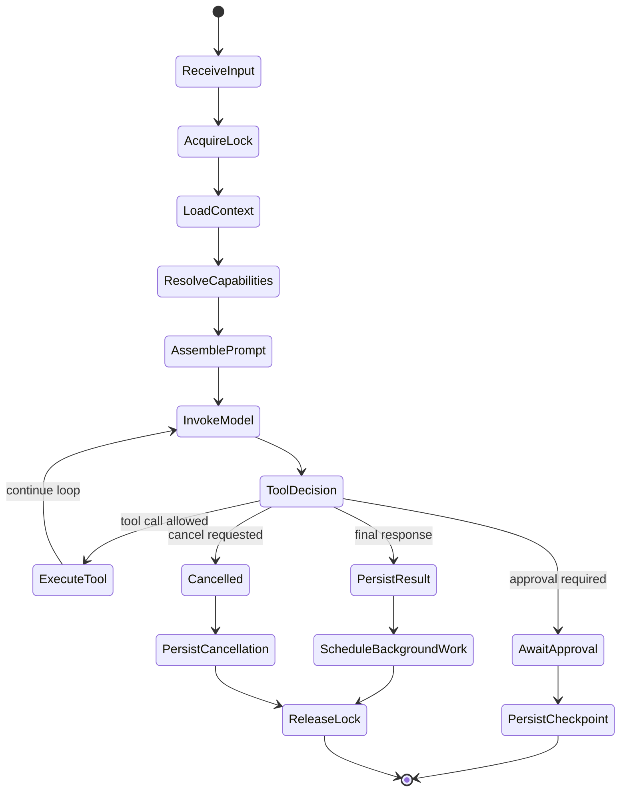
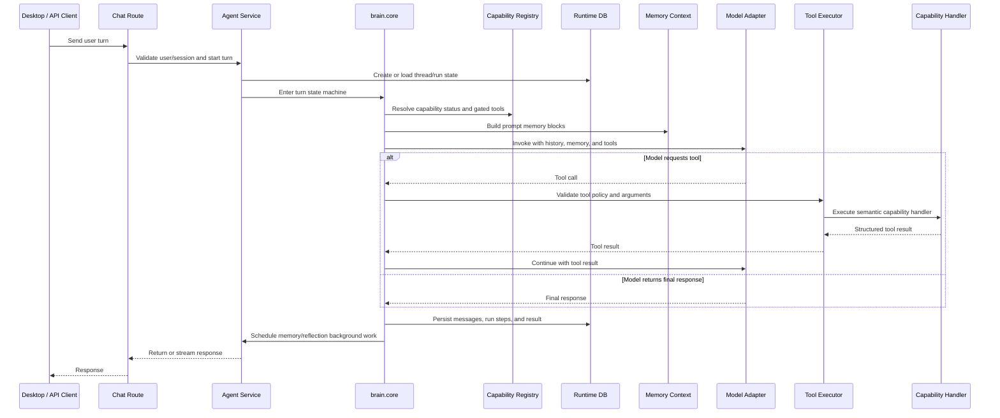
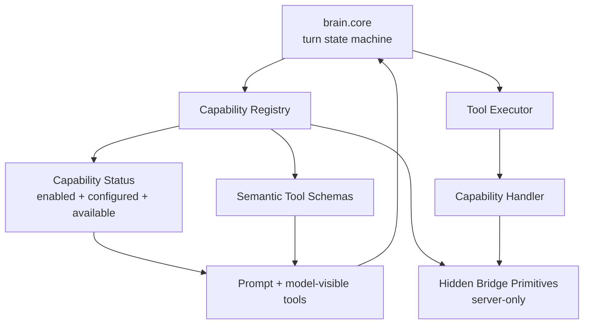
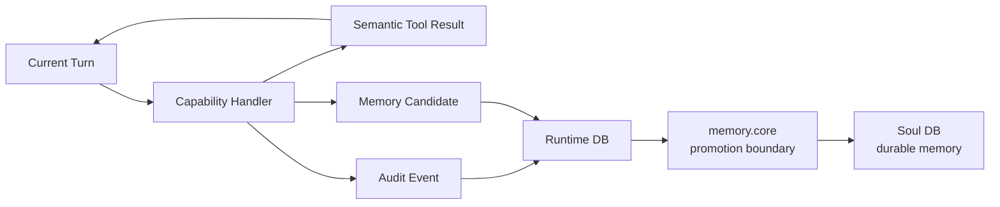

# Brain System

[Back to Agent Capability Modules](capability-modules/README.md)

Brain System is the non-optional agent runtime of ANIMA. Its module id is `brain.core`.

It is not a module in the same sense as camera or voice. It is the runtime state machine that makes a turn possible: identity context, thread coordination, system prompt construction, model invocation, tool routing, persistence, and the memory write boundary.

## Runtime Responsibilities

The Brain System owns the agent runtime loop:

- the conversation turn lifecycle
- thread/user locks
- prompt assembly
- memory block injection
- LLM provider calls
- tool orchestration rules
- approval flow
- cancellation
- persistence of runs/messages/steps
- final response policy
- module registry loading
- capability-aware tool assembly

These responsibilities are the minimum runtime surface for a turn.

## Agent State Machine

Every chat turn moves through a predictable state machine:

```text
receive input
-> acquire thread lock
-> load user/session/runtime context
-> resolve capability status
-> assemble prompt and gated tools
-> invoke model
-> execute approved tool calls
-> persist messages, runs, and steps
-> schedule memory/reflection background work
-> release turn
```



Capability Modules attach to that state machine at explicit points:

- before model invocation, as compact capability status
- during tool assembly, as policy-gated semantic tools
- during tool execution, as module handlers
- after tool execution, as audit events or memory candidates
- after the turn, as background work inputs

## Full Turn Sequence

The Brain System is the runtime coordinator between API routes, runtime state, memory context, the model adapter, the tool executor, and capability handlers.



## Runtime Identity

`brain.core` is the always-present runtime identity for the agent loop. It is the part of the server that receives a user turn, advances the state machine, coordinates model/tool execution, and commits the result back into runtime state.

In implementation terms, `brain.core` should map to the existing agent runtime and service orchestration path rather than becoming a separate feature package.

## Relationship To Tools

The Brain System does not hardcode every possible tool forever. It asks the capability registry for the active tool set:

```text
core tools
+ policy-gated capability tools
+ hidden bridge primitives for server handlers
= effective runtime capability surface
```

The LLM only sees semantic tools that policy allows. Hidden bridge tools exist for server code, not for direct model selection.



## Relationship To Memory

The Brain System enforces the memory write boundary. Capability handlers can produce:

- transient call data
- semantic tool results
- an audit record
- memory candidates

Durable memory should be created only through Memory Core's promotion path.



## Failure Mode

The Brain System should survive capability failure.

If a capability is unavailable, the turn state machine should still complete when possible. Missing capabilities degrade into explicit status and clear tool results, not runtime chaos.
