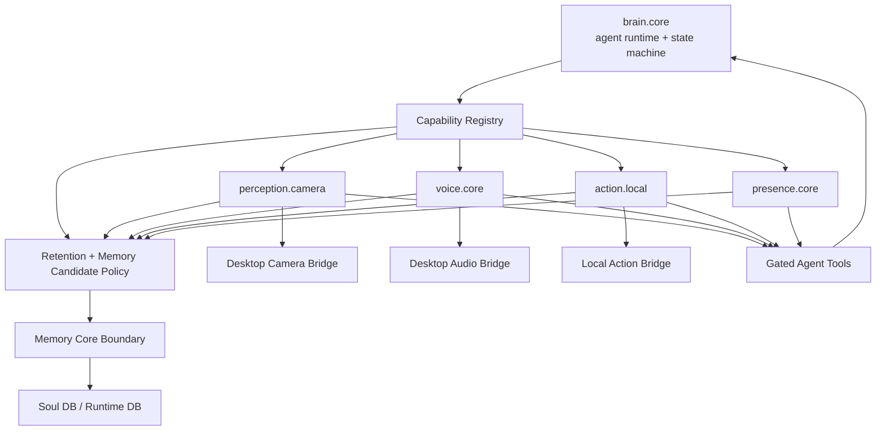

# Agent Capability Modules

[Back to Architecture Index](../../README.md)

Agent Capability Modules are optional body systems that attach to ANIMA's Brain System.
They are how ANIMA gains senses, voice, local action, presence, and future embodied abilities without making every sensitive capability part of the required cognitive kernel.

The model is modular-body rather than plugin-marketplace: Brain System is the agent runtime and state machine; capability modules are governed body systems attached around it. They can extend what ANIMA can perceive or do, but they do not replace who ANIMA is.

## Doctrine

The short version:

```text
The self is continuous.
The body is modular.
Each body system is governed.
```

ANIMA is one identity with many possible body systems. A camera module does not create a camera-agent. A voice module does not create a voice-agent. A local action module does not become a second operator. They are all governed surfaces around the same Brain System.

This keeps the Portable Core thesis intact. The Core can move to a new machine and remain the same ANIMA, even if that machine has different hardware, different voice providers, no camera, or a different local automation surface.

## The Core Idea

ANIMA should not become one giant agent file where every feature is always present. A camera, microphone, screen reader, shell executor, calendar bridge, proactive presence loop, and long-term memory system do not have the same risk, consent model, retention policy, or runtime availability.

Capability Modules give each major ability its own boundary:

- Is it required or optional?
- Is it enabled for this user?
- What tools does it expose to the agent?
- Does it require desktop hardware?
- What can it store?
- What must it audit?
- What happens when it is unavailable?

This keeps Brain System stable and lets ANIMA grow a body without turning every body part into permanent brain tissue.

## Why This Is Not Just Plugins

Plugins usually mean arbitrary extensions. Capability Modules mean governed body systems.

The difference:

| Plugin-style thinking | Capability-module thinking |
| --- | --- |
| "Add this feature to the agent" | "Grant this ability under policy" |
| Tool list first | Consent, retention, audit, and lifecycle first |
| Feature owns its behavior | Brain System owns the turn state machine; module owns capability |
| Failure is an implementation detail | Failure is part of runtime status |
| Data flows wherever convenient | Data crosses explicit runtime/archive/soul boundaries |

This matters because camera, voice, screen, action, and presence are intimate. They change what ANIMA can experience and do. That deserves more than a function import.

## Host, Boundaries, And Modules

| Kind | Example | Role | Normal toggle |
| --- | --- | --- | --- |
| Host runtime | `brain.core` | Agent runtime, turn state machine, prompt assembly, tool rules, identity boundary, provider calls | No |
| Memory boundary | `memory.core` | Durable memory, recall, self-model, consolidation boundary | No |
| Capability module | `perception.camera` | Optional webcam perception through desktop bridge | Yes |
| Capability module | `voice.core` | Optional STT/TTS conversation surface | Yes |
| Capability module | `action.local` | Optional local execution and automation | Yes |
| Capability module | `presence.core` | Optional proactive/ambient signals | Partially |

Brain System advances the turn state machine. Modules decide whether a capability exists, what policy governs it, and what tools it contributes.

## How A Module Becomes Part Of A Turn

At a high level:

```text
manifest -> user config -> runtime status -> gated tool list -> module handler -> audit -> memory boundary
```

Detailed flow:

1. Server loads built-in module manifests.
2. User-specific config decides which optional modules are enabled.
3. Desktop bridges report hardware availability.
4. Agent service resolves capability status before each turn.
5. Brain System receives a compact capability status block and only the allowed semantic tools.
6. If the agent calls a module tool, the module re-checks policy before touching hardware or providers.
7. Sensitive usage emits audit events.
8. Any durable learning goes through Memory Core and the Soul Writer path.

This means the model never gets raw camera, mic, shell, or screen primitives directly. It gets semantic, policy-aware tools.

## Not `apps/anima-mod`

This architecture is separate from `apps/anima-mod`.

`apps/anima-mod` is the external integration layer: Telegram, Google, future Discord, webhooks, and channel/service adapters. It connects ANIMA to the outside world.

Agent Capability Modules live inside `apps/server`. They shape ANIMA's internal body and cognitive runtime. Some may call external integrations, but their primary job is to govern ANIMA's own abilities.

## Architecture



## Module Documents

- [Body System Doctrine](body-system-doctrine.md) - the conceptual model behind one self with many governed body systems.
- [Body System Diagrams](body-system-diagrams.md) - Mermaid diagrams for the host runtime plus modular body-system architecture.
- [Upgrade And Compatibility Model](upgrade-and-compatibility.md) - how Brain System and Capability Modules update like versioned parts around a portable Core.
- [Module Contract](module-contract.md) - the manifest, config, tools, bridge, memory, and audit fields every module declares.
- [Capability Runtime Flow](runtime-flow.md) - how manifests become status, tools, bridge calls, audit events, and memory candidates.
- [Capability Data Boundaries](data-boundaries.md) - retention, audit, and memory rules for module outputs.
- [Lifecycle And Gating](lifecycle-and-gating.md) - installed, enabled, available, degraded, tool-visible, and runtime failure states.
- [Desktop Bridges](desktop-bridges.md) - how hardware-backed modules use desktop-controlled sensors without giving the model raw device access.
- [Module Families](module-families.md) - host/boundary references plus perception, voice, action, presence, and future module families.
- [Perception Modules](perception.md) - governed senses such as camera, screen, window, and media perception.
- [Voice Core Module](voice-core.md) - optional speech, listening, STT/TTS, and audio retention policy.
- [Local Action Module](action-local.md) - governed local execution and automation.
- [Presence Core Module](presence-core.md) - ambient awareness, nudges, follow-ups, and quiet policy.
- [Module Authoring Guide](module-authoring-guide.md) - checklist for production-grade module design.
- [Camera Perception](perception-camera.md) - the first concrete Perception module.

## Related Architecture Boundaries

These docs are related to capability modules, but they live outside this folder because they are not module-creation docs:

- [Brain System](../brain-system.md) - the required agent runtime and state machine that hosts the module standard.
- [Memory Core Boundary](../../memory/memory-core-boundary.md) - the durable memory and promotion boundary that modules may send candidates into.
- [External Integration Boundary](../../system/external-integration-boundary.md) - how server-side capability modules differ from `apps/anima-mod`.

## Design Principles

1. **Brain stays small.** Core identity, turn orchestration, and safety rules should not become feature soup.
2. **Sensitive abilities are opt-in.** Camera, mic, screen, shell, and ambient presence should be explicitly enabled.
3. **The model sees semantic tools.** It should call `view_camera_snapshot`, not raw `camera_capture_frame`.
4. **Hardware belongs to the desktop.** Browser/Tauri permission surfaces stay in the desktop app.
5. **Raw sensory data is transient by default.** Durable memory requires an explicit path through memory policy.
6. **Modules degrade honestly.** Missing camera, missing desktop bridge, or non-vision model should produce clear state, not hidden failures.
7. **Audit without hoarding.** Record that a capability was used without storing raw sensitive payloads.
8. **One self, not many agents.** Modules extend the same ANIMA instance; they do not create separate identities.
9. **Action requires stronger policy than perception.** Reading context, speaking, and changing local state have different risk levels.
10. **Module output is evidence, not identity.** Durable identity changes still go through Memory Core and reflection.

## First Implementation Target

The first module should be `perception.camera`.

It is a useful forcing function because it needs almost every part of the module model:

- user opt-in
- desktop hardware permission
- hidden bridge primitive
- semantic agent tool
- vision-model capability gate
- transient raw bytes
- consent prompt
- audit record
- memory boundary

If `perception.camera` fits cleanly, the module architecture is probably shaped correctly.
