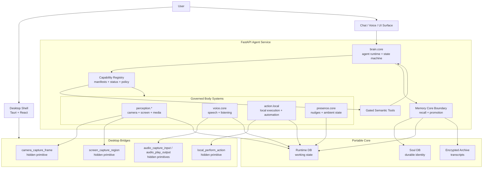
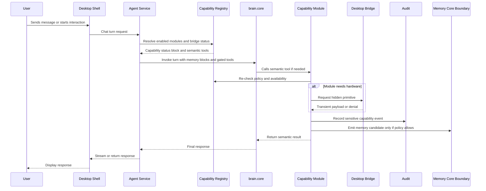
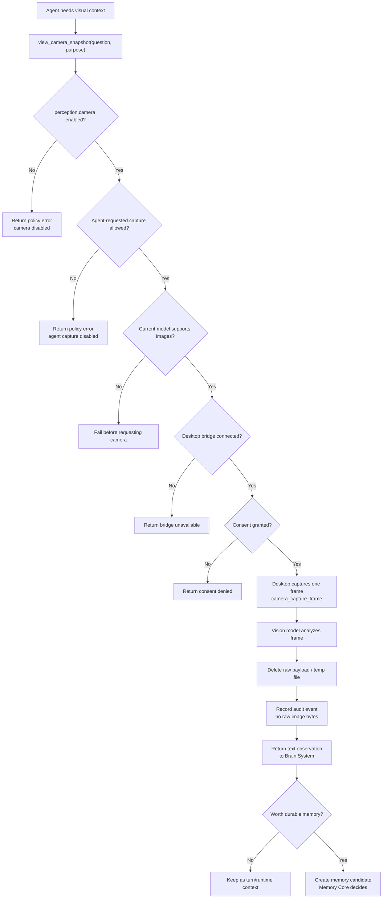
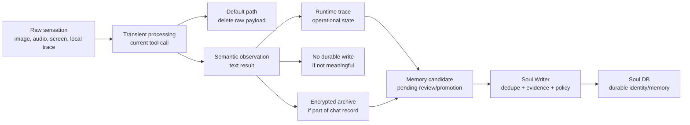
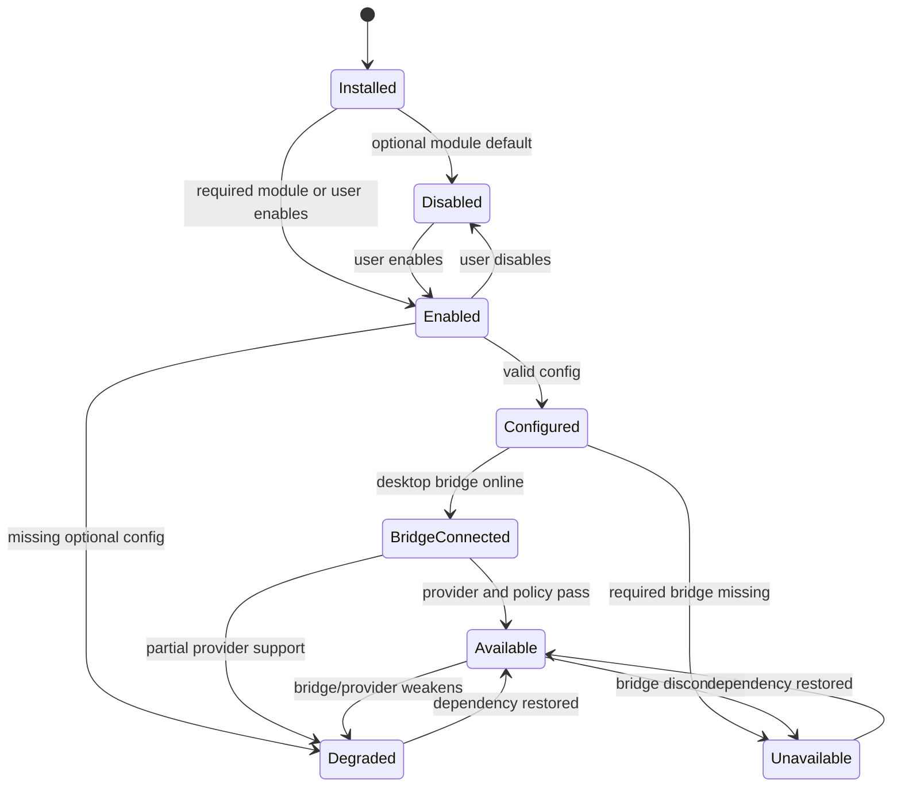
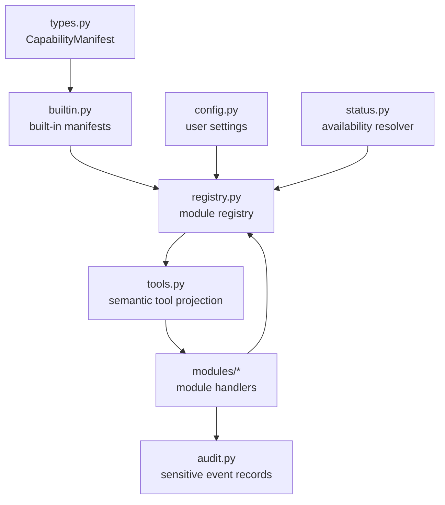

# Body System Diagrams

[Back to Capability Modules](README.md)

This is the visual version of the Agent Capability Modules doctrine.

ANIMA has one continuous self, a required Brain System, and optional governed body systems. The code name stays boring and precise: `capabilities`.

```text
The self is continuous.
The body is modular.
Each body system is governed.
```

## Body Map

This is the body-system view. Brain System is the agent runtime and state machine. Memory Core is the soul and recall boundary. Perception, Voice, Action, and Presence are bolt-on body systems with policy and status.



## Turn Flow

Every turn resolves the body before the model speaks. The agent gets only the capabilities that are enabled, configured, available, and safe for the current model/provider.



## Camera Perception Flow

Camera sight is a one-frame perception sense. It is not continuous video and not background watching.



## Retention Boundary

This is the most important privacy diagram: sensation does not automatically become soul.



Module rule:

```text
Body systems can experience.
Memory Core decides what becomes durable.
```

## Capability Lifecycle

Enabled is not the same as available. A body system can exist but still be unusable because config, bridge, permission, or model support is missing.



## Prompt View

Brain System should receive a compact status block, not every config detail.

```text
Host:
- brain.core: available

Memory boundary:
- memory.core: available

Capability modules:
- perception.camera: available; consent required per capture
- voice.core: disabled
- action.local: degraded; destructive actions require approval
- presence.core: available; quiet hours active
```

That gives ANIMA body awareness without flooding every turn.

## Implementation Spine

The code path should eventually look like this:



This is the production-grade shape: manifest first, policy before tools, bridges hidden, audit without hoarding, and memory protected.
