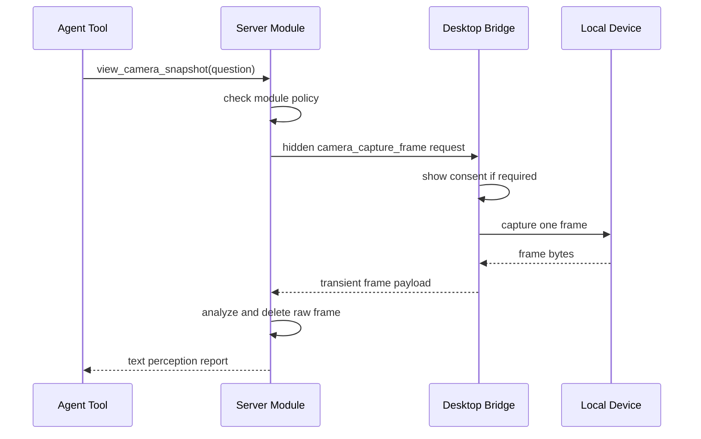

# Desktop Bridges

[Back to Capability Modules](README.md)

Some capability modules need access to hardware or OS surfaces that the FastAPI server should not own directly. The desktop app is the user's local body surface. It owns camera, microphone, speaker, screen, window, and other device permissions.

Desktop Bridges let server-side modules request local sensing or action without making the LLM a raw device controller.

## Why Bridges Exist

The server can reason, enforce policy, and call models. But the desktop owns:

- browser/Tauri permission prompts
- visible device activity state
- camera streams
- microphone streams
- screen/window capture
- local app context
- user confirmation UI

Putting these in desktop keeps sensitive hardware access tied to visible user surfaces.

## Pattern

## Hidden Actions

Desktop bridge actions should be marked hidden from model tool exposure.

Examples:

- `camera_capture_frame`
- `microphone_capture_clip`
- `screen_capture_region`

These names describe raw device operations. They are useful for server code but too low-level for the model.

The model should receive tools like:

- `view_camera_snapshot`
- `listen_for_voice_note`
- `inspect_selected_screen_area`

## Consent UI

Bridge consent is part of the module policy.

For sensitive bridges, v1 should support at least:

| Consent Mode | Meaning |
| --- | --- |
| `ask_each_time` | Prompt the user every request |
| `allow_when_chat_open` | Allow while user is actively in chat |
| `disabled` | Do not bridge |

Future modes can add scheduled windows or trusted workflows, but v1 should bias toward explicit consent.

## Visibility

The desktop should show when a bridge is active.

For camera:

- show a capture indicator during frame acquisition
- show prompt text explaining why ANIMA is asking
- let user deny
- return denial as a normal tool result

For microphone:

- show recording state
- show duration
- let user stop/cancel

Do not hide local sensing behind invisible background work.

## Data Handling

Bridge payloads should be minimal and short-lived.

For camera:

- one JPEG or PNG frame
- scaled to module config limits
- no continuous stream
- no automatic durable storage

For screen:

- selected region or explicit window, not whole desktop by default
- no background polling unless future policy allows it

For voice:

- short audio clips or session stream with visible state
- transcript retention separate from raw audio retention

## Failure Handling

Desktop bridges should return structured failures:

- permission denied
- device unavailable
- user denied consent
- capture timed out
- payload too large
- bridge not enabled

Server modules should pass these to the agent in clear language.

## Security Boundary

The bridge is not a backdoor. It is a user-visible device surface.

Rules:

1. No bridge while logged out.
2. No bridge when the module is disabled.
3. No raw bridge primitive exposed directly to the LLM.
4. No durable raw payload storage unless retention policy explicitly permits.
5. No bypassing OS/browser permission prompts.
6. No background sensing by default.
