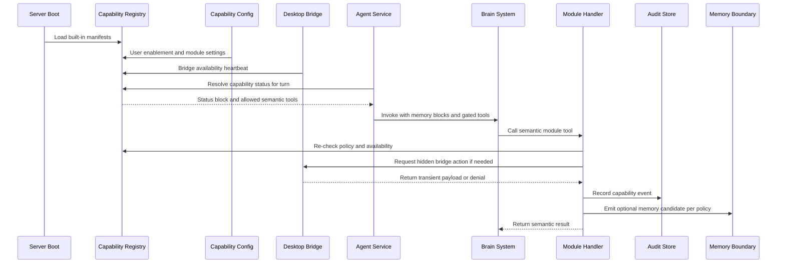

# Capability Runtime Flow

[Back to Capability Modules](README.md)

Capability Modules are loaded by the FastAPI agent service and projected into the agent runtime as governed tools and compact status.

The runtime flow should be boring, explicit, and inspectable.

## Full Flow

## Boot

At server boot, the registry loads built-in manifests. v1 should not need dynamic user-installed modules.

Built-in manifests should include:

- `brain.core`
- `memory.core`
- `perception.camera`
- `voice.core`
- `action.local`
- `presence.core`

The registry should validate ids, families, default states, config schemas, bridge requirements, tool schemas, memory policies, and audit policies before the server exposes them.

## User Unlock

Most capability status should be resolved only after a user is unlocked.

User-specific state includes:

- whether an optional module is enabled
- per-module config values
- provider choices
- consent policy
- retention policy
- bridge trust state
- recent audit state

Required modules may be listed before unlock, but their full operational status depends on the active user session.

## Desktop Bridge Registration

The desktop reports bridge availability for hardware-backed modules.

Examples:

| Bridge | Used by |
| --- | --- |
| `camera_capture_frame` | `perception.camera` |
| `audio_capture_input` | `voice.core` |
| `audio_play_output` | `voice.core` |
| `screen_capture_region` | `perception.screen` |
| `local_perform_action` | `action.local` |

Bridge primitives should never be LLM-visible tools. They are hidden actions callable only by trusted server module code.

## Turn Preparation

Before invoking Brain System for a chat turn, the agent service asks the registry to resolve module status.

The registry returns:

- compact capability status for prompt context
- agent-visible tool schemas
- tool handler mapping
- any module-specific context that is safe to expose

Tool visibility must be resolved per turn because availability can change quickly. A camera can disconnect. A desktop can lock. A provider can switch from vision-capable to text-only.

## Tool Projection

The model should see semantic tools.

Examples:

| Module | Model-visible tool | Hidden primitive |
| --- | --- | --- |
| `perception.camera` | `view_camera_snapshot` | `camera_capture_frame` |
| `voice.core` | usually none for normal speech I/O | `audio_capture_input`, `audio_play_output` |
| `action.local` | `perform_local_action` or narrower tools | `local_perform_action` |
| `presence.core` | `schedule_nudge`, `check_presence_state` | timers, activity sources |

Not every module needs to expose a model tool. Some modules change the interface around the turn rather than the tool list. Voice is the clearest example: speech input/output can wrap the conversation without giving the model a raw microphone tool.

## Tool Call

When the model calls a semantic tool, the module handler re-checks policy.

This protects against stale tool lists and race conditions:

- user disabled the module mid-turn
- bridge disconnected
- model provider changed
- consent was denied
- retention policy prevents requested behavior

The handler should return a clear structured result rather than throwing vague runtime errors into the agent loop.

## Audit

Every sensitive module should emit audit events.

Audit events answer:

- what module was used
- who or what requested it
- what policy allowed or denied it
- which bridge/provider was involved
- whether raw data was retained
- whether the operation succeeded

Audit events should avoid storing raw payloads by default.

## Memory Emission

Modules do not write durable memory directly.

They may emit:

- transient observations for the current turn
- runtime traces
- archive entries if the interaction itself is archived
- memory candidates when policy permits

The Soul Writer and memory consolidation pipeline remain the durable write boundary.

## Failure Behavior

Failures should be typed and user-recoverable.

Useful failure classes:

- `disabled_by_user`
- `missing_config`
- `bridge_unavailable`
- `permission_denied`
- `consent_denied`
- `provider_unsupported`
- `payload_invalid`
- `timeout`
- `policy_denied`

This lets desktop settings and chat responses explain what happened without guessing.

## Testing Shape

Each module should have deterministic tests for:

- manifest validation
- default enablement
- config validation
- status resolution
- tool visibility
- hidden bridge exclusion
- policy denial
- audit event shape
- retention behavior

Hardware behavior should be mocked. Production-grade tests should verify the policy and boundary logic without requiring an actual camera, microphone, or desktop session.
