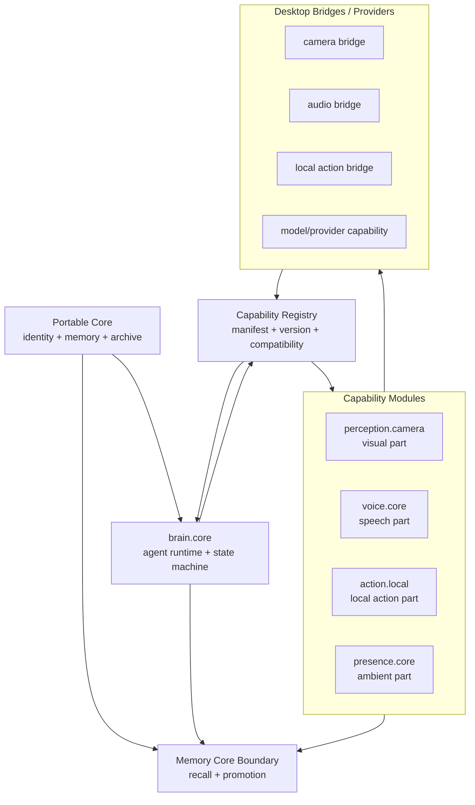
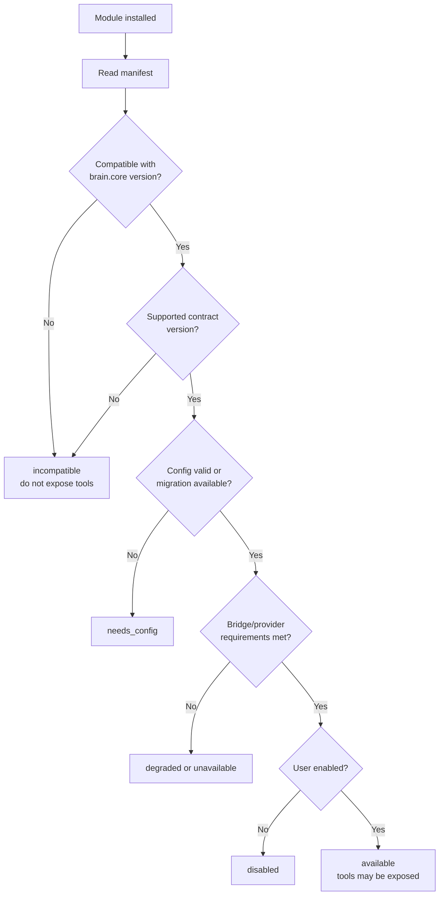
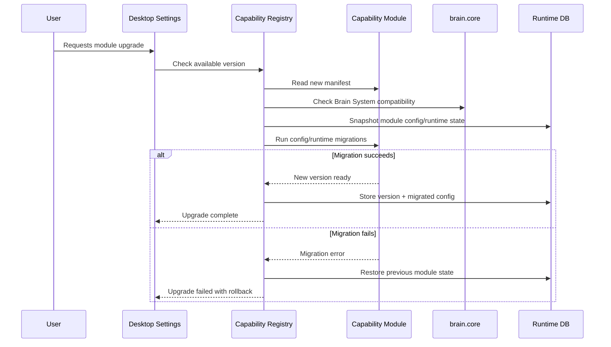

# Upgrade And Compatibility Model

[Back to Capability Modules](README.md)

ANIMA should be buildable like a good local machine: the identity lives on the owned drive, the runtime can be updated, and capability parts can be added, upgraded, disabled, or removed.

The formal architecture language:

```text
Portable Core = owned identity and memory
Brain System = agent runtime and state machine
Capability Modules = versioned parts attached to the runtime
Desktop Bridges = local drivers and hardware surfaces
Compatibility Registry = what can safely run together
```

The PC-build analogy is useful because it separates identity from parts. Upgrading a graphics card should not erase a hard drive. Updating the OS should not silently install a microphone. Removing a peripheral should not change who the machine belongs to.

ANIMA follows the same principle.

## Build Model



## What Can Change

| Part | Can update? | Can be removed? | What persists? |
| --- | --- | --- | --- |
| Portable Core | Migrated carefully | User-owned deletion/export only | Identity, memory, archive |
| Brain System | Yes | No for normal operation | Core identity remains |
| Capability Module | Yes | Yes if not required | Module config/audit per policy |
| Desktop Bridge | Yes | Yes | Module becomes unavailable/degraded |
| Provider | Yes | Yes | Provider-specific cache is replaceable |

This gives ANIMA a stable self with replaceable parts.

## Brain System Updates

Brain System updates are runtime updates.

They may change:

- turn-state implementation
- prompt assembly strategy
- model adapter behavior
- tool execution rules
- capability registry behavior
- background scheduling
- persistence format for runtime state

They should not rewrite durable identity directly. If an update requires Core data migration, that is a Core migration with explicit versioning and backup rules, not a casual runtime update.

## Module Upgrades

Capability Modules are versioned parts.

A module upgrade may change:

- tool schemas
- config schema
- provider requirements
- bridge requirements
- retention policy
- audit event shape
- internal handler implementation
- migration logic for module runtime data

Upgrading a module is different from enabling it. A module can be installed but disabled, upgraded while disabled, or held back because its requirements are not met.

## Compatibility Check

Before a module becomes available, the registry should check:

- module id is known or trusted
- module version is compatible with current Brain System
- module contract version is supported
- config schema migration has succeeded
- required bridge is available or can degrade
- required provider/model capability exists
- retention and audit policies are valid
- user has enabled the module if optional



## Manifest Version Fields

The module contract should include version and compatibility metadata:

```python
CapabilityManifest(
    id="perception.camera",
    version="1.0.0",
    contract_version="1",
    family="perception",
    min_brain_version="1.0.0",
    max_brain_version=None,
    config_schema_version="1",
    migrations=[...],
    ...
)
```

Important fields:

| Field | Meaning |
| --- | --- |
| `version` | Module implementation version |
| `contract_version` | Capability manifest/tool contract version |
| `min_brain_version` | Oldest Brain System version the module supports |
| `max_brain_version` | Optional upper bound when a breaking runtime change exists |
| `config_schema_version` | Version of the module's persisted config shape |
| `migrations` | Config/runtime migration steps the module can perform |
| `feature_flags` | Optional feature gates within the module |

## Upgrade States

Capability state should include upgrade-related states:

| State | Meaning |
| --- | --- |
| `upgrade_available` | A newer compatible module version exists |
| `upgrade_required` | Current module version cannot run safely |
| `migrating` | Config or runtime data is being migrated |
| `migration_failed` | Migration failed; module must stay unavailable |
| `incompatible` | Module cannot run with current Brain System/provider/bridge |
| `rollback_available` | Previous version can be restored |

These are separate from enabled/disabled. A disabled module can still have an available upgrade.

## Upgrade Flow



## Removing A Module

Removing a module should not delete identity.

Removal policy should answer:

- Is the module disabled first?
- Are runtime traces retained, pruned, or archived?
- Are audit records retained?
- Are memory candidates from that module still pending?
- Do durable memories need source-module metadata?
- Can the module be reinstalled later with previous config?

Default behavior:

```text
disable module -> hide tools -> disconnect bridges -> preserve audit -> preserve durable memories -> prune transient data
```

Durable memories created through Memory Core remain durable because they are no longer owned by the module. Their evidence may still record the source module.

## Core Migration Is Different

The Portable Core is not just another part.

Brain System updates and module upgrades can be frequent. Core migrations should be rarer, explicit, and careful because they touch durable identity, memory, archive indexes, or encryption metadata.

Rule:

```text
Upgrade parts freely.
Migrate the Core deliberately.
Never confuse the two.
```

## Implementation Implications

The first implementation should not need a public module marketplace. It still needs version fields now so v1 does not paint itself into a corner.

Minimum v1:

- built-in module versions
- Brain System version
- manifest contract version
- compatibility check
- config schema version
- clear `incompatible` and `migration_failed` statuses
- migration hooks, even if most modules start with no-op migrations

That gives ANIMA the upgrade path: new runtime, same Core, better parts.
