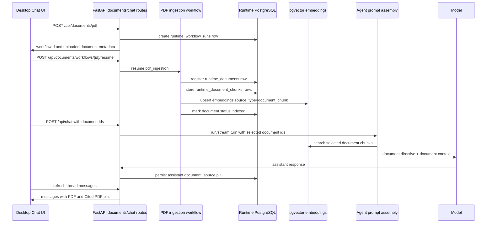

# Document Processing Architecture

This document describes the current document-processing path in AnimaOS. The implemented user-facing document format is PDF. Documents are runtime context for chat and RAG; they are not automatically promoted into durable SQLCipher memory.

## Scope

Document processing covers five responsibilities:

1. Accept a PDF from the desktop chat UI.
2. Store the uploaded file under the local runtime data root.
3. Run a resumable PDF ingestion workflow that extracts text, chunks it, embeds chunks, and marks the document indexed.
4. Retrieve relevant chunks during chat and inject them as a high-priority document context block.
5. Render visible attachment/source pills so the user can see which PDF was attached or cited.

The source of truth is:

| Area | Implementation |
| --- | --- |
| Desktop upload and chat attachment UI | `apps/desktop/src/pages/chat/Chat.tsx` |
| API client methods | `packages/api-client/src/client.ts` |
| Document REST routes | `apps/server/src/anima_server/api/routes/documents.py` |
| Chat REST/SSE route | `apps/server/src/anima_server/api/routes/chat.py` |
| PDF workflow | `apps/server/src/anima_server/services/documents/pdf_workflow.py` |
| Document storage helpers | `apps/server/src/anima_server/services/documents/store.py` |
| PDF text extraction | `apps/server/src/anima_server/services/documents/pdf_text.py` |
| Chunking | `apps/server/src/anima_server/services/documents/chunking.py` |
| Chunk embedding | `apps/server/src/anima_server/services/documents/indexing.py` |
| Document RAG search | `apps/server/src/anima_server/services/documents/rag.py` |
| Chat prompt assembly | `apps/server/src/anima_server/services/agent/service.py` |
| Message persistence and pills | `apps/server/src/anima_server/services/agent/persistence.py` |
| Runtime models | `apps/server/src/anima_server/models/runtime.py` |
| Runtime embedding model | `apps/server/src/anima_server/models/runtime_embedding.py` |

## End-to-End Flow

## Upload And Workflow Creation

The desktop chat page accepts PDF files through the same attachment control as images. When the user selects a PDF, `Chat.tsx` starts indexing immediately:

1. `api.documents.uploadPdf(userId, file, threadId)` posts multipart form data to `POST /api/documents/pdf`.
2. The server validates the unlock session, optional thread ownership, PDF MIME type, non-empty body, configured size limit, and `%PDF-` file header.
3. The server sanitizes the filename, computes SHA-256, writes the file under the configured data root, and starts a `pdf_ingestion` workflow.
4. The desktop immediately calls `api.documents.resumeWorkflow(workflowId)`.
5. When resume returns a document id, the selected PDF becomes eligible for chat submission.

There is also `POST /api/documents/workflows/pdf` for starting a workflow from an already-stored relative document path. Both routes use `PDFIngestionRequest` and create a row in `runtime_workflow_runs`.

## Runtime Storage Model

Documents live in the runtime PostgreSQL store, not the encrypted soul database.

| Runtime table | Purpose |
| --- | --- |
| `runtime_workflow_runs` | One resumable workflow run, including `workflow_type`, `status`, `current_state`, input, result, and error JSON |
| `runtime_workflow_checkpoints` | Ordered idempotent checkpoints for each completed or waiting workflow state |
| `runtime_documents` | Per-user document metadata: filename, MIME type, storage path, SHA-256, size, status, indexed timestamp, optional thread/workflow ids |
| `runtime_document_chunks` | Extracted text chunks with chunk index, page range, content hash, token count, section title, and metadata |
| `embeddings` | pgvector rows for document chunks and other runtime-search sources |
| `runtime_messages` | User/assistant chat rows, including serialized document attachment/source pills in `content_json` |

`runtime_documents` is unique on `(user_id, sha256)`, so uploading the same file for the same user reuses the existing document row. The document row is still runtime state: it can support local retrieval and workflow resumption, but it is not the portable memory authority.

## Checkpointed PDF Ingestion

The PDF workflow is state-based and resumable. `resume_pdf_ingestion_workflow()` calls `run_pdf_ingestion_until_wait_or_done()`, which loads the latest completed checkpoint and continues from the next state.

The current workflow states are:

| State | Behavior |
| --- | --- |
| `created` | Workflow row exists but no document work has been recorded yet |
| `file_registered` | Creates or reuses a `runtime_documents` row |
| `text_extracted` | Reads the PDF from the stored path and stores page text in the checkpoint output |
| `chunked` | Converts page text into `runtime_document_chunks` rows |
| `embedded` | Embeds every unembedded chunk into the runtime `embeddings` table |
| `indexed` | Confirms the document is fully indexed |
| `summarized` | Produces a workflow summary object |
| `facts_proposed` | Stages candidate facts, if the dependency supplies any |
| `awaiting_approval` | Pauses with summary and proposed facts in `result_json` |
| `memory_saved` | Creates `MemoryCandidate` rows for approved proposed facts |
| `memory_rejected` | Completes without creating memory candidates |
| `completed` | Terminal workflow state |

Every completed state appends a `runtime_workflow_checkpoints` row with an idempotency key of the form `pdf:{workflow_run_id}:{state_name}`. This lets the workflow resume after partial progress without duplicating completed work.

### Restart And Repair Behavior

The workflow deliberately reuses durable intermediate artifacts:

- If a document is already indexed and has chunks plus embeddings, resume can skip extraction and chunking.
- If the workflow resumes after `text_extracted`, it can reuse the page text stored in checkpoint output.
- If it resumes after `chunked`, it can reuse stored chunks and continue embedding.
- If document chunks changed, `replace_document_chunks()` deletes stale chunk rows and stale `document_chunk` embeddings before inserting replacements.
- If a document is marked indexed but embeddings are missing after an embedding-table reset, document search and approval paths attempt to re-embed missing chunks.

## Text Extraction And Chunking

`extract_pdf_text()` uses `pypdf.PdfReader`:

- It rejects unreadable PDFs.
- It attempts empty-password decryption for encrypted PDFs.
- It rejects password-protected encrypted PDFs that cannot be opened.
- It extracts text page-by-page.
- It normalizes text with the same PDF spacing cleanup used by memory text processing.
- It rejects PDFs with no extractable text.

`chunk_pages()` is paragraph-oriented:

- Default target chunk size is 1800 characters.
- Chunk overlap is currently disabled.
- Paragraphs larger than the target are split by words.
- Each chunk records `chunk_index`, `content_text`, `page_start`, and `page_end`.

The current pipeline does not do OCR. Scanned PDFs without extractable text fail ingestion.

## Embedding And Indexing

`embed_document_chunks()` finds chunks that do not have a current matching embedding row. A matching embedding row must have:

- the same `user_id`,
- `source_type = "document_chunk"`,
- `source_id = runtime_document_chunks.id`,
- matching `content_hash`.

For each missing chunk, it calls the configured embedding function, then writes through `PgVecStore.upsert_source()` into the runtime `embeddings` table. Document chunk embeddings use:

| Embedding field | Value |
| --- | --- |
| `source_type` | `document_chunk` |
| `source_id` | `runtime_document_chunks.id` |
| `category` | `document` |
| `importance` | `3` |
| `content_hash` | SHA-256 of chunk text |
| `content_preview` | first 200 characters for debugging and BM25 support |

If every current chunk has an embedding, the document status becomes `indexed` and `indexed_at` is set. If an embedding provider returns no vector for any chunk, the document stays `registered` so callers know indexing is incomplete.

## Document RAG Search

`search_document_chunks()` retrieves indexed document chunks from pgvector.

The search path is:

1. Resolve live chunk ids from `runtime_documents` joined to `runtime_document_chunks`.
2. Generate an embedding for the user query.
3. Repair indexed documents that are missing current vectors, when possible.
4. Search pgvector through `PgVecStore.search_by_vector()`.
5. Hydrate vector hits back into chunk and document rows.
6. Return `DocumentRagResult` objects with filename, page range, section title, chunk text, and similarity.

When called with explicit `document_ids`, search is constrained to those documents. When called without document ids, the route-level document search API can search all indexed documents for the user. Chat prompt assembly uses explicit or active thread document ids rather than searching every document by default.

## Chat Grounding

The chat API accepts `documentIds` separately from image attachments. The desktop sends `documentIds` only after the PDF upload workflow returns an indexed document id.

During turn preparation:

1. `append_user_message()` persists the user message.
2. Selected document ids are stored as `document_attachment` pills on the user message.
3. `_assemble_turn_context()` resolves the effective document ids:
   - explicit ids from the current request win,
   - otherwise it reuses the latest visible document attachment/source pills in the same thread.
4. `_build_document_context_block()` retrieves up to 5 relevant chunks for the effective document ids.
5. If document context exists, the model receives only:
   - a per-turn `user_directive`,
   - the `document_context` block,
   - optional same-day context.

Personal memory blocks are intentionally omitted for document-grounded turns. This prevents ambiguous prompts such as "what do you see" from being answered from relationship memory or image-style context when a PDF can answer the question.

The document directive tells the model:

- the user is primarily asking about the selected PDF,
- document context should be used first when relevant,
- ambiguous wording should be interpreted as asking about the selected PDF,
- personal memory and stylistic inference should not replace document evidence,
- missing evidence should be reported plainly.

## Active Document Follow-Ups

Follow-up turns do not need to resend `documentIds` from the UI. The backend treats the latest visible document pill in the thread as the active document context:

1. `_recent_thread_document_ids()` scans recent visible messages in reverse sequence order.
2. It ignores internal assistant/tool machinery.
3. It looks for `document_attachment` and `document_source` pills.
4. It validates that the referenced document still belongs to the user.
5. It stops at the most recent message containing document pills.

This is state-based, not phrase-based. The backend does not guess from strings like "tell me more" or "what about it". Attaching a different PDF creates newer document pills, so the active document shifts to the newer selection.

## Citation Pills

Pills are small provenance badges stored in message `content_json` and returned through chat history and thread display APIs.

| Pill kind | Written on | Meaning |
| --- | --- | --- |
| `document_attachment` | user message | The user attached or selected this PDF for the turn |
| `document_source` | assistant message or visible `send_message` tool row | The answer used retrieved context from this PDF |
| `image_source` | assistant message or visible `send_message` tool row | The answer used image input |

Assistant source pills carry the document filename and document id when known. The desktop renders `document_attachment` as `PDF <filename>` and `document_source` as `Cited PDF <filename>`.

The desktop also refreshes thread messages after a completed response. This matters for follow-up turns: an optimistic streamed assistant message may not know the active document, but the persisted server message does.

## Document Memory Boundary

Uploaded PDFs do not automatically become long-term memory.

The boundary is:

- Raw document metadata, text chunks, and chunk embeddings live in runtime PostgreSQL.
- Retrieved chunks are prompt context for the current turn.
- The workflow may stage proposed facts in `awaiting_approval`.
- Only approved proposals create `MemoryCandidate` rows.
- Soul Writer promotion is still required before candidates become durable `MemoryItem` records in SQLCipher.

The default API dependency currently indexes and summarizes PDFs but does not propose facts by default. The approval path exists for workflows that provide proposed facts.

## API Surface

| Endpoint | Purpose |
| --- | --- |
| `POST /api/documents/pdf` | Upload a PDF file, store it, and create a PDF ingestion workflow |
| `POST /api/documents/workflows/pdf` | Start a PDF workflow for an already stored relative path |
| `GET /api/documents/workflows/{workflow_id}` | Read workflow status, result, and checkpoints |
| `POST /api/documents/workflows/{workflow_id}/resume` | Continue ingestion from the latest completed checkpoint |
| `POST /api/documents/workflows/{workflow_id}/approve-memory` | Approve staged PDF memory proposals |
| `POST /api/documents/search` | Search indexed document chunks |
| `POST /api/chat` | Send chat text, images, context messages, today context, and selected `documentIds` |
| `GET /api/chat/history` | Return messages with serialized attachments, retrieval traces, and pills |

## Failure Modes

| Failure | Behavior |
| --- | --- |
| Unsupported upload type | `POST /api/documents/pdf` returns a 400 |
| Empty upload | 400 |
| File larger than configured attachment limit | 413 |
| Invalid PDF header | 400 |
| Unreadable PDF | resume returns an error |
| Password-protected encrypted PDF | resume returns an error |
| No extractable text | resume returns an error |
| Embedding provider unavailable or returns no vector | document remains unindexed; callers can resume later |
| Stale chunk embeddings | search and approval paths try to re-embed or reject incomplete indexing |

## Test Coverage

Important regression coverage lives in:

| Test file | Coverage |
| --- | --- |
| `apps/server/tests/test_documents_api.py` | document route validation and workflow API behavior |
| `apps/server/tests/test_pdf_text.py` | PDF text extraction behavior |
| `apps/server/tests/test_document_chunking.py` | paragraph and oversized paragraph chunking |
| `apps/server/tests/test_document_rag.py` | embedding, pgvector source rows, search hydration, stale vector repair |
| `apps/server/tests/test_pdf_workflow_checkpoints.py` | checkpoint resume, idempotency, approvals, embedding reset repair |
| `apps/server/tests/test_chat_document_context.py` | document context block construction |
| `apps/server/tests/test_agent_service.py` | chat document grounding, memory exclusion, source pills, active document follow-ups |
| `apps/server/tests/test_agent_persistence.py` | persistence of message pills and retrieval metadata |
| `apps/server/tests/test_prompt_budget.py` | document context priority in prompt budgeting |

## Current Constraints

- PDF is the only supported document format in the chat upload flow.
- OCR is not implemented.
- Chunk overlap is not implemented.
- Document chunks are runtime context, not encrypted soul memory.
- Citation pills identify the document, not exact chunk ids or page-level inline citations.
- Chat document grounding is scoped to explicit or active thread documents, not a global search over every indexed PDF.
- Runtime pgvector availability and embedding provider availability determine whether indexing/search can complete.
