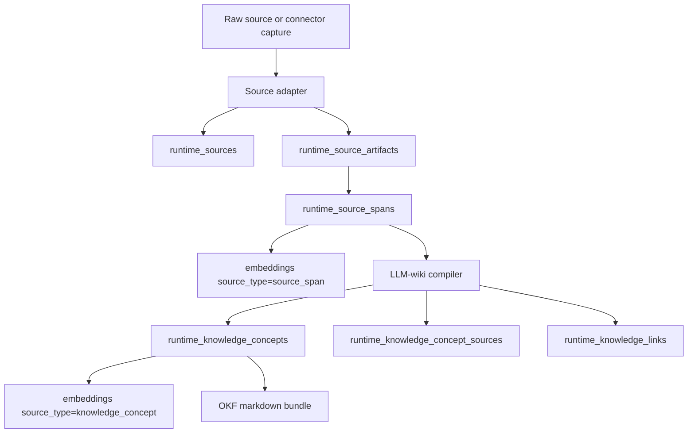

# Source Ingestion Architecture

Source ingestion is the universal evidence layer for files, media, web captures, transcripts, app exports, and future source adapters. It keeps raw or derived evidence in the runtime database, compiles that evidence into OKF-compatible concept pages, and lets the agent search compiled knowledge while drilling back into citable spans.

This layer is separate from long-term personal memory. It may produce knowledge concepts or future memory candidates, but it does not automatically promote source content into SQLCipher memory.

## Scope

The current implementation covers:

- runtime source, artifact, span, concept, citation, link, and bundle-run tables,
- adapter contracts for source-type-agnostic ingestion,
- bridges from existing PDF chunks and image annotations,
- markdown, plain text, and web capture adapters,
- OKF import/export,
- deterministic LLM-wiki compiler merge rules,
- concept and source-span retrieval,
- linting for broken links, uncited pages, stale concepts, duplicates, contradictions, and orphan sources,
- REST/API-client/desktop surfaces for listing, reading, searching, linting, compiling, importing, and exporting knowledge bundles.

## Runtime Model

Source ingestion stores rebuildable operational knowledge in the runtime DB:

| Table | Purpose |
| --- | --- |
| `runtime_sources` | One row per ingested source, such as a PDF, image, markdown file, web capture, connector export, dataset, transcript, or repo snapshot |
| `runtime_source_artifacts` | Extracted material derived from a source, such as document text, OCR text, captions, readable web text, tables, or code file content |
| `runtime_source_spans` | Citable ranges inside artifacts, with locators for page, character, timestamp, row, cell, image annotation, or line references |
| `runtime_knowledge_concepts` | OKF-style compiled concept pages with slug, title, type, frontmatter, body markdown, status, and content hash |
| `runtime_knowledge_concept_sources` | Citation links from concept pages back to source spans |
| `runtime_knowledge_links` | Typed links between concepts, such as `related`, `supports`, `contradicts`, `depends_on`, and `updates` |
| `runtime_knowledge_bundle_runs` | Audit records for adapter, compiler, import, export, lint, and queued maintenance work |

Embeddings reuse the runtime `embeddings` table:

| Source type | Meaning |
| --- | --- |
| `source_span` | normalized evidence span text |
| `knowledge_concept` | compiled concept title, description, and body markdown |
| `document_chunk` | legacy/current PDF chunk retrieval path |
| `image_annotation` | legacy/current image annotation retrieval path |

The new source-span index does not replace existing `document_chunk` or `image_annotation` rows. Those existing paths continue to work while adapter bridges mirror their evidence into the universal source model.

## Ingestion Flow

Adapters emit normalized artifacts and spans. A span is the citation unit, not a whole file. Locators are JSON so each source type can preserve its native reference shape without changing the core schema.

## Adapter Contract

Adapters return the same normalized structure regardless of source kind:

- source identity: kind, URI, media type, title, content hash, metadata,
- artifacts: extracted bodies such as page text, readable text, OCR text, captions, or table metadata,
- spans: citable evidence units with `span_kind`, `locator_json`, `content_text`, `content_hash`, and optional metadata.

Current adapters and bridges:

| Adapter | Source kind | Notes |
| --- | --- | --- |
| PDF bridge | `document` | Mirrors `RuntimeDocument` and `RuntimeDocumentChunk` into sources and page-located spans |
| Image bridge | `image` | Mirrors `RuntimeImageAsset` and `RuntimeImageAnnotation` into sources and annotation-located spans |
| Text adapter | `text` | Splits plain text into paragraph spans |
| Markdown adapter | `markdown` | Preserves headings in span metadata and splits headings/paragraphs |
| Web capture adapter | `web_capture` | Stores URL/canonical URL/title metadata and caller-provided readable text |

Future adapters should reuse this contract for transcripts, Office docs, datasets, code repositories, email/calendar exports, audio/video, and other connector payloads.

## OKF Concept Model

Concept rows map to OKF-compatible markdown files:

- one concept per markdown file under `concepts/<slug>.md`,
- YAML frontmatter with required `type`,
- `title`, `description`, `resource`, `tags`, `timestamp`, and unknown fields preserved when present,
- markdown body with bundle-relative links,
- generated `index.md` and `log.md` during export.

Import is permissive. Unknown concept types and unknown frontmatter fields are accepted. Existing concepts are updated by user and slug. Markdown links between imported concept files become `runtime_knowledge_links` with `link_type="related"`.

Export writes compiled concepts and citation metadata, not raw source binaries. The raw evidence remains in the runtime source tables.

## LLM-Wiki Compiler

The compiler turns selected source spans into maintained concept pages. It receives a source id, span ids, a mode (`initial`, `refresh`, or `repair`), and optional selected concepts. Model output is strict JSON containing concepts and typed links.

Merge rules are deterministic before and after model output:

- exact slug matches update the same concept,
- source summary concepts are stable per source,
- same normalized title and concept type may update instead of duplicate,
- concept-source links are replaced for the compiled concept set,
- concept links are upserted by user/source/target/type,
- malformed model output records a failed bundle run without corrupting existing concepts.

Concept frontmatter stores source count, tags, status, and content hashes used by linting and stale-page checks.

## Retrieval Contract

Knowledge retrieval is two-stage:

1. Search compiled concepts for broad understanding, navigation, and summaries.
2. Search source spans for evidence, quotations, and dispute resolution.

The agent tool `search_knowledge_bundle(query, scope=None, mode="balanced")` returns concept summaries, evidence span references, and concept links. It does not promote memory. Route-level search also exposes a lightweight text fallback so the desktop library remains useful before embeddings are populated.

The routing contract avoids English keyword heuristics. Search behavior should use concept/source types, embeddings, graph links, scope, and mode rather than brittle phrase checks.

## Lint And Maintenance

Knowledge linting reports structured findings:

| Rule family | Examples |
| --- | --- |
| Link integrity | broken concept links |
| Citation integrity | claim concepts without source citations, pages with no source links |
| Duplicate detection | duplicate slugs or duplicate titles by concept type |
| Staleness | concept hash stale after source span changes |
| Contradictions | contradiction links must remain explicit instead of being silently merged |
| Orphans | sources with no compiled concept |

Lint can run globally or scoped to a source or concept. Findings are returned to the desktop and API client as structured codes, severities, messages, and optional concept/source/link ids.

## API Surface

| Endpoint | Purpose |
| --- | --- |
| `GET /api/knowledge/sources` | List runtime sources for a user |
| `GET /api/knowledge/sources/{source_id}` | Read source, artifacts, and spans |
| `POST /api/knowledge/sources/text` | Ingest plain text |
| `POST /api/knowledge/sources/markdown` | Ingest markdown |
| `POST /api/knowledge/sources/web-capture` | Ingest caller-provided web capture text |
| `POST /api/knowledge/sources/{source_id}/compile` | Queue a compile run marker for a source |
| `GET /api/knowledge/concepts` | List compiled concepts |
| `GET /api/knowledge/concepts/{concept_id}` | Read a concept with citations and links |
| `GET /api/knowledge/search` | Search concepts and evidence spans |
| `POST /api/knowledge/lint` | Run knowledge lint |
| `GET /api/knowledge/export` | Download an OKF bundle zip |
| `POST /api/knowledge/import` | Import an OKF bundle zip |

The desktop `KnowledgeLibrary` page exposes source and concept lists, concept markdown, citations, lint findings, compile queueing, refresh, and OKF export.

## Memory Boundary

Source ingestion is not durable personal memory. The boundary is:

- source metadata, artifacts, spans, concept pages, links, lint findings, and embeddings live in runtime state,
- source spans and compiled concepts can ground an answer,
- imported/exported OKF bundles are portable knowledge artifacts, not the encrypted soul database,
- automatic promotion into `MemoryItem`, structured claims, self-model blocks, or user profile data is out of scope,
- any future memory promotion must create explicit candidates and pass through the existing Soul Writer/promotion path.

This keeps external documents, web captures, images, and connector exports inspectable and citable without silently changing Anima's long-term identity or memory.

## Extension Path

New source types should add adapters, not new ingestion silos. A future adapter should:

1. create or reuse a `runtime_sources` row with a stable URI and content hash,
2. emit rebuildable artifacts,
3. emit spans with native locators,
4. upsert `source_span` embeddings when embedding support is available,
5. optionally queue a compiler run,
6. preserve raw/source-specific metadata,
7. avoid memory promotion unless an explicit approval workflow is added.

Examples:

- transcripts: timestamped spans,
- Office docs: section/page/paragraph spans,
- datasets: row/cell/table-schema spans,
- code repositories: file path and line-range spans,
- email/calendar exports: message/event ids and timestamp locators,
- audio/video: transcript segment and timecode spans.
