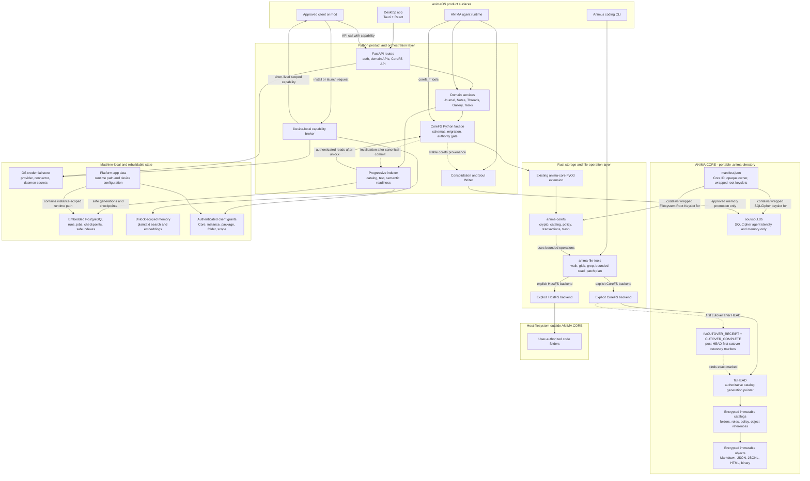
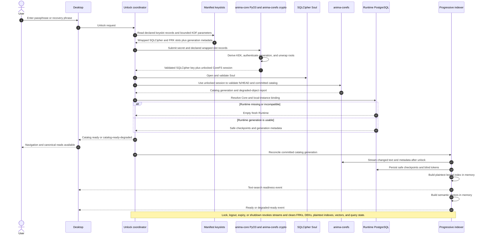
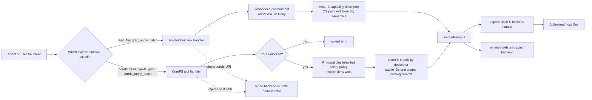
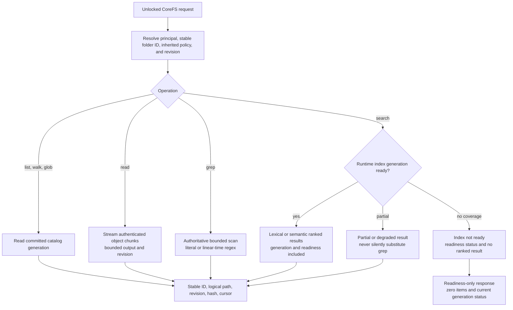
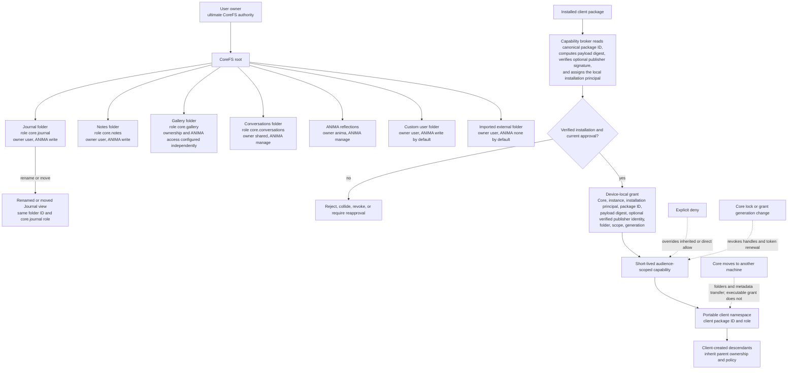
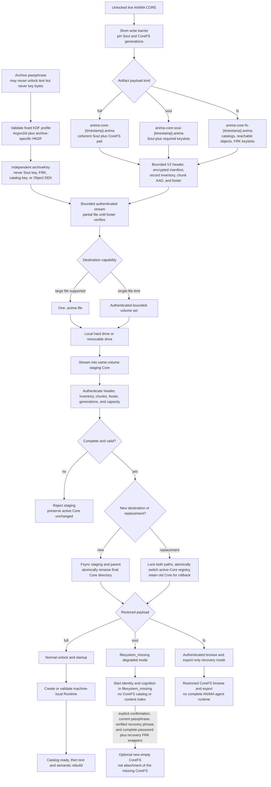

# ANIMA CORE Filesystem Target Architecture

> **Status: planned target architecture.** These diagrams describe the approved Portable Core Filesystem design and implementation sequence. They do not claim that the migration is already implemented.

**Normative sources:** [Portable Core Filesystem design](../../superpowers/specs/2026-07-12-portable-core-filesystem-design.md), [key hierarchy design](../../superpowers/specs/2026-07-12-portable-core-key-hierarchy-design.md), and [implementation plan](../../superpowers/plans/2026-07-12-portable-core-filesystem.md).

## 1. Complete System Topology

animaOS is the product. ANIMA CORE is the portable encrypted Soul-plus-CoreFS subsystem. Runtime PostgreSQL, installed-client grants, device configuration, and external credentials remain machine-local.



There is deliberately no CoreFS-to-host-files edge and no Runtime-to-canonical-catalog write edge. CoreFS cannot escape into an Animus folder, and Runtime cannot become canonical authority.

### Authority summary

| State | Canonical authority | Portable | Rebuildable |
|---|---|---:|---:|
| ANIMA identity, durable memories, self-model, relationship, growth | SQLCipher Soul | yes | no |
| Diary, notes, folders, threads, messages, gallery, attachments, tasks, portable preferences | encrypted CoreFS catalogs and objects | yes | no |
| Runs, jobs, queues, checkpoints, blind tokens, safe operational metadata | Runtime PostgreSQL | no | yes |
| Decrypted text index and semantic vectors | unlock-scoped process memory | no | yes |
| Client executable grants and machine configuration | authenticated platform app data | no | yes or reapproved |
| Provider, connector, and daemon secrets | OS credential store | no | reconfigured |

## 2. Unlock, Startup, and Progressive Reindexing

The Core becomes navigable before full-text and semantic indexing complete. A missing Runtime is a rebuild event, not data loss.



## 3. Explicit HostFS and CoreFS Tool Routing

The shared library reuses algorithms, not authority. Tool names and backend handles select the boundary explicitly; a path string never causes automatic routing.



## 4. Read, Grep, Search, and Atomic Mutation

### Read and discovery paths



### One-generation write and patch transaction

```mermaid
sequenceDiagram
    autonumber
    participant Caller
    participant Tools as anima-file-tools
    participant Core as anima-corefs
    participant Lock as Core-wide commit lock
    participant Store as Objects, catalogs, fs/HEAD, and cutover markers
    participant Index as Runtime indexer

    Caller->>Tools: write or multi-file apply_patch with expected revisions
    Tools->>Tools: Parse into typed mutation plan
    Tools->>Core: Submit complete plan
    Core->>Core: Resolve every stable ID and path
    Core->>Core: Preflight policy, deny rules, revisions, collisions, formats, and limits
    Core->>Core: Prepare encrypted immutable object revisions
    Core->>Store: Flush and atomically publish immutable object revisions
    Core->>Lock: Acquire exclusive commit lock
    Core->>Store: Reload authoritative generation
    Store-->>Core: Latest catalog and fs/HEAD
    Core->>Core: Revalidate every precondition

    alt Any precondition changed or failed
        Core->>Lock: Release lock
        Core-->>Caller: Structured conflict with unreferenced object garbage and no catalog generation
    else Complete plan remains valid
        Core->>Store: Publish encrypted catalog generation
        Core->>Store: Atomically replace and flush fs/HEAD
        opt First accepted post-migration mutation
            Core->>Store: Publish exact CUTOVER_RECEIPT then CUTOVER_COMPLETE
            Note over Core,Store: HEAD is already authoritative; marker failure returns recovery pending.
        end
        Core->>Lock: Release lock
        Core-->>Index: Invalidate committed generation
        Note over Core,Index: Index failure never rolls back the canonical commit.
        Core-->>Caller: New revisions, hashes, generation, atomic true
    end
```

### Catalog-bound key rotation

FRK activation is split deliberately across the credential coordinator and CoreFS. The credential side must first durably write and independently verify both pending password and recovery keyslots. Only then may it pass session-owned old/pending FRK subkeys into the CoreFS rotation transaction; CoreFS never persists those raw keys and does not promote manifest state itself.

```mermaid
sequenceDiagram
    autonumber
    participant Auth as Credential coordinator
    participant Core as anima-corefs
    participant Lock as Core-wide commit lock
    participant Store as Catalogs and fs/HEAD
    participant Runtime as Runtime indexer

    Auth->>Auth: Reload and verify pending password + recovery FRK slots
    Auth->>Core: Old/pending in-memory keyring + expected generation
    Core->>Lock: Acquire exclusive commit lock
    Core->>Store: Reload and authenticate HEAD/catalog with declared FRK version
    Core->>Core: Rewrap every retained Object DEK, including tombstones, under pending OKWK
    Note over Core: Object ciphertext, revision, hash, and key epoch stay unchanged
    Core->>Store: Publish complete encrypted catalog under pending FRK
    Core->>Store: Atomically replace and flush fs/HEAD with pending FRK version
    Core->>Lock: Release lock
    Core-->>Runtime: Invalidate committed generation
    Core-->>Auth: Published generation and required FRK version
    Auth->>Auth: Promote pending FRK; retain prior FRK decrypt-only
```

`fs/HEAD.requiredFrkVersion` is only a key-selection hint until the referenced encrypted catalog authenticates. During activation, a versioned in-memory keyring authenticates the new HEAD/catalog and the older immutable cutover markers with their own keys. After an old cutover key is legitimately retired, a strictly later authenticated catalog carrying the irreversible cutover marker preserves lineage; equal-generation or rollback-only inputs still require the old key and fail closed.

Targeted Object-DEK rotation is separate from FRK rewrap: it streams the authenticated current envelope into a complete new revision with a fresh Object DEK, fresh nonces, and incremented object-key epoch, then uses the normal prepared-revision/catalog commit path. A crash during FRK publication leaves the old HEAD authoritative or the complete pending-key HEAD readable—never a partially visible catalog generation.

Old-key retirement is not implied by successful activation. Authenticated retention inventory must show that no retained catalog HEAD or wrapped Object DEK still requires the retiring version, and a verified backup under the active version must exist. Physical catalog/object pruning and keyslot deletion remain the separately authenticated PCF-010 operation.

## 5. Folder Ownership, ANIMA Access, and Client Trust

Folder names and paths may change. Stable IDs and roles preserve app bindings; policy inheritance controls principals.



| Scope | Read | Create/edit | Rename/move/trash/restore | Policy/grants/reserved roles | Permanent purge/key retirement |
|---|---:|---:|---:|---:|---:|
| User after unlock | yes | yes | yes | yes | recent reauthentication and bound confirmation |
| ANIMA `none` | no | no | no | never | never |
| ANIMA `read` | yes | no | no | never | never |
| ANIMA `write` | yes | yes | no | never | never |
| ANIMA `manage` | yes | yes | yes | never | never |
| Client `read`/`write`/`manage` | by approved scope | by approved scope | `manage` only | never | never |

Normal deletion moves content into encrypted trash. `purge(trash_id, expected_trash_revision, confirmation)` is a separate user-only maintenance operation for already-trashed content after recent reauthentication; ANIMA and clients cannot call it even with `manage`.

## 6. Local Export, Transfer, Recovery, and Runtime Rebuild

One versioned streaming container supports complete, Soul-only, and CoreFS-only local artifacts. Cloud upload and sync remain out of scope.



## 7. Cross-Graph Invariants

1. SQLCipher Soul contains ANIMA's internal continuity, not canonical app-feature records.
2. CoreFS catalogs and objects are the only canonical authority for portable user content.
3. Runtime PostgreSQL may accelerate and coordinate work, but deleting it cannot delete canonical content.
4. CoreFS and HostFS share bounded algorithms while retaining distinct tools, principals, paths, and transaction guarantees.
5. All CoreFS access requires unlock plus principal policy; explicit deny wins and lock revokes every handle.
6. Multi-file CoreFS mutations publish one complete catalog generation or none.
7. Client content is portable; executable authorization is device-local and must be reapproved after transfer or package-digest change.
8. Soul and CoreFS use separate root keys and can enter explicit independent recovery states.
9. Export/import is local, streaming, authenticated, capacity-preflighted, and staged before activation.
10. Memory promotion from CoreFS into Soul occurs only through the existing candidate, consolidation, and Soul Writer boundary with stable provenance.
11. The transfer container derives an archive-specific key from bounded KDF parameters; it never reuses the Soul key, FRK, catalog key, or Object DEKs as its archive payload key.
12. FRK activation publishes one complete next catalog/HEAD generation; old FRKs remain decrypt-only until authenticated retention and backup gates permit PCF-010 retirement.
