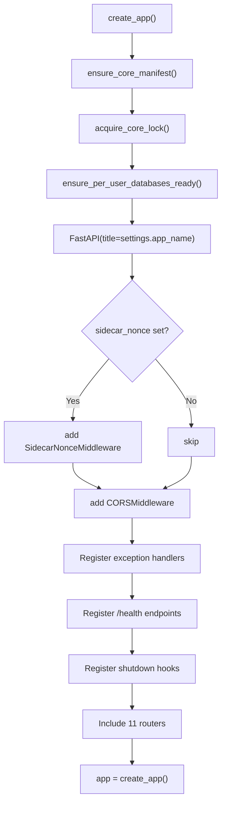

# Configuration & Startup

[Back to Index](README.md)

## Configuration (`config.py`)

All settings use the `ANIMA_` env prefix, loaded from `.env` / `.env.local` via Pydantic Settings.

### Key Settings

| Setting | Default | Purpose |
|---------|---------|---------|
| `ANIMA_DATA_DIR` | `.anima/dev` | Root data directory |
| `ANIMA_DATABASE_URL` | `sqlite:///.anima/dev/anima.db` | DB connection string |
| `ANIMA_AGENT_PROVIDER` | `ollama` | LLM provider (`ollama`, `openrouter`, `vllm`) |
| `ANIMA_AGENT_MODEL` | `qwen3.5:35b` | LLM model |
| `ANIMA_AGENT_MAX_STEPS` | `6` | Max tool-call steps per turn |
| `ANIMA_AGENT_MAX_TOKENS` | `4096` | Context window budget |
| `ANIMA_CORE_PASSPHRASE` | `""` | SQLCipher passphrase (empty = unified mode) |
| `ANIMA_CORE_REQUIRE_ENCRYPTION` | `true` | Fail if no encryption configured |
| `ANIMA_SIDECAR_NONCE` | `""` | Binds desktop to exact sidecar process |
| `ANIMA_AGENT_BACKGROUND_MEMORY_ENABLED` | `true` | Enable post-turn consolidation |
| `ANIMA_AGENT_LLM_TIMEOUT` | `120.0` | LLM call timeout (seconds) |
| `ANIMA_AGENT_COMPACTION_TRIGGER_RATIO` | `0.8` | Compact at 80% of context window |

## Startup Sequence (`main.py:63`)

### Startup Steps

1. **`ensure_core_manifest()`** (`core.py:32`): Creates/loads `.anima/dev/manifest.json` with core UUID, version, encryption mode, next_user_id.
2. **`acquire_core_lock()`**: File lock to prevent multiple server instances.
3. **`ensure_per_user_databases_ready()`** (`user_store.py`): Scans existing user directories, creates per-user SQLite databases, runs schema creation.
4. **Middleware**: `SidecarNonceMiddleware` (if nonce set) + `CORSMiddleware`.
5. **11 routers** mounted at `/api/` prefixes.
6. **Shutdown hooks**: drain background memory tasks, cancel pending reflections.

## Sidecar Nonce Binding

The `ANIMA_SIDECAR_NONCE` mechanism prevents rogue localhost processes from talking to the server. The Tauri desktop app generates a random nonce, passes it to the Python sidecar on launch, and includes it in every HTTP request via the `x-anima-nonce` header. The middleware rejects requests with mismatched nonces.
