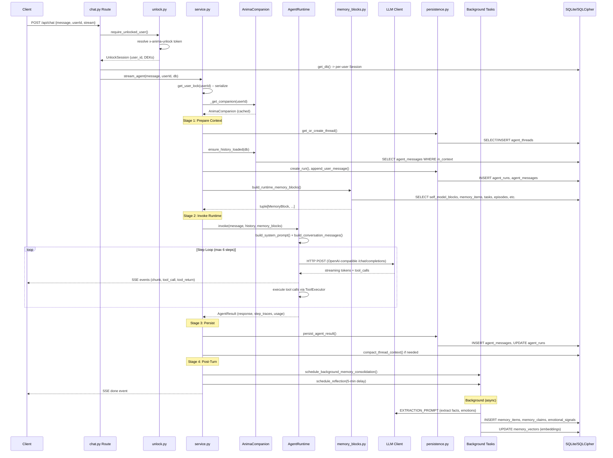

# Data Flow

[Back to Index](README.md)

## User Message: End-to-End Call Chain

```
HTTP POST /api/chat  (payload: { message, userId, stream })
  -> api/routes/chat.py:53  send_message()
    -> api/deps/unlock.py:26  require_unlocked_user(request, userId)
      -> sessions.py:40  UnlockSessionStore.resolve(token) -> UnlockSession
    -> db/session.py:283  get_db(request) -> Session (per-user SQLite DB)
    -> [if stream=false] services/agent/service.py:96  run_agent()
    -> [if stream=true]  services/agent/service.py:1022  stream_agent()
      -> service.py:341  _execute_agent_turn()
        -> turn_coordinator.py:20  get_user_lock(user_id)  # serialize per user
        -> service.py:356  _execute_agent_turn_locked()

          STAGE 1: PREPARE TURN CONTEXT (service.py:447)
            -> companion.py  _get_companion(user_id)  -> AnimaCompanion
            -> persistence.py  get_or_create_thread(db, user_id) -> AgentThread
            -> companion.py  ensure_history_loaded(db) -> list[StoredMessage]
            -> persistence.py  create_run() -> AgentRun
            -> sequencing.py   reserve_message_sequences()
            -> persistence.py  append_user_message() -> AgentMessage
            -> embeddings.py   hybrid_search(query=user_message) -> semantic results
            -> memory_blocks.py  build_runtime_memory_blocks() -> tuple[MemoryBlock,...]
              -> build_soul_biography_block()
              -> build_persona_block()
              -> build_human_core_block()
              -> build_user_directive_memory_block()
              -> build_self_model_memory_blocks()
              -> build_emotional_context_block()
              -> _build_semantic_block()
              -> build_facts_memory_block()
              -> build_preferences_memory_block()
              -> build_goals_memory_block()
              -> build_tasks_memory_block()
              -> build_relationships_memory_block()
              -> build_current_focus_memory_block()
              -> build_thread_summary_block()
              -> build_episodes_memory_block()
              -> build_session_memory_block()
            -> feedback_signals.py  collect_feedback_signals()
            -> _inject_memory_pressure_warning()

          STAGE 1b: PROACTIVE COMPACTION (service.py:693)
            -> compaction.py  compact_thread_context() if estimated tokens > threshold

          STAGE 2: INVOKE RUNTIME (service.py:610)
            -> tool_context.py  set_tool_context(ToolContext)
            -> runtime.py  AgentRuntime.invoke()
              -> system_prompt.py  build_system_prompt(context) -> str
              -> prompt_budget.py  plan_prompt_budget() -> PromptBudgetTrace
              -> messages.py  build_conversation_messages(history) -> list[dict]
              -> llm.py  create_llm() -> OpenAICompatibleChatClient
              -> [STEP LOOP, max agent_max_steps=6]:
                -> adapters/  LLM call (streaming or blocking)
                -> executor.py  ToolExecutor.execute(tool_calls) -> results
                  -> tools.py  [tool function] -> string result
                -> streaming.py  emit chunk/tool events via callback
              -> [if context overflow]: _emergency_compact() + retry

          STAGE 3: PERSIST RESULT (service.py:910)
            -> persistence.py  persist_agent_result() -> writes AgentMessages
            -> compaction.py  compact_thread_context_with_llm() (best-effort)
            -> compaction.py  compact_thread_context() (fallback)

          STAGE 4: POST-TURN HOOKS (service.py:990)
            -> consolidation.py  schedule_background_memory_consolidation()
              [async background task]:
                -> regex extraction (facts, preferences, focus)
                -> LLM extraction (EXTRACTION_PROMPT)
                -> claims.py  upsert_claim()
                -> emotional_intelligence.py  record emotional signals
                -> embeddings.py  generate + store embeddings
                -> episodes.py  create episodic memory
                -> memory_store.py  add_daily_log()
            -> reflection.py  schedule_reflection() (5-min delay)
              [async delayed task]:
                -> inner_monologue.py  run_deep_monologue()
                -> self_model.py  update self-model sections
```

## Sequence Diagram


