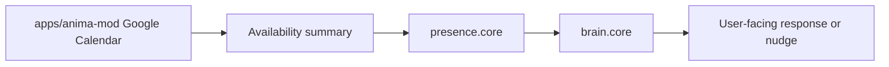

# External Integration Boundary

[Back to Architecture Index](../README.md)

[Related: Agent Capability Modules](../agent/capability-modules/README.md)

Agent Capability Modules are not the same thing as `apps/anima-mod`.

This distinction matters because they solve different problems.

```text
Capability Modules = ANIMA's internal body systems.
apps/anima-mod = external services and channels.
```

## Two Different Boundaries

| Boundary | Lives in | Purpose |
| --- | --- | --- |
| Capability Module | `apps/server` | Governs what ANIMA can sense, say, do, remember, or initiate |
| External Integration | `apps/anima-mod` | Connects ANIMA to third-party services, channels, and APIs |

Capability modules shape the agent runtime. External integrations connect the runtime to the outside world.

## Examples

| Need | Correct home |
| --- | --- |
| Webcam sight | `perception.camera` in `apps/server` |
| Microphone/speaker voice session | `voice.core` in `apps/server` |
| Local filesystem automation policy | `action.local` in `apps/server` |
| Gmail API adapter | `apps/anima-mod/mods/google` |
| Google Calendar API adapter | `apps/anima-mod/mods/google` |
| Telegram channel adapter | `apps/anima-mod` |
| Presence nudge policy | `presence.core` in `apps/server` |

## How They Work Together

External integrations can feed capability modules, but they do not become them.

Example:



The Google integration owns OAuth, API calls, refresh tokens, and provider-specific errors. Presence Core owns whether ANIMA is allowed to use availability context proactively.

## Why Not Put Camera In anima-mod?

Camera is not a third-party service. It is part of ANIMA's local body.

Putting camera perception in `apps/anima-mod` would blur:

- local hardware permission
- agent tool gating
- memory retention
- prompt capability status
- desktop bridge ownership
- sensory consent

Those are Brain System adjacency concerns, so the module belongs inside FastAPI.

## When An Integration Becomes Capability Context

An external integration can expose data to a capability module through a narrow summary boundary.

Good:

```text
Calendar integration returns "user has meetings from 10:00-12:00."
presence.core decides whether a reminder is appropriate.
```

Risky:

```text
Calendar integration directly injects proactive messages into chat.
```

The agent service should remain the policy center.

## Tool Ownership

An integration may provide thin tools such as:

- search Gmail
- create calendar event
- send Telegram message

Those tools should still be gated by relevant capability policy when they affect ANIMA's body-level agency.

For example:

- reading calendar data can be an integration tool
- proactively nudging based on calendar data is Presence policy
- sending an email is Action policy plus integration execution

## Memory Boundary

External services can produce memory candidates, but Memory Core remains the promotion boundary.

Example:

```text
Gmail thread suggests user is planning a conference talk.
Integration extracts candidate evidence.
Memory Core decides whether it becomes durable memory.
```

The external service is evidence. It is not the soul writer.

## Future Rule Of Thumb

Ask this when placing new work:

```text
Is this about connecting to an outside service,
or about what ANIMA is allowed to perceive/do/be?
```

If it is a provider/channel/API adapter, start in `apps/anima-mod`.

If it changes ANIMA's senses, voice, local action, memory authority, or proactive presence, start as a FastAPI capability module.
