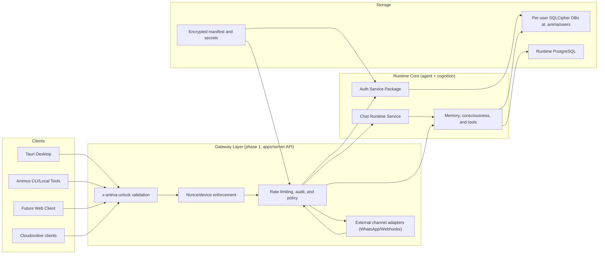
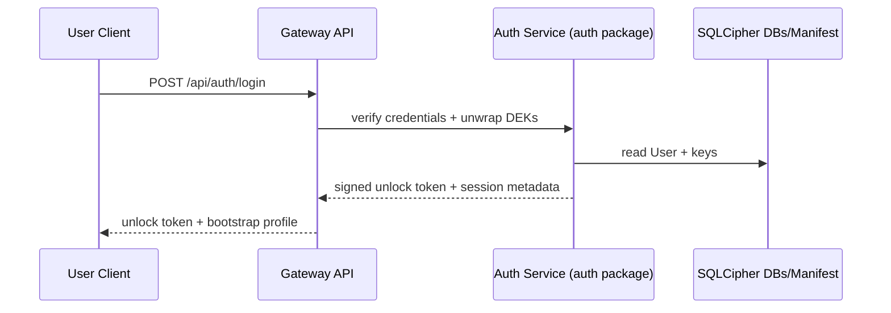
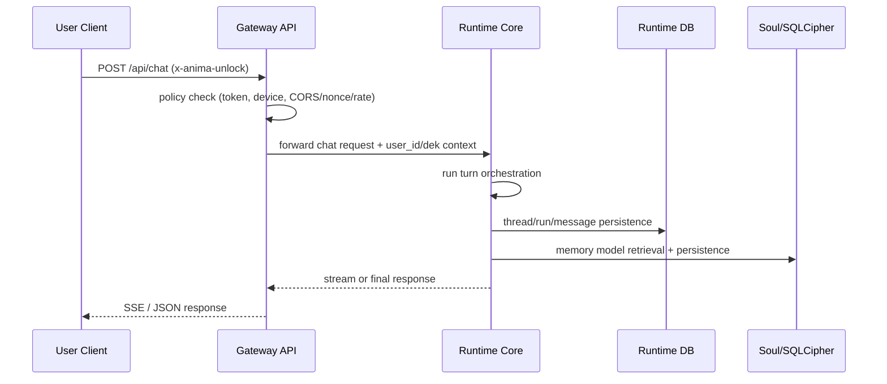

# Gateway + Runtime Boundary

[Back to Index](../README.md)

## Goal

Keep the current local execution model intact, while making a clean path to online delivery.
The architecture separates:

- **Gateway/API layer**: security, sessions, device trust, protocol adaptations.
- **Runtime core**: cognition, memory, threads, and storage orchestration.

Runtime implementation stays in one place, while policy and ingress adaptation can evolve independently.

## Runtime Boundary

The current `apps/server` code base should be treated as **Runtime Core** plus the phase-1 API gateway. Runtime-facing code should expose narrow internal use-cases and assume the caller has already authenticated and attached request context.

- API routes become ingress shims.
- Session/identity checks stay in a dedicated gateway-oriented auth service.
- Tooling and chat flow remain in the existing service layer.

### Boundary invariants

- Phase 1 stays same-process inside `apps/server`; separation is logical first, physical later.
- Runtime services receive a typed request context, not raw HTTP request state.
- Gateway policy may validate tokens, devices, nonces, rate limits, and channel signatures.
- Runtime code owns cognition, memory retrieval, tools, thread state, and persistence decisions.
- Public gateway code must not persist or log passphrases, raw DEKs, provider secrets, or memory payloads outside the existing encrypted/runtime stores.

### Recommended logical packages (incremental)

- Planned auth package under apps/server/src/anima_server/auth/
  Identity primitives and password/session policy extracted from service code.
- Planned agent runtime facade under apps/server/src/anima_server/agent_runtime/ or existing `services/agent/*`
  Chat/decision/runtime orchestration.
- `apps/server/src/anima_server/api/`
  Thin request/response boundary; no cross-cutting auth policy beyond token validation.

## High-Level Design

## Request Flow

### Login/Unlock

### Chat

## Why this boundary is needed

- Single-user machine remains the default deployment.
- Multi-device onboarding is an extension: run gateway in front, keep runtime local or move it to managed hosts later.
- Third-party integrations do not require touching cognition internals; they become gateway adapters.
- Auditability and policy controls are centralized at ingress.

## Making the system online (end-to-end map)

1. Host `apps/server` as an HTTPS service for desktop/web clients.
2. Add per-client token/session policy in the gateway layer:
   - device binding
   - token refresh/revocation
   - optional rate limiting
3. Use a shared secret/PKI for webhook adapters.
4. Keep `.anima` ownership local in phase 1 (portable single-instance model) or route to a managed runtime host in phase 2.
5. Add adapter-specific ingress contracts that normalize external payloads into the internal chat request shape.
6. Ensure request tracing and telemetry spans cover both gateway and runtime paths.

## Deployment Modes

### Mode 1: Local desktop default

- `apps/server` runs locally.
- Tauri desktop and local tools call the local API.
- `x-anima-unlock` remains supported through the compatibility bridge.
- No external gateway app is required.

### Mode 2: Online-facing server

- `apps/server` runs behind HTTPS and acts as both gateway and runtime host.
- Gateway middleware enforces sessions, devices, nonces, rate limits, and trace IDs before runtime code runs.
- This is the first online-capable milestone because it avoids adding a second service boundary too early.

### Mode 3: Dedicated public gateway

- A future edge app handles public auth, channels, webhook verification, rate limits, and request normalization.
- `apps/server` becomes a private runtime API behind that gateway.
- This mode should wait until the internal gateway-to-runtime contract is stable.

## Core Contracts

| Contract | Purpose | First owner |
| --- | --- | --- |
| Request context | Carries user, device, session, channel, and trace metadata from gateway to runtime | planned auth package |
| Runtime invocation | Normalized chat/task request shape used by desktop, web, CLI, and adapters | `apps/server` service layer |
| Device/session policy | Device enrollment, revocation, token rotation, nonce/replay checks | gateway auth service |
| External ingress | Provider-specific webhook input normalized into runtime invocation | gateway routes/adapters |
| Outbound adapter | Runtime output mapped back to provider-specific channel payloads | `apps/anima-mod` or gateway adapter |

## Current Tech Stack Map

### Runtime Core (already in repo)

- Python runtime: `FastAPI` (`fastapi`), async-friendly endpoint model
- LLM runtime orchestration: local service layer under `anima_server/services/agent/*`
- Data layer:
  - `SQLAlchemy 2` ORM
  - `sqlcipher3` for encrypted per-user soul DBs
  - PostgreSQL runtime store via `psycopg` / `asyncpg` + `pgvector`
- Auth/data protection:
  - `argon2-cffi` + `cryptography`
  - existing unlock/session/dek model in `anima_server/services/sessions.py`
- Local bootstrap/runtime infra:
  - `pgserver` embedded PG option
  - file-backed manifest (`.anima/`) boot flow
- Async/background execution:
  - local task scheduling in Python services
- API contracts:
  - shared TS contracts in `packages/anima-auth-contracts`, `packages/api-client`
- Frontend client:
  - `desktop` uses `@anima/api-client` and `Tauri`

### Gateway Layer (what to centralize here)

- HTTP API ingress: can start inside `apps/server` (same process) while separating logic by layer.
- This checkout does not currently include a dedicated public gateway app; phase 1 work should target `apps/server` unless a new gateway app is explicitly introduced.
- Online-facing gateway (future option after the boundary is stable):
  - a dedicated public gateway app (for example Bun + Hono or FastAPI edge)
  - dedicated auth/session middleware
  - rate limiting
  - device trust and token checks
  - webhook adapters and payload normalizers
- Service bridge:
  - internal REST/gRPC contract from gateway to runtime core

### Missing / planned for online delivery

- Identity session hardening:
  - token revocation store with short TTL and fan-out
  - device registry + key rotation endpoints
- Observability:
  - request tracing with correlation IDs across gateway + runtime
  - unified structured logs (JSON) + metrics
- Security controls:
  - webhook signature verification and replay protection
  - abuse/rate controls at gateway
  - audit log retention policy
- Stateful online runtime ops:
  - managed PostgreSQL in production mode (external host not local `pgserver`)
  - external cache/store for short-lived sessions (Redis class)
  - optional queue for long-running background jobs if runtime and gateway separate at scale
- Delivery primitives:
  - HTTPS/TLS termination + reverse proxy
  - deployment manifests (Docker/Compose/K8s), health/readiness probes

### Practical split order (lowest risk)

1. Keep runtime in `apps/server` and add strict gateway-style boundaries in code structure.
2. Extract auth primitives and define the typed request context.
3. Define the internal runtime invocation contract used after gateway validation.
4. Add gateway middleware, compatibility auth bridge, and trace propagation.
5. Add device lifecycle, revocation, nonce/replay, and rate policy.
6. Add adapter contracts (`/api/webhook/*`, `.../agent/*`, etc.).
7. When stable, optionally add a dedicated public edge app and keep `apps/server` as the private runtime API.
