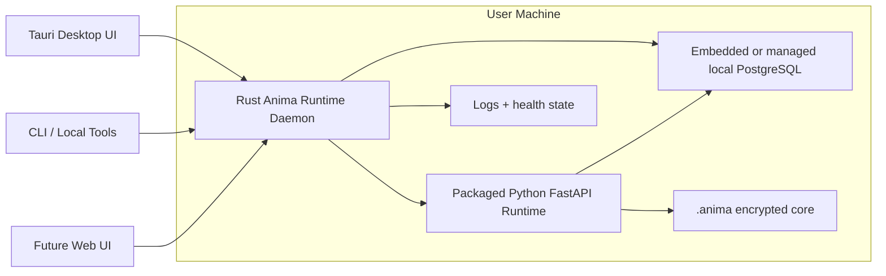

# Local Runtime Daemon

[Back to Index](../README.md)

## Goal

Keep Anima alive locally even when the desktop window is closed.

The desktop app should become a control surface. The runtime should be supervised by a local background daemon that can start on login, keep the server healthy, and expose a small local control surface to official clients.

## Decision

Use a Rust daemon/supervisor for the normal desktop product.

Do not use Docker as the default local desktop runtime. Docker remains useful for self-hosted/server deployments, but it is too heavy for normal users, has poor consumer-desktop ergonomics, and does not solve OS-native lifecycle concerns like login startup, tray state, local IPC, crash recovery, and installer integration.

## Process Shape

## Responsibilities

### Rust daemon

- Start, stop, and restart the packaged Python runtime.
- Keep runtime bound to localhost unless explicit online mode is enabled.
- Own local control IPC/API for desktop and CLI clients.
- Generate and rotate local sidecar nonce/session material.
- Manage autostart/login integration.
- Track health, logs, PID files, ports, and crash recovery.
- Expose runtime status to the desktop UI.

### Python runtime

- Keep cognition, memory, tools, SQLCipher, runtime DB, and API behavior.
- Remain the source of runtime business logic.
- Avoid owning OS lifecycle concerns.

### Tauri desktop

- Render the UI.
- Open, hide, or quit the window without implicitly killing the runtime.
- Ask the daemon for status and runtime control operations.
- Offer user-facing controls for background mode, lock, restart, and diagnostics.

## Security Rules

- Closing the UI must not silently change unlock state.
- The daemon must define explicit lock/unlock policy for background work.
- If the core is locked, background jobs that need decrypted memory must pause.
- Local control endpoints must require daemon-issued local credentials or IPC permissions.
- Passphrases, raw DEKs, provider secrets, and durable memory payloads must not be written to daemon logs.
- Online exposure must go through the gateway/session/device policy, not raw daemon ports.

## Deployment Modes

### Local desktop mode

- Rust daemon installed with the desktop app.
- Python runtime packaged as a managed child process.
- Runtime starts on login if the user enables background mode.
- Desktop close hides/quits UI only; daemon continues based on user preference.

### Developer mode

- `bun dev` remains for repo development.
- Daemon can be bypassed while developing server/desktop.

### Self-hosted/server mode

- Docker Compose is acceptable here.
- Compose should run server dependencies and online-mode service topology.
- This is separate from the desktop daemon path.

## First Build Order

1. Define daemon control contract and runtime lifecycle states.
2. Scaffold Rust daemon binary.
3. Package or locate the Python runtime artifact the daemon supervises.
4. Add health checks, logs, restart policy, and local credentials.
5. Integrate Tauri with daemon status/control.
6. Add OS-specific autostart/service installation.
7. Add lock/unlock/background-job policy.
8. Add installer and release packaging.
