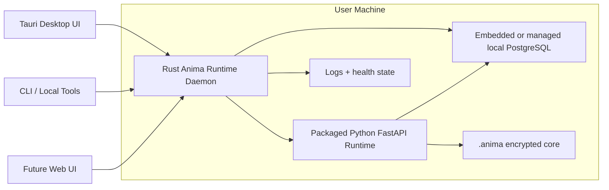

# Local Runtime Daemon

[Back to Index](../README.md)

## Goal

Keep Anima alive locally even when the desktop window is closed.

The desktop app should become a control surface. The runtime should be supervised by a local background daemon that can start on login, keep the server healthy, and expose a small local control surface to official clients.

## Decision

Use a Rust daemon/supervisor for the normal desktop product.

Do not use Docker as the default local desktop runtime. Docker remains useful for self-hosted/server deployments, but it is too heavy for normal users, has poor consumer-desktop ergonomics, and does not solve OS-native lifecycle concerns like login startup, tray state, local IPC, crash recovery, and installer integration.

## Process Shape



## Responsibilities

### Rust daemon

- Start, stop, and restart the packaged Python runtime.
- Keep runtime bound to localhost unless explicit online mode is enabled.
- Own local control IPC/API for desktop and CLI clients.
- Generate and rotate local sidecar nonce/session material.
- Manage autostart/login integration.
- Track health, logs, PID files, ports, and crash recovery.
- Expose runtime status to the desktop UI.

### Python runtime

- Keep cognition, memory, tools, SQLCipher, runtime DB, and API behavior.
- Remain the source of runtime business logic.
- Avoid owning OS lifecycle concerns.

### Tauri desktop

- Render the UI.
- Open, hide, or quit the window without implicitly killing the runtime.
- Ask the daemon for status and runtime control operations.
- Offer user-facing controls for background mode, lock, restart, and diagnostics.

## Build, Run, and Package

The daemon is the Rust workspace crate in `apps/local-runtime-daemon`. Build it from the repository root.

### Development build

```powershell
cargo build -p anima-local-runtime-daemon
```

The debug binary is written under the workspace `target/debug` directory. On Windows the executable name is:

```text
target/debug/anima-local-runtime-daemon.exe
```

### Release build

```powershell
cargo build -p anima-local-runtime-daemon --release
```

The release binary is written under the workspace `target/release` directory. On Windows the executable name is:

```text
target/release/anima-local-runtime-daemon.exe
```

### Run directly

```powershell
cargo run -p anima-local-runtime-daemon
```

By default the daemon binds its local control API to `127.0.0.1:3032` and supervises the Python runtime on `127.0.0.1:3031`. If no explicit runtime launcher is configured, it starts the runtime through the repository source with:

```powershell
uv run --project apps/server uvicorn anima_server.main:app --app-dir apps/server/src --host 127.0.0.1 --port 3031
```

The daemon data directory defaults to the platform data directory under `anima/runtime-daemon`, with a fallback to `.anima/runtime-daemon` when no platform data directory is available. Override it with `ANIMA_DAEMON_DATA_DIR` when isolating local test runs.

The daemon writes `runtime-daemon.control-token` into its data directory. Desktop and local clients use that token through the `x-anima-daemon-token` header for control operations.

### Desktop release staging

For desktop packaging, run the release preparation script from the desktop app:

```powershell
cd apps/desktop
bun run prepare:release
```

That script builds the daemon in release mode, writes runtime daemon release metadata, stages daemon artifacts under the local `.anima` release metadata directory, and stages bundled desktop resources under `apps/desktop/src-tauri/resources/.anima`.

The desktop package scripts call the same release preparation path before Tauri builds:

```powershell
cd apps/desktop
bun run package
```

Use `bun run package:app` for an app-only Tauri bundle.

### Useful environment overrides

| Variable | Purpose |
| --- | --- |
| `ANIMA_DAEMON_BIND_HOST` | Override the daemon control API host. Defaults to `127.0.0.1`. |
| `ANIMA_DAEMON_BIND_PORT` | Override the daemon control API port. Defaults to `3032`. |
| `ANIMA_DAEMON_RUNTIME_HOST` | Override the supervised runtime host. Defaults to `127.0.0.1`. |
| `ANIMA_DAEMON_RUNTIME_PORT` | Override the supervised runtime port. Defaults to `3031`. |
| `ANIMA_DAEMON_RUNTIME_COMMAND` | Use an explicit command to start the Python runtime. |
| `ANIMA_DAEMON_RUNTIME_LAUNCH_MODE` | Select `python`, `command`, or `artifact` launch behavior. |
| `ANIMA_DAEMON_RUNTIME_ARTIFACT` | Point the daemon at a runtime artifact or Python entrypoint. |
| `ANIMA_DAEMON_RUNTIME_WORKDIR` | Set the working directory used when launching the runtime. |
| `ANIMA_DAEMON_DATA_DIR` | Set the daemon state, token, PID, port, and log directory. |
| `ANIMA_DAEMON_CONTROL_TOKEN` | Provide a fixed local control token instead of generating one. |

## Security Rules

- Closing the UI must not silently change unlock state.
- The daemon must define explicit lock/unlock policy for background work.
- If the core is locked, background jobs that need decrypted memory must pause.
- Local control endpoints must require daemon-issued local credentials or IPC permissions.
- Passphrases, raw DEKs, provider secrets, and durable memory payloads must not be written to daemon logs.
- Online exposure must go through the gateway/session/device policy, not raw daemon ports.

## Deployment Modes

### Local desktop mode

- Rust daemon installed with the desktop app.
- Python runtime packaged as a managed child process.
- Runtime starts on login if the user enables background mode.
- Desktop close hides/quits UI only; daemon continues based on user preference.

### Developer mode

- `bun dev` remains for repo development.
- Daemon can be bypassed while developing server/desktop.

### Self-hosted/server mode

- Docker Compose is acceptable here.
- Compose should run server dependencies and online-mode service topology.
- This is separate from the desktop daemon path.

## First Build Order

1. Define daemon control contract and runtime lifecycle states.
2. Scaffold Rust daemon binary.
3. Package or locate the Python runtime artifact the daemon supervises.
4. Add health checks, logs, restart policy, and local credentials.
5. Integrate Tauri with daemon status/control.
6. Add OS-specific autostart/service installation.
7. Add lock/unlock/background-job policy.
8. Add installer and release packaging.
