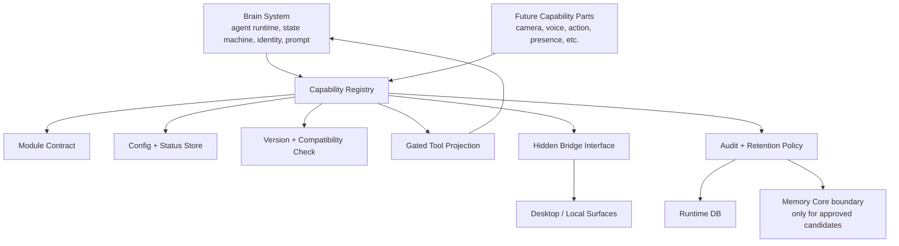

# Agent Capability Modules v1

**Status:** Draft
**Date:** 2026-06-29
**Owner:** AnimaOS Engineering

## Summary

Agent Capability Modules are optional bolt-ons inside the FastAPI agent service. This PRD defines the base module standard: the contract, registry, lifecycle, compatibility, config, status, tool gating, bridge, audit, and retention rules that future capability parts use.

This is the factory/standard layer first. It is not the Camera module, Voice module, Memory module, or any other specific module implementation.

The mental model is:

- **Brain System:** the `brain.core` agent runtime and state machine that hosts the capability module standard. It is not implemented by this module-standard ticket.
- **Capability Module Standard:** the base factory/contract for registering, configuring, gating, upgrading, and auditing capability parts.
- **Capability Modules:** future governed systems such as perception, voice, action, presence, and other body-system parts.
- **Desktop Bridges:** local device surfaces that provide hardware access when a module needs the user's machine.
- **Upgradeable Build:** Brain System and Capability Modules are versioned parts around the Portable Core. The Core carries identity; runtime/modules can update around it.

This is different from `apps/anima-mod`. `anima-mod` is the external integration layer for channels and third-party services. Agent Capability Modules live inside `apps/server` and shape ANIMA's cognitive/body runtime.

The product doctrine is:

```text
The self is continuous.
The body is modular.
Each body system is governed.
```

ANIMA should remain one identity even as optional body systems are added or removed. A capability part extends the same agent runtime; it does not create a separate agent identity.

## Naming Decision

Use **Capability Modules** as the formal architecture name.

Use **Perception Module**, **Voice Module**, **Memory Module**, etc. for specific capability families.

Avoid metaphor-heavy names in code or docs. The product language can say "bolt-on body systems"; the code should say `capabilities`.

Example ids that can consume the standard later:

| Family | Module id | Purpose |
| --- | --- | --- |
| Brain | `brain.core` | Host runtime; not implemented by this standard |
| Memory | `memory.core` | Durable memory and recall boundary; not the first base deliverable |
| Perception | `perception.camera` | Optional webcam perception |
| Perception | `perception.screen` | Future explicit screen/window perception |
| Voice | `voice.core` | Optional STT/TTS conversation surface |
| Action | `action.local` | Optional local action/tool execution |
| Presence | `presence.core` | Optional proactive/context signals |

## Product Goals

1. Keep ANIMA's core small, stable, and portable.
2. Make sensitive capabilities opt-in and governable.
3. Give each module a clear lifecycle: installed, enabled, configured, available, degraded, disabled.
4. Gate agent tools based on enabled modules and runtime availability.
5. Preserve local-first ownership and memory boundaries.
6. Support hardware-backed capabilities through explicit desktop bridges.
7. Avoid mixing external service integrations with internal body/cognition modules.
8. Preserve one continuous ANIMA identity across different enabled module sets.
9. Allow Brain System and modules to evolve through explicit version and compatibility checks.
10. Define the base module standard before implementing any specific capability module.

## Architecture



## Module Contract

Each module should declare:

- `id`: stable dotted id, such as `perception.camera`
- `version`: module implementation version
- `contractVersion`: capability manifest/tool contract version
- `family`: memory, perception, voice, action, presence
- `displayName`: user-facing name
- `description`: short explanation
- `required`: whether the module or host-surface manifest is mandatory in a given runtime
- `defaultEnabled`: false for sensitive modules
- `minBrainVersion`: oldest Brain System version the module supports
- `maxBrainVersion`: optional upper bound for future incompatible Brain System versions
- `configSchemaVersion`: version of persisted module config shape
- `configSchema`: typed settings exposed to desktop
- `runtimeStatus`: available, unavailable, degraded, disabled
- `toolSchemas`: agent-visible tools, gated by module policy
- `bridgeRequirements`: optional desktop/hardware requirements
- `memoryPolicy`: whether module outputs can enter runtime, archive, or soul
- `auditPolicy`: what events must be recorded
- `migrations`: config/runtime migrations for module upgrades

## Host Runtime Boundary

Brain System is the host runtime. The capability standard attaches to it but does not replace it.

Brain System remains responsible for:

- turn orchestration
- prompt and memory block assembly
- tool rule enforcement
- approval flow
- final response policy
- provider/model configuration
- soul/runtime/archive write boundaries
- module registry loading

Capability modules attach to this state machine through manifests, status resolution, gated tools, module handlers, audit hooks, and memory-candidate boundaries.

## Capability Registry

The registry is a server-side service under `apps/server/src/anima_server/services/agent/capabilities/`.

Responsibilities:

- load built-in module manifests
- read enabled/config state from local runtime settings
- expose module status to desktop
- expose module-specific tools only when policy permits
- make unavailable modules fail clearly
- provide audit hooks
- check Brain System/module compatibility before tool exposure
- run or report config/runtime migrations during upgrades

This registry can later support user-installed modules. v1 should focus on the standard and built-in registration path only, with simple fixture/reference manifests for tests if needed.

## Upgrade And Compatibility

Brain System updates, module upgrades, and Core migrations are separate events.

| Event | Meaning |
| --- | --- |
| Brain System update | Agent runtime/state-machine code changes |
| Module upgrade | A Capability Module version changes |
| Bridge/provider update | Local hardware/provider surface changes |
| Core migration | Durable identity/memory/archive schema changes |

Core migrations must be deliberate because they touch the user's durable identity. Brain System and module updates can be more frequent, but must still pass compatibility checks before enabling tools.

## Desktop Bridge Pattern

Some modules need local machine access. The server cannot own those permissions directly.

Future examples:

- `perception.camera` needs webcam permission.
- `voice.core` needs microphone/speaker access.
- `perception.screen` needs screen/window capture permission.
- `action.local` may need filesystem/process access.

Pattern:

1. Server module declares bridge requirement.
2. Desktop reads module config/status while unlocked.
3. Desktop registers a hidden bridge action over the existing client-action channel or a future dedicated bridge channel.
4. Server module calls hidden bridge actions.
5. Raw device data remains transient unless module policy says otherwise.

## Tool Gating

Tools should be visible only when:

- the module is installed/built in,
- enabled by the user,
- configured sufficiently,
- unlocked for the active user,
- required desktop bridge is connected if needed,
- model/provider capability is sufficient if needed.

The LLM should not see lower-level bridge primitives. It should see module-level tools such as `view_camera_snapshot`, not `camera_capture_frame`.

## Memory And Retention

Modules must declare output retention:

| Retention | Meaning |
| --- | --- |
| `transient` | Used for the current tool call/turn only |
| `runtime` | Stored in operational runtime tables |
| `archive` | Stored in encrypted transcript/archive |
| `soul_candidate` | Proposed for durable memory, requires promotion |
| `soul` | Durable memory, only through approved write boundary |

Sensitive modules default to `transient` or `runtime`, not `soul`.

Module outputs are evidence, not identity. A body system may produce observations, transcripts, action results, or ambient signals, but durable learning still crosses the Memory Core and Soul Writer boundary.

## Future Module Families

These are examples of families that will consume the standard. They are not all part of the base implementation.

### `brain.core`

Host runtime. It is represented for status/compatibility but not implemented as an optional module.

### `memory.core`

Memory boundary. It may expose status/compatibility later, but the base module standard does not implement memory.

### `perception.camera`

Optional. Gives one-frame webcam perception through a desktop bridge.

### `voice.core`

Optional. Owns STT/TTS providers, voice sessions, push-to-talk/continuous listening policy, and audio retention.

### `action.local`

Optional. Owns local execution/automation capabilities and approval policy.

### `presence.core`

Optional or partially optional. Owns proactive context, nudges, and ambient state.

## Success Criteria

- The base module standard exists before specific capability modules are implemented.
- Optional sensitive modules can be disabled by default when they are added later.
- Brain System can run without perception or voice modules.
- Agent-visible tools are derived from enabled module policy.
- Hidden bridge primitives are never direct model tools.
- Desktop can show module status and configuration.
- Audit records explain when a module was used without storing raw sensitive payloads.
- Optional modules do not create separate agent identities or bypass Memory Core.
- Module status can be compactly exposed to the prompt so ANIMA knows which body systems are currently available.
- Incompatible or migration-failed modules do not expose tools.

## Reference Architecture Docs

- [Agent Capability Modules](../../architecture/agent/capability-modules/README.md)
- [Body System Doctrine](../../architecture/agent/capability-modules/body-system-doctrine.md)
- [Capability Runtime Flow](../../architecture/agent/capability-modules/runtime-flow.md)
- [Capability Data Boundaries](../../architecture/agent/capability-modules/data-boundaries.md)
- [Module Authoring Guide](../../architecture/agent/capability-modules/module-authoring-guide.md)
- [Upgrade And Compatibility Model](../../architecture/agent/capability-modules/upgrade-and-compatibility.md)

## Out Of Scope

- Public user-installed module marketplace.
- Remote cloud module hosting.
- Replacing `apps/anima-mod` external integrations.
- Making memory optional in a way that breaks ANIMA's identity thesis.
- Continuous background sensors by default.
- Implementing Camera Perception, Voice, Action, Presence, or Memory as part of the base standard.
