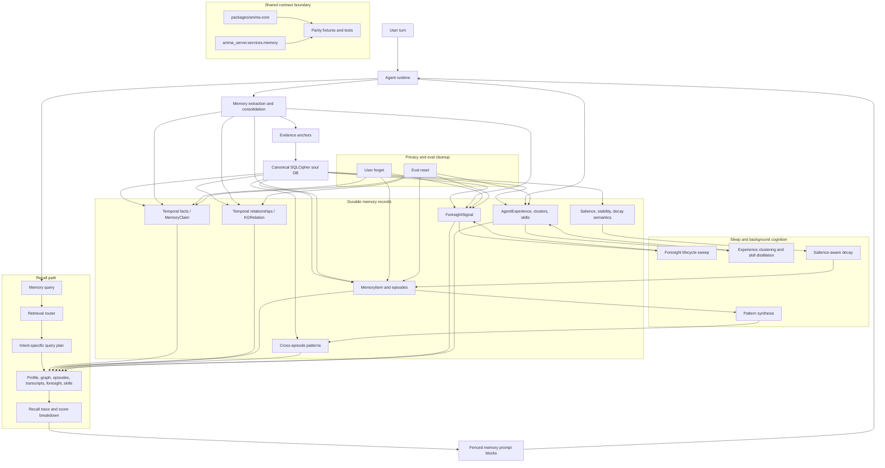
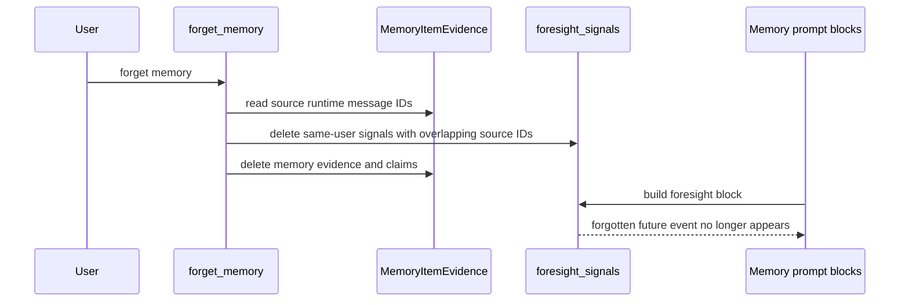

# Single-User Temporal Memory v2

**Status:** Draft
**Date:** 2026-06-27
**Owner:** AnimaOS Engineering
**Related plan:** [2026-06-27 Single-User Temporal Memory v2](../../superpowers/plans/2026-06-27-single-user-temporal-memory-v2.md)

## Summary

Anima should optimize memory for one long-lived human relationship, not multi-tenant SaaS scale. This version upgrades the memory system toward a local-first temporal cognitive memory engine: evidence-backed, graph-aware, emotionally calibrated, and able to synthesize patterns across years of interaction.

## Context

The existing memory foundation is strong: encrypted durable soul storage, runtime retrieval indexes, hybrid search, heat scoring, knowledge graph tables, episodes, reflection, sleep-time orchestration, intentional forgetting, and provenance primitives.

The remaining gap is the cognitive layer. Current memory can store and retrieve facts, but the system needs stronger semantics for personal continuity:

- Facts should be backed by source evidence.
- Relationships and preferences should evolve over time instead of only being superseded.
- Emotionally salient memories should decay more slowly than casual observations.
- Retrieval should choose different strategies based on user intent.
- Background synthesis should discover recurring patterns across episodes.
- Procedural experience should become reusable skill memory.

External frameworks are useful references, not target dependencies. Graphiti demonstrates the value of temporal graph memory. Weaviate demonstrates production-grade hybrid/vector retrieval patterns. Anima should adopt the useful semantics while preserving the `.anima/` local-first architecture.

## Scale Model

This PRD targets one primary user and one agent identity.

Design for:

- 5 to 10 years of daily use.
- Hundreds of thousands to a few million messages.
- Tens of thousands of durable memory items and episodes.
- Thousands of entities.
- Tens or hundreds of thousands of temporal relations.
- Local-first operation on a normal laptop.

This is not a plan for multi-user shared memory. F14 remains useful later, but it is not in the critical path for this version.

## Product Goals

1. Improve personal recall quality for facts, episodes, relationships, preferences, and active projects.
2. Preserve continuity across time by modeling memory evolution, not only contradiction.
3. Let Anima recognize repeated patterns across conversations.
4. Let emotionally important events remain available even when old.
5. Keep all canonical memory local, encrypted, portable, and inspectable.
6. Use external memory engines only as optional adapters after native semantics are stable.

## What This Version Delivers

### Evidence-First Memory

Every durable memory class should either carry direct evidence or be derived from evidence-backed rows. This includes memory items, profile fields, graph relations, foresight signals, and future procedural memories.

### Temporal Knowledge Graph Upgrade

The existing knowledge graph should become temporal:

- entities support alias and embedding-based deduplication
- relations have observed time and optional valid time
- relations carry evidence and confidence
- evolving relations are chained instead of treated only as binary conflicts
- graph retrieval can explain why a relation is believed

### Structured User Profile

The user profile should become a typed, evidence-backed profile with categories such as identity, relationships, work, preferences, goals, values, health/context constraints, and emotional patterns.

### Retrieval Intent Routing

Before retrieval, the system should infer what kind of memory the current turn needs:

- factual recall
- emotional support
- relationship context
- project continuity
- preference lookup
- future commitment recall
- contradiction or update handling
- procedural skill recall

The router should produce a query plan that combines the right sources: profile, graph, memory items, episodes, transcripts, foresight, or experience/skill memory.

### Salience-Aware Decay

Memory decay should depend on the kind of memory:

- identity facts decay very slowly
- grief, trauma, and major life events decay very slowly
- relationships decay slowly and refresh on mention
- active projects decay moderately
- casual observations decay quickly
- transient states use explicit expiry

### Cross-Episode Pattern Synthesis

A sleep-time synthesis pass should periodically ask what patterns recur across recent and older episodes. Outputs should include recurring stressors, repeated goals, avoidance loops, emotional rhythms, unresolved threads, and changing preferences.

### Foresight and Commitments

Future-oriented statements should be captured as foresight signals with lifecycle states such as active, due, occurred, stale, or cancelled.

### Procedural Experience and Skills

Agent experiences should be extracted, clustered, and distilled into reusable skills. This lets Anima learn how to work with this specific user over time.

## Architecture Rules

1. SQLCipher soul storage remains canonical.
2. Runtime PostgreSQL, pgvector, BM25, Rust retrieval indexes, and any future Weaviate/Qdrant/LanceDB integration are rebuildable indexes.
3. No mandatory Neo4j, Weaviate, Graphiti, Redis, or hosted vector service.
4. Main conversation latency stays protected. Expensive synthesis runs in sleep-time or idle tasks.
5. Derived memories must point to source evidence where practical.
6. User-facing inspection and correction remain first-class product requirements.
7. Multi-user/group memory stays out of scope for this version.

## Architecture Snapshot

## Success Metrics

| Metric | Target | Measurement |
| --- | --- | --- |
| Evidence coverage | At least 95 percent of active MemoryItem rows have evidence | DB audit |
| Profile grounding | 100 percent of profile fields link to evidence | DB audit and tests |
| Temporal graph grounding | 90 percent of active KG relations link to evidence | DB audit |
| Intent routing quality | 90 percent correct route on deterministic fixture set | Unit/eval tests |
| Recall improvement | Better top-k recall than current baseline on local memory probes | Regression eval |
| Pattern synthesis usefulness | Recurrent patterns appear after repeated evidence, not single mentions | Golden tests |
| Conversation latency | No material increase to main turn latency from sleep-only features | Timing tests |
| Portability | Memory export/import preserves profile, graph, foresight, and evidence | Integration test |

## Out Of Scope

- Multi-user and group memory.
- Mandatory Weaviate, Graphiti, Neo4j, or other external services.
- Hosted memory sync.
- Full UI redesign.
- Replacing existing memory blocks wholesale.
- Replacing SQLCipher as the canonical soul store.

## Related Existing Work

- [F8 Foresight Signals](F8-foresight-signals.md)
- [F9 Episode Extraction Upgrade](F9-episode-extraction-upgrade.md)
- [F10 Structured User Profile](F10-structured-user-profile.md)
- [F11 Agent Experience Extraction](F11-agent-experience-extraction.md)
- [F12 Experience Clustering](F12-experience-clustering.md)
- [F13 Skill Distillation](F13-skill-distillation.md)
- [F15 Memory Provenance And Event Evidence](provenance-and-event-memory.md)
- [Inner Life v1](../presence/inner-life-v1.md)
- [Memory System Architecture](../../architecture/memory/memory-system.md)

## External References

- [Graphiti](https://github.com/getzep/graphiti)
- [Weaviate documentation](https://weaviate.io/developers/weaviate)
