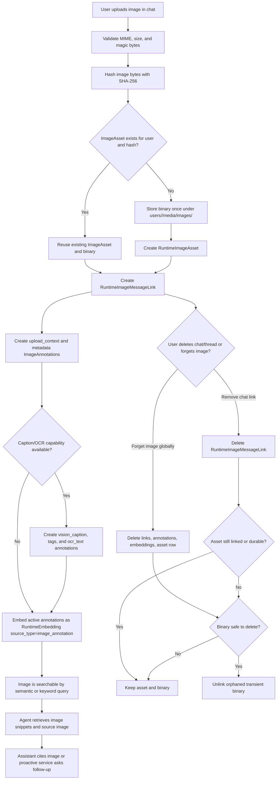

# Visual Memory Image Assets v1

**Status:** Draft
**Date:** 2026-06-29
**Owner:** AnimaOS Engineering
**Related plan:** [2026-06-29 Visual Memory Image Assets](../../superpowers/plans/2026-06-29-visual-memory-image-assets.md)

## Summary

Anima should treat user-provided images as first-class visual memory assets, not as opaque chat-only blobs. This version introduces a central user-scoped image store, indexes image-derived text including capability-gated OCR/text extraction, links images back to chat provenance, and gives the AI a safe way to retrieve and proactively ask about images later.

## Context

Current chat image support is built for immediate vision turns. Images are sent as base64 request attachments, saved under `users/<user_id>/attachments/chat/`, and referenced from `runtime_messages.content_json.attachments`. The model can see the image while the message remains in active history, but the image is not indexed, not searched, not promoted into memory, and not cleaned up when a thread is deleted.

That shape is too narrow for proactive visual memory. If Anima should later ask "what was in that screenshot?" or notice "you keep sending photos of this workspace," images need a durable identity, text annotations, embeddings, provenance, and explicit deletion rules.

## Product Goals

1. Make uploaded chat images discoverable across future turns when the user allows that behavior.
2. Let Anima ask proactive follow-up questions about images that appear meaningful, unresolved, or connected to ongoing context.
3. Preserve privacy by keeping image binaries local in `.anima/` and scoped to the owning user.
4. Avoid duplicate image files when the same image is uploaded more than once.
5. Extract visible text from images when the configured model/helper declares support for image text extraction.
6. Give the user clear control over whether an image is merely a chat attachment or a durable visual memory.
7. Make deletion honest: removing a thread should not silently leave unreachable image blobs forever.

## What This Version Delivers

### Core Production Path

This version is not complete until the full core path works end to end:

1. A chat upload creates or reuses one deduped `ImageAsset` for the user.
2. The chat message links to that asset through provenance, without owning the binary.
3. The asset receives searchable `ImageAnnotation` rows.
4. Each active annotation has a `RuntimeEmbedding` row using `source_type = "image_annotation"`.
5. The agent can retrieve indexed image annotations and cite the source image.
6. Proactive image follow-ups use only indexed, owned, non-deleted assets.
7. Deletion removes chat links, embeddings, annotations, and orphaned transient files according to retention state.

### Central Image Asset Store

Images are stored under a user-scoped central media path:

`users/<user_id>/media/images/<sha256-prefix>/<sha256>.<ext>`

Each image has a runtime `ImageAsset` record with owner, MIME type, size, checksum, storage path, status, indexing timestamps, and metadata such as filename, dimensions, and origin.

### Chat Provenance Links

Chat messages link to image assets through an explicit message-image join table. A single image can appear in multiple messages without duplicating bytes. Chat history still renders images, but the public attachment URL resolves through the image asset layer.

### Image Indexing

Each image can produce text annotations:

- upload context from the user message and filename
- basic metadata such as dimensions and MIME type
- optional vision caption/tags when a vision-capable configured model is available
- OCR/text-extraction annotations when the configured model or helper advertises that capability

Annotations are embedded with the existing runtime embedding infrastructure so image search can use the same local retrieval path as documents and memory.

OCR/text extraction is included in the v1 indexing contract, but it is capability-gated. If a configured adapter can read visible text from an image, Anima creates an `ocr_text` annotation and embeds it. If no adapter supports that capability, upload still succeeds and the asset is indexed with upload context and metadata.

### Future Media Extension

This PRD is image-first. The architecture should not block later media memory, but full PDF/video/media ingestion is not part of this v1 implementation.

- GIFs are supported as image assets when accepted by chat upload. v1 stores and dedupes the binary and indexes context, metadata, and OCR when supported; frame-by-frame animation analysis is future work.
- PDFs already have a document ingestion path through `RuntimeDocument` and `RuntimeDocumentChunk`. Future unified media recall should compose PDF results with image results at the retrieval/source-pill layer instead of copying PDFs into the image asset table.
- Video should be a separate future processor with checksum dedupe, keyframe derivatives, transcript or audio text, timecoded annotations, and deletion of generated derivatives.
- Future media types should reuse the same principles: local binary storage, user ownership, checksum dedupe, provenance links, text annotations, runtime embeddings, source citations, and explicit deletion cleanup.

### Proactive Visual Recall

The agent can retrieve indexed images by semantic query and can surface image source pills in replies. Proactive services can select recent or salient indexed images and ask a user-facing follow-up when the image has unresolved or potentially useful context.

### User Controls And Deletion

Users can remove an image from a pending message before send, delete an image link from a chat message, or forget the image asset globally. Deleting a thread removes message links and deletes orphaned transient image assets. Durable visual memories remain only when explicitly retained or promoted.

## What Users See

- Images uploaded in chat still appear in the message transcript.
- The AI can later reference an indexed image with a visible image source pill.
- When a proactive image follow-up appears, the user can inspect the referenced image.
- Users can remove an image from a chat, forget it globally, or keep it as durable visual memory.
- If OCR, captioning, or richer image indexing is unavailable, the app still stores the image and indexes filename/message context.

## Rules And Constraints

1. Image binaries stay local under `ANIMA_DATA_DIR`.
2. Runtime image records are rebuildable operational state unless promoted into encrypted durable memory through an explicit future workflow.
3. Base64 image payloads are never stored in the database.
4. Image metadata must not contain absolute filesystem paths.
5. A model/provider without vision or image text-extraction support must not block chat image upload.
6. Proactive image prompts must reference only images owned by the unlocked user.
7. Thread deletion must not leave orphaned transient image files.
8. Durable visual memory promotion is opt-in for this version unless the user explicitly chooses an automatic policy later.

## Success Metrics

| Metric | Target | How to measure |
| --- | --- | --- |
| Asset dedupe | Reuploading the same image for one user stores exactly one binary and one active asset row | Backend unit test |
| Annotation embeddings | Every active image annotation has a current `RuntimeEmbedding` row | Indexing audit test |
| OCR/text extraction | When mocked image text-extraction capability returns text, an `ocr_text` annotation and embedding are created; when unsupported, upload still succeeds | Service tests with mocked capabilities |
| Retrieval | Indexed image annotations can be found by semantic or keyword query and return the parent image asset | Focused retrieval tests |
| Provenance | Every public chat attachment resolves through an owned image asset or legacy fallback | API tests |
| Deletion | Forgetting an image removes active links, annotations, embeddings, asset row, and orphaned transient binary | Deletion tests |
| Fallback | Models without vision or image text-extraction support still accept and context-index images | Service tests with mocked capabilities |
| Proactive guardrail | Proactive image prompts only use indexed assets for the active user | Proactive selection tests |

## Out Of Scope

- Cloud image storage or sync.
- Mandatory OCR dependency; OCR/text extraction is included when capability is available, but v1 does not require bundling an OCR engine.
- Mandatory raw visual/image embedding model; this version embeds image-derived text annotations through the existing text embedding path.
- Full PDF, video, audio, or generic media memory ingestion.
- Frame-by-frame GIF/video analysis and timecoded media annotations.
- Face recognition or identity inference.
- Automatic promotion of every image into encrypted long-term soul memory.
- A full gallery UI beyond the controls needed for chat and inspection.
- Multi-user shared visual memory.

## References

- [Agent Runtime](../../architecture/agent/agent-runtime.md)
- [Document Processing](../../architecture/agent/document-processing.md)
- [Memory System](../../architecture/memory/memory-system.md)
- [PRD Ticket Workflow](../../ops/prd-ticket-workflow.md)
