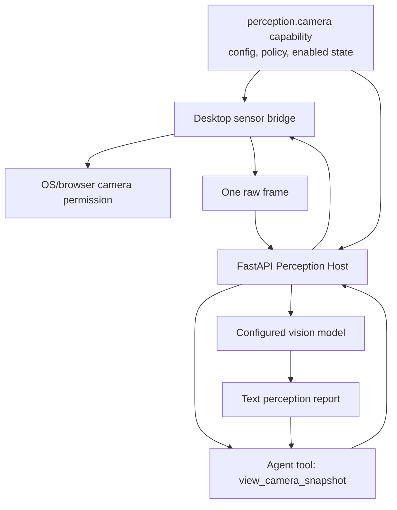

# Camera Perception Capability Module v1

**Status:** Draft
**Date:** 2026-06-29
**Owner:** AnimaOS Engineering
**Capability family:** Perception
**Technical module id:** `perception.camera`
**Architecture PRD:** [Agent Capability Modules v1](../capability-modules/agent-capability-modules-v1.md)
**Related plan:** [2026-06-29 Camera Perception](../../superpowers/plans/2026-06-29-camera-perception.md)

## Naming Decision

Use **Capability Modules** as the formal architecture term and **Perception Module** as this family name.

- User-facing family: **Perception**
- First built-in module: **Camera Perception**
- Technical module id: `perception.camera`
- Agent-facing tool: `view_camera_snapshot`
- Desktop bridge primitive: `camera_capture_frame`

Do not call this a required camera feature, external integration mod, or core vision mode. The camera is an optional Agent Capability Module because it touches hardware, privacy, user consent, model cost, and platform permissions.

Future perception modules can follow the same family shape:

- `perception.screen` for explicit screen/context snapshots
- `perception.window` for a selected app/window
- `perception.environment_audio` only if distinct from the voice conversation stack
- `perception.media` for user-selected local media analysis

## Summary

Camera Perception gives ANIMA a controlled visual sense through an optional FastAPI-side capability module. The desktop owns camera permission and frame capture. The capability module owns setup, policy, tool exposure, transient vision analysis, and the memory boundary.

This is not always-on video. v1 is single-frame perception only. Agent-requested camera access is disabled by default and must be enabled through the capability registry.

## Product Goals

1. Make camera perception enableable as an Agent Capability Module, not required core behavior.
2. Let the user manually attach a webcam snapshot to chat when they choose.
3. Let the agent request one camera snapshot only when `perception.camera` is enabled and policy permits it.
4. Analyze agent-requested frames transiently with the configured vision-capable model.
5. Keep raw agent-requested frames out of durable storage by default.
6. Record enough audit/presence state for the user to understand when perception was used.
7. Keep long-term memory promotion explicit and compatible with the visual memory asset plan.

## Why A Capability Module

Camera perception should be optional because:

- Some users will not want any camera surface.
- Some devices have no camera or unreliable camera permissions.
- Camera input can expose private spaces, people, documents, and bystanders.
- Vision models may require cloud providers, which should remain opt-in.
- Different perception capabilities will have different consent and retention rules.

Brain System should provide a generic **capability registry** and **perception host**, not a mandatory camera tool.

## Architecture

This is a **client-assisted Agent Capability Module**:

1. FastAPI capability registry owns the `perception.camera` lifecycle, config schema, policy, status, and tool gating.
2. Desktop reads enabled capability state and registers a local sensor bridge only while the user is unlocked.
3. Python server exposes/loads the perception tool only when the capability is enabled.
4. When the agent calls `view_camera_snapshot`, the server asks the desktop bridge for one frame, runs transient vision analysis, deletes raw bytes, and returns a text report.

## Module Configuration

`perception.camera` should expose these config fields:

| Field | Type | Default | Meaning |
| --- | --- | --- | --- |
| `agentRequestedCaptureEnabled` | boolean | `false` | Whether the agent may request a frame |
| `manualChatCaptureEnabled` | boolean | `true` | Whether chat can capture a user-triggered frame |
| `consentMode` | enum | `ask_each_time` | `ask_each_time`, `allow_when_chat_open`, future `scheduled_window` |
| `retentionMode` | enum | `transient_only` | `transient_only`, future `save_as_chat_attachment`, future `visual_memory_candidate` |
| `maxWidth` | integer | `1280` | Maximum captured frame width |
| `maxHeight` | integer | `720` | Maximum captured frame height |
| `quality` | number | `0.86` | JPEG quality for transient frames |
| `auditEnabled` | boolean | `true` | Whether perception events are recorded |

## User Experience

- The capability appears in Capability Settings as **Camera Perception**.
- Setup explains what camera access means before enabling agent-requested capture.
- Chat attachment menu gains a camera option only when manual capture is enabled.
- Agent-requested capture shows a visible consent prompt in `ask_each_time` mode.
- The user can deny a requested capture without breaking the conversation.
- When the camera is active, desktop shows a visible capture state.
- The agent receives text analysis, not raw camera bytes.

## Core Rules

1. `perception.camera` is disabled by default.
2. Camera capture must never run while the user is logged out or locked.
3. Agent-requested capture must never happen unless the capability is enabled.
4. `ask_each_time` is the default consent mode.
5. Captures are still frames only.
6. Raw agent-requested frames are deleted after analysis.
7. Manual chat snapshots become normal user-sent image attachments because the user explicitly sends them.
8. Non-vision model configuration fails before requesting a frame.
9. The raw desktop bridge primitive must not be exposed directly to the LLM.
10. Face recognition, identity inference, protected-trait inference, gaze tracking, emotion-from-face inference, and background surveillance are out of scope.

## Memory Boundary

Camera observations are runtime context by default.

- Manual chat snapshots follow the existing chat image attachment path.
- Agent-requested raw frames are transient and deleted after analysis.
- The text perception report may appear in tool trace/runtime history.
- Durable memory requires an explicit memory write or a future visual-memory candidate workflow.
- Future integration with Visual Memory Image Assets should use the asset pipeline rather than storing raw frames ad hoc.

## Success Metrics

| Metric | Target |
| --- | --- |
| Optionality | Fresh install has no agent camera tool visible until the capability is enabled |
| Consent | `ask_each_time` blocks capture unless the user approves |
| Manual capture | User can add a camera frame to chat as an image attachment when manual capture is enabled |
| Hidden primitive | `camera_capture_frame` is callable only by the perception host, not directly by the model |
| Transience | Agent-requested temp frame is deleted after analysis |
| Capability gate | Non-vision models receive a clear error before any frame request |
| Audit | Enabled audit records capture request, approval/denial, result status, and retention mode |

## Out Of Scope

- Always-on camera access.
- Continuous video streaming.
- Background capture while desktop is closed, locked, or logged out.
- Automatic long-term visual memory retention.
- Face recognition or biometric inference.
- Multi-camera selection beyond the OS/browser default camera.
- Native mobile camera support.
