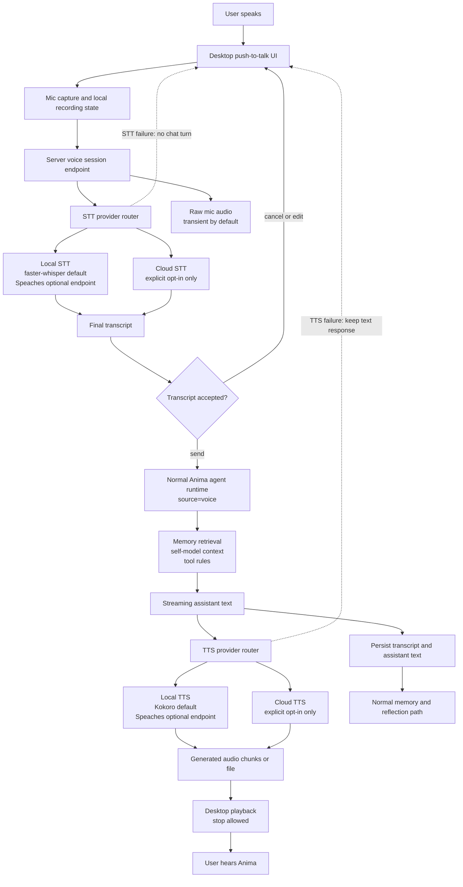
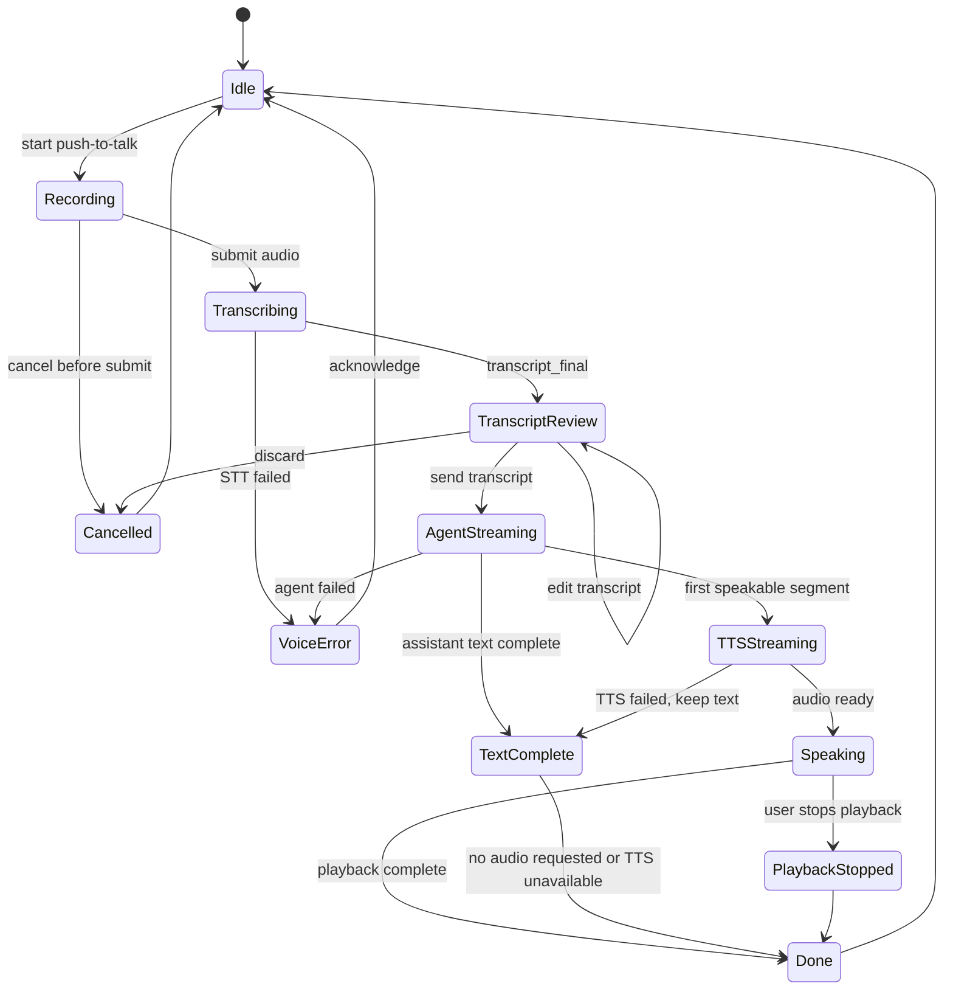

# Voice Foundation v1

**Status:** Draft
**Date:** 2026-06-29
**Owner:** AnimaOS Engineering
**Related plan:** [Voice Foundation v1 Implementation Plan](../../superpowers/plans/2026-06-29-voice-foundation-v1.md)

## Summary

Anima should be able to speak and listen without becoming dependent on cloud voice services. Voice Foundation v1 adds a local-first voice conversation surface around the existing agent runtime: microphone audio becomes text through a speech-to-text provider, the normal Anima chat turn runs with full memory and tool access, and the assistant response is rendered back to audio through a text-to-speech provider.

Voice is an interface shell, not a separate mind. The same Core, self-model, memory, emotional context, tools, and conversation runtime remain authoritative. A user's acoustic voice choice can change, but Anima's identity and relational continuity stay in the portable `.anima/` Core.

## Context

AnimaOS already has the right cognitive boundary for voice:

- The Python server owns cognition, memory, tools, and persistence.
- The desktop app owns microphone capture, playback, and visible interaction state.
- The local runtime daemon can keep the server alive independently of the UI.
- The existing chat endpoint already supports streaming events and `source` metadata.
- The diary system already establishes a privacy pattern for local audio: recorded audio is encrypted if stored, and transcription does not automatically become long-term memory.

The missing piece is a first-class voice pipeline with provider abstraction, local defaults, and privacy rules. Browser-side speech recognition is not enough because it is opportunistic, platform-dependent, and often cloud-backed. Voice Foundation v1 should provide a real local path while allowing cloud providers as explicit user opt-ins.

## Product Goals

1. Let the user hold a low-friction spoken conversation with Anima.
2. Keep the full Anima cognition loop intact for every voice turn.
3. Prefer local STT and TTS providers by default.
4. Support cloud STT and TTS providers only through explicit settings.
5. Preserve privacy by storing transcripts, not raw audio, unless the user opts in.
6. Make provider health, latency, and failure states visible enough to debug.
7. Leave room for realtime VAD, wake word, and barge-in without requiring them in v1.
8. Treat voice-to-voice as audio input plus audio output around Anima's normal cognition loop, not as a separate speech-native agent.

## What This Version Delivers

### Push-To-Talk Voice Chat

The desktop chat surface gains a push-to-talk mode:

- press or click to record;
- show recording state and elapsed time;
- submit audio to the server;
- show final transcript as the user's message;
- stream Anima's response as normal text while TTS prepares audio;
- play synthesized audio when available;
- allow stopping playback.

Continuous ambient listening is out of scope for v1.

### Half-Duplex Voice-To-Voice

v1 voice-to-voice means the user speaks and Anima speaks back, while the transcript remains visible and canonical. The first version is half-duplex:

- user records an utterance;
- STT creates a transcript;
- the transcript runs through the normal Anima agent runtime;
- TTS synthesizes Anima's answer;
- playback starts when the first complete audio segment is ready.

The implementation should use the cascaded pipeline:

```text
microphone audio -> STT -> Anima agent runtime -> TTS -> speaker audio
```

If the selected providers support streaming, the server may begin TTS from sentence or clause-sized assistant chunks. If not, playback can begin after the full assistant response. In both cases, the text transcript and assistant text remain the durable conversation record.

Full-duplex speech, interruption handling, and barge-in are future work because they require tighter turn-taking, echo cancellation, cancellation semantics, and memory-safe handling of partial turns.

### Voice Pipeline Diagram



### Voice Session State Graph



### Voice Provider Abstraction

The server gets provider contracts for:

- speech-to-text;
- text-to-speech;
- optional voice activity detection.

Providers are selected through runtime settings, parallel to the existing LLM provider configuration. The product should distinguish local providers from cloud providers clearly.

### Local-First Provider Path

v1 should support a local provider path that can run without sending audio off-device. The first implementation may use external local runtimes or Python libraries, but the user-facing product model is:

- local STT endpoint or library;
- local TTS endpoint or library;
- health check for each configured provider;
- graceful fallback when a provider is unavailable.

Provider adapters should be narrow enough that faster-whisper, whisper.cpp, Kokoro, Piper, sherpa-onnx, or an OpenAI-compatible local voice server can be supported without changing the chat runtime.

## Provider Decision Matrix

This matrix reflects current online source review as of 2026-06-29. Scores are 1-5 where 5 is strongest for AnimaOS v1.

Weighted criteria:

| Criterion | Weight | Why it matters |
| --- | ---: | --- |
| Local/privacy fit | 25% | Voice contains biometric and intimate context; local operation is the product center. |
| Integration fit | 20% | The first implementation should land cleanly in the Python server and desktop app. |
| Latency/realtime path | 20% | Voice must feel responsive, even if v1 starts with push-to-talk. |
| Quality/capability | 20% | STT accuracy and TTS naturalness affect trust immediately. |
| Packaging/license risk | 15% | Desktop packaging must avoid hard-to-ship runtimes and unclear license obligations. |

### Local Candidates

| Candidate | Role | Privacy | Integration | Latency | Quality | Packaging | Weighted score | Decision |
| --- | --- | ---: | ---: | ---: | ---: | ---: | ---: | --- |
| faster-whisper | STT | 5 | 5 | 4 | 4 | 4 | 4.45 | Preferred v1 STT library. Python-native, MIT, CTranslate2-backed, supports CPU int8/GPU, no system FFmpeg dependency, and includes Silero VAD support. |
| Kokoro 82M | TTS | 5 | 4 | 4 | 4 | 5 | 4.35 | Preferred v1 TTS model. Apache-2.0, small open-weight model, good local deployment posture. |
| Speaches | Local voice server | 5 | 5 | 4 | 4 | 3 | 4.30 | Best external/local endpoint option. OpenAI-compatible server using faster-whisper plus Kokoro/Piper, useful for rapid integration and dev setups. |
| Moonshine | STT/voice-agent toolkit | 5 | 4 | 5 | 3 | 4 | 4.25 | Strong low-latency on-device candidate for live transcription and command-style voice. Evaluate after the baseline pipeline because the Anima server contract should stay provider-neutral. |
| FunASR / SenseVoice | STT toolkit | 5 | 4 | 5 | 4 | 3 | 4.25 | Strong multilingual and streaming STT candidate with an OpenAI-compatible local API path. Good secondary STT lane, especially when language coverage beats Whisper. |
| whisper.cpp | STT | 5 | 3 | 4 | 4 | 5 | 4.25 | Preferred later packaged/native STT path, especially for Apple Silicon and cross-platform desktop binaries. |
| MeloTTS | TTS | 5 | 4 | 4 | 3 | 4 | 4.00 | Good permissive multilingual TTS option, including CPU-friendly use. Evaluate if Kokoro voice fit or language coverage is not enough. |
| sherpa-onnx | STT/TTS/VAD toolkit | 5 | 3 | 4 | 3 | 4 | 3.90 | Strong future all-in-one offline speech runtime; broad platform and language bindings but larger integration surface. |
| CosyVoice | TTS/voice generation | 5 | 3 | 3 | 5 | 3 | 3.85 | High-quality multilingual generation candidate. Heavier integration surface and voice-cloning-adjacent features make it evaluation-only for v1. |
| Piper | TTS | 5 | 4 | 5 | 3 | 2 | 3.85 | Useful optional fast CPU TTS. Do not make the default bundled TTS until GPL-3.0 implications are deliberately accepted. |
| F5-TTS | TTS/voice generation | 5 | 3 | 4 | 4 | 1 | 3.65 | Technically promising, but pretrained model licensing is non-commercial. Do not use as a default distributable provider without legal review. |

### Expanded Local Open-Source Landscape

There are many more local/open-source projects worth tracking than the v1 default shortlist. The product should keep the provider layer open enough to test these without rewriting the voice surface.

| Category | Candidates | Why they matter | v1 posture |
| --- | --- | --- | --- |
| STT | `faster-whisper`, `whisper.cpp`, `Moonshine`, `FunASR`, `Vosk`, `sherpa-onnx`, `NVIDIA NeMo/Parakeet` | Local transcription spans Python libraries, native desktop runtimes, small on-device models, multilingual toolkits, and GPU research stacks. | Default to `faster-whisper`; test `Speaches`, `Moonshine`, and `FunASR` behind the same adapter contract. |
| TTS | `Kokoro 82M`, `Piper`, `MeloTTS`, `CosyVoice`, `F5-TTS`, `OpenVoice`, `Bark`, `eSpeak NG` | Local synthesis ranges from tiny deterministic voices to neural multilingual and voice-cloning-capable systems. | Default to `Kokoro`; keep cloning-capable or non-commercial model families out of the default install. |
| Native speech-to-speech | `Moshi`, `Qwen2.5-Omni`, `GLM-4-Voice`, `MiniCPM-o` | These can accept speech and emit speech directly, sometimes with lower theoretical latency or richer prosody. | Research track only until they can preserve Anima's memory, tools, approvals, and transcript contract. |
| Voice-agent frameworks | `Pipecat`, `LiveKit Agents`, `Vocode`, `OpenVoiceOS` | These solve realtime audio orchestration, WebRTC, telephony, turn-taking, and provider wiring. | Useful reference or optional integration layer, but not a replacement for Anima's own runtime. |
| VAD/audio processing | `Silero VAD`, `WebRTC VAD`, `RNNoise`, `sherpa-onnx VAD` | Realtime voice quality depends on turn detection, silence trimming, noise reduction, and echo handling. | Use narrowly where needed; do not infer durable emotional state from acoustic signals in v1. |

### Voice-To-Voice Decision Matrix

| Approach | Local/privacy fit | Preserves Anima cognition | Latency | Integration risk | Decision |
| --- | ---: | ---: | ---: | ---: | --- |
| Cascaded batch voice-to-voice | 5 | 5 | 3 | 2 | v1 default. It is reliable, debuggable, and keeps transcript-first memory. |
| Cascaded streaming voice-to-voice | 5 | 5 | 4 | 4 | v1-compatible architecture, v2 product target. Stream STT, agent text, and TTS segments through the same event contract. |
| Native speech-to-speech model | 4 | 2 | 4 | 5 | Research only. Promising models exist, but they risk bypassing Anima's runtime and governance. |
| Voice conversion after TTS | 5 | 3 | 3 | 4 | Out of scope. It increases identity, consent, and cloning risk without solving core cognition. |
| Cloud realtime speech-to-speech | 2 | 2 | 5 | 4 | Optional experiment only if it can preserve Anima's memory, tools, approval checkpoints, and transcript contract. |

### Local Recommendation

Use two local implementation lanes:

1. **Built-in lane:** `faster-whisper` for STT and `Kokoro 82M` for TTS.
2. **External endpoint lane:** OpenAI-compatible local voice endpoint, with Speaches as the first tested target.

This gives Anima a simple Python-native v1 path while also supporting a server-style local runtime for users who want isolation, Docker, GPU containers, or OpenAI SDK compatibility.

For desktop packaging, evaluate `whisper.cpp` after the push-to-talk loop works. It is a better native packaging candidate than Python STT for long-term consumer distribution, especially on macOS.

### Optional Cloud Provider Path

Cloud STT and TTS are allowed as opt-in adapters. When enabled, the UI must make clear that audio or generated speech text may be processed by the selected provider.

Cloud realtime speech-to-speech is out of scope for v1 unless it can preserve Anima's normal memory, tool, and approval loop. Request-based STT/TTS around the existing runtime is the default cloud model.

### Cloud Candidates

Cloud voice is optional and must never become required for core local operation.

| Candidate | Role | Privacy | Integration | Latency | Quality | Packaging | Weighted score | Decision |
| --- | --- | ---: | ---: | ---: | ---: | ---: | ---: | --- |
| OpenAI Audio API | STT/TTS/realtime | 2 | 5 | 4 | 5 | 5 | 4.00 | Best default cloud fallback. Strong unified API, high-quality transcription and TTS, request-based and realtime paths. Use only behind explicit cloud opt-in. |
| Cartesia | STT/TTS/realtime | 3 | 4 | 5 | 5 | 4 | 4.15 | Best low-latency specialist cloud candidate. Ink 2 and Sonic 3.5 are built around realtime voice-agent use, but this adds a new provider surface. |
| Deepgram | STT/TTS/realtime STT | 3 | 4 | 5 | 4 | 4 | 4.00 | Best streaming STT and turn-detection specialist. Flux and Nova-3 are especially relevant for future realtime voice agents. |
| ElevenLabs | TTS/STT | 2 | 4 | 4 | 5 | 4 | 3.70 | Best expressive/voice-quality cloud TTS candidate. Strong TTS and Scribe STT, but voice cloning/history/retention features require careful product boundaries. |
| Google/Azure/AWS speech | STT/TTS | 3 | 3 | 3 | 4 | 4 | 3.35 | Enterprise fallback class, not v1 default. Useful later for customers already committed to a cloud. |

### Cloud Recommendation

Use OpenAI as the first cloud adapter because Anima already has OpenAI-style provider plumbing and the Audio API covers STT, TTS, and realtime experiments in one place. Add Deepgram next if realtime turn-taking quality becomes the bottleneck. Add Cartesia when lowest-latency or high-quality realtime speech becomes a product differentiator. Treat ElevenLabs as an optional high-quality TTS provider, not the default, because Anima should avoid making voice cloning or retained generated-audio workflows central.

The cloud adapter must preserve the cascaded pipeline:

```text
microphone audio -> STT -> Anima agent runtime -> TTS -> playback
```

Do not route user speech directly into an external realtime agent that bypasses Anima's memory, tool rules, approval checkpoints, and post-turn reflection.

### Provider Decision

For v1 implementation planning:

| Layer | Default | Secondary | Later |
| --- | --- | --- | --- |
| Local STT | faster-whisper | OpenAI-compatible local endpoint via Speaches | whisper.cpp native packaging |
| Local TTS | Kokoro 82M | Speaches TTS endpoint | Piper only if GPL-3.0 posture is accepted |
| Cloud STT | OpenAI transcriptions | Deepgram Flux/Nova-3 | Cartesia Ink 2 |
| Cloud TTS | OpenAI TTS | Cartesia Sonic 3.5 | ElevenLabs for premium expressive voices |
| Realtime/VAD | Not v1 default | Deepgram Flux or Cartesia Ink 2 for cloud | sherpa-onnx / whisper.cpp VAD for local |

### Normal Chat Runtime Integration

Voice turns feed the existing agent runtime as ordinary user turns with `source="voice"`. The transcript becomes the user message. The assistant response comes from the normal `run_agent` or `stream_agent` flow.

The voice layer must not bypass:

- memory retrieval;
- self-model blocks;
- tool rules;
- approval checkpoints;
- post-turn consolidation;
- reflection and sleep tasks.

### Streaming Voice Event Contract

The server exposes a voice streaming endpoint that can emit events such as:

- `voice_session_started`;
- `transcript_partial`;
- `transcript_final`;
- `agent_chunk`;
- `tts_started`;
- `audio_chunk`;
- `tts_done`;
- `voice_done`;
- `voice_error`.

The first implementation can omit partial transcripts if the chosen local STT provider is batch-only, but the event contract should leave room for streaming STT later.

### Privacy And Storage Controls

By default:

- raw microphone audio is transient;
- the final transcript is persisted as the user message;
- assistant text is persisted as the assistant message;
- generated audio is not persisted;
- acoustic features are not promoted into memory.

If raw audio storage is later enabled, it must be encrypted, user-visible, deletable, and excluded from memory extraction unless the user explicitly asks otherwise.

### Settings And Diagnostics

Voice settings should include:

- STT provider;
- STT model or endpoint;
- TTS provider;
- TTS voice/model or endpoint;
- cloud voice enablement;
- raw audio retention preference;
- playback speed or voice style when supported;
- provider test buttons for recording, transcription, synthesis, and playback.

Diagnostics should report provider availability and a simple latency breakdown: upload/receive, STT, agent first token, TTS, playback ready.

## User Experience Requirements

Voice should feel like the same Anima, not a separate assistant.

The UI should:

- keep the transcript visible and editable before send when feasible;
- show when Anima is listening, thinking, speaking, or unavailable;
- let the user cancel recording before submission;
- let the user stop generated speech without cancelling the completed text response;
- recover cleanly when STT or TTS fails;
- never imply ambient listening when push-to-talk is the active mode.

If STT succeeds but TTS fails, the normal text answer should still appear.

If STT fails, no chat turn should be created unless the user chooses to send a corrected transcript.

## Memory Requirements

The transcript is the canonical memory input for v1. It should enter the same memory, episode, and reflection paths as typed chat.

Voice-derived emotional or acoustic signals are explicitly deferred. Tone, pace, hesitation, and volume can be useful later, but they require careful consent and governance. v1 should not infer durable emotional state from acoustic features.

The system may record operational metadata such as:

- `source="voice"`;
- transcript confidence when available;
- duration in milliseconds;
- provider name;
- whether the transcript was edited before send.

Operational metadata should support debugging and future quality evaluation without becoming identity-level memory by default.

## Architecture Rules

1. Voice is a surface around the existing runtime, not a separate agent runtime.
2. Local providers are the default product direction.
3. Cloud providers require explicit opt-in and clear UI copy.
4. Raw audio is transient by default.
5. No ambient listening, wake word, or always-on microphone in v1.
6. Voice turns must honor unlock state, sidecar nonce, and local runtime security.
7. The Core remains the authority for identity, memory, and persona.
8. Acoustic voice selection is presentation state; it does not rewrite Anima's persona or self-model.
9. Provider adapters must fail closed: if STT cannot produce text, do not create a normal chat turn.
10. TTS failure must not erase or block the assistant text response.

## Success Metrics

| Metric | Target | Measurement |
| --- | --- | --- |
| Local voice path | STT and TTS can run without cloud provider credentials | Manual smoke test and provider health checks |
| Runtime continuity | Voice turn uses normal memory/tool/chat path | Integration test asserting persisted `source="voice"` turn and agent response |
| Privacy default | Raw audio is not persisted by default | Test and storage inspection |
| STT failure behavior | Failed transcription creates no chat message | API test |
| TTS failure behavior | Text response still persists and displays | API/UI test |
| Latency visibility | STT, agent, and TTS timing are exposed in events or diagnostics | Contract test |
| Desktop usability | User can record, submit, read transcript, hear response, and stop playback | Manual desktop smoke test |

## Out Of Scope

- Always-on microphone.
- Wake word detection.
- Realtime duplex voice or barge-in.
- Native speech-to-speech replacing the Anima runtime.
- Voice cloning.
- Speaker identification.
- Durable acoustic emotion inference.
- Automatic promotion of raw audio into memory.
- Mobile or wearable voice surfaces.
- Replacing the existing chat runtime.
- Bundling large model weights in the first PRD version.

## Open Questions

1. Should v1 ship with a bundled local STT/TTS library, or first support external local endpoints with clear setup?
2. Should generated assistant audio ever be cached locally for replay?
3. Should the transcript be editable before send in chat, or should editability wait until after the first push-to-talk version?
4. Should voice settings live inside AI Settings or get a dedicated Voice/Presence settings panel?
5. What is the minimum acceptable local latency target on a normal laptop?
6. Should sentence-level TTS streaming ship in v1, or wait until after batch voice-to-voice is stable?

## Related Existing Work

- [ANIMA OS Whitepaper](../../thesis/whitepaper.md)
- [Inner Life](../../thesis/inner-life.md)
- [Portable Core](../../thesis/portable-core.md)
- [Agent Runtime](../../architecture/agent/agent-runtime.md)
- [Memory System](../../architecture/memory/memory-system.md)
- [Daily Diary Design](../../superpowers/specs/2026-06-05-daily-diary-design.md)
- [Local Runtime Daemon](../../architecture/system/local-runtime-daemon.md)

## External References

- [faster-whisper](https://github.com/SYSTRAN/faster-whisper)
- [whisper.cpp](https://github.com/ggml-org/whisper.cpp)
- [Kokoro](https://github.com/hexgrad/kokoro)
- [Kokoro 82M model card](https://huggingface.co/hexgrad/Kokoro-82M)
- [Piper](https://github.com/OHF-Voice/piper1-gpl)
- [sherpa-onnx](https://github.com/k2-fsa/sherpa-onnx)
- [Speaches](https://github.com/speaches-ai/speaches)
- [Moonshine paper](https://arxiv.org/abs/2410.15608)
- [Moonshine v2 paper](https://arxiv.org/abs/2602.12241)
- [FunASR](https://github.com/modelscope/FunASR)
- [Vosk](https://github.com/alphacep/vosk-api)
- [NVIDIA NeMo](https://github.com/NVIDIA/NeMo)
- [MeloTTS](https://github.com/myshell-ai/MeloTTS)
- [CosyVoice](https://github.com/FunAudioLLM/CosyVoice)
- [F5-TTS](https://github.com/SWivid/F5-TTS)
- [OpenVoice](https://github.com/myshell-ai/OpenVoice)
- [Bark](https://github.com/suno-ai/bark)
- [eSpeak NG](https://github.com/espeak-ng/espeak-ng)
- [Moshi](https://github.com/kyutai-labs/moshi)
- [Qwen2.5-Omni](https://github.com/QwenLM/Qwen2.5-Omni)
- [GLM-4-Voice](https://github.com/THUDM/GLM-4-Voice)
- [MiniCPM](https://github.com/OpenBMB/MiniCPM)
- [Pipecat](https://github.com/pipecat-ai/pipecat)
- [LiveKit Agents](https://github.com/livekit/agents)
- [Vocode](https://github.com/vocodedev/vocode-core)
- [OpenVoiceOS](https://github.com/OpenVoiceOS/ovos-core)
- [OpenAI Audio Guide](https://platform.openai.com/docs/guides/audio)
- [OpenAI Speech to Text](https://platform.openai.com/docs/guides/speech-to-text)
- [OpenAI Text to Speech](https://platform.openai.com/docs/guides/text-to-speech)
- [Deepgram Models and Languages](https://developers.deepgram.com/docs/models-languages-overview)
- [Deepgram Aura TTS Voices and Languages](https://developers.deepgram.com/docs/tts-models)
- [Cartesia Overview](https://docs.cartesia.ai/get-started/overview)
- [Cartesia Sonic 3.5](https://docs.cartesia.ai/build-with-cartesia/tts-models/latest)
- [Cartesia Ink 2](https://docs.cartesia.ai/build-with-cartesia/stt/latest)
- [Cartesia Zero Data Retention](https://docs.cartesia.ai/enterprise/zero-data-retention)
- [ElevenLabs Text to Speech API](https://elevenlabs.io/docs/api-reference/text-to-speech/convert)
- [ElevenLabs Speech to Text API](https://elevenlabs.io/docs/api-reference/speech-to-text/convert)
