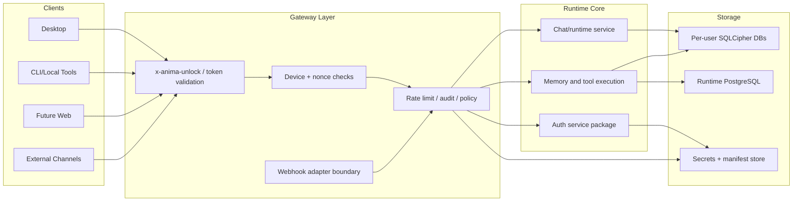

# Runtime Gateway + Online Delivery

This is the local planning artifact for the hybrid gateway-runtime direction.

## Project

- Name: Runtime Gateway + Online Delivery
- Team: ANIMA Core
- Workspace: ANIMA
- Target delivery: Phase 1 online-ready hybrid
- Owner: You
- State model: Backlog -> In Progress -> Done
- Start date: 2026-06-26
- Primary value: Keep local single-user runtime, add safe API gateway boundary so desktop, CLI, web, and third-party channels can route through the same runtime contract.

## Design Direction

- Keep `apps/server` as the primary runtime core initially.
- Add a dedicated ingress/gateway layer for unlock validation, device identity, session checks, and abuse controls.
- Route external channels via adapters that map external payloads into internal chat/runtime inputs.
- Keep cognition and memory internals stable while improving policy, tracing, and transport boundaries.
- Move to split deployment (public gateway + private runtime) after gateway contracts are stable.

## Architecture Decisions

- Phase 1 is a same-process boundary inside `apps/server`; do not create a new public gateway app until the internal runtime contract is stable.
- The first reusable primitive is request context, not device management. Device and webhook work should consume the context instead of inventing their own auth path.
- Gateway code validates transport, session, device, nonce, rate, and channel trust. Runtime code handles cognition, memory, tools, and persistence.
- No public gateway path should persist or log passphrases, raw DEKs, provider secrets, or durable memory payloads outside existing encrypted/runtime stores.
- External channels must normalize into the same runtime invocation shape used by desktop/web/CLI.

## Ticket Set

Use local ticket IDs `GWR-001` through `GWR-014`.

Parent tracker: `tickets/gateway-runtime-online/GWR-000-parent.md`

| Ticket | Title | Priority | Type | Scope | Notes |
| --- | --- | --- | --- | --- | --- |
| GWR-001 | Extract runtime auth primitives into dedicated package | P1 | Tech Debt | Server | Move unlock/session validation helpers from routes into a dedicated auth package with a typed context interface. |
| GWR-002 | Add gateway-style request context contract | P1 | Feature | Server | Introduce shared request context containing user, device, session, and trace metadata consumed by runtime services. |
| GWR-003 | Add auth + rate middleware in API layer | P1 | Feature | Server API | Validate token, check nonce, and enforce replay-safe request IDs for chat/task endpoints. |
| GWR-004 | Add device enrollment and revocation API | P1 | Feature | Server API + auth | Endpoints for listing devices, rotating per-device secrets, and revoking sessions. |
| GWR-005 | Centralize trust policy and nonce store | P1 | Feature | Auth | Add Redis/DB-backed nonce store plus token introspection and logout/invalidation paths. |
| GWR-006 | Standardize webhook/third-party ingress contract | P2 | Feature | Server API | Add `POST /api/webhook/{provider}` with normalized payload schema and idempotency. |
| GWR-007 | Add outbound adapter abstraction | P2 | Feature | Mods | Add adapter layer for normalized events to runtime invocation and tool access without cognition rewrites. |
| GWR-008 | Add end-to-end trace IDs and audit logs | P2 | Feature | All | Add `trace_id` + audit trail across gateway and runtime request handling and chat persistence. |
| GWR-009 | Add compatibility auth bridge for desktop | P1 | Chore | Server + Desktop | Preserve desktop unlock flow while adding optional bearer/session-token gateway path. |
| GWR-010 | Internal gateway-to-runtime client contract | P2 | Tech Debt | Gateway/runtime | Define typed bridge contract, timeout/retry policy, and transport errors from gateway to runtime. |
| GWR-011 | Add multi-device onboarding flow docs | P2 | Docs | Docs | Document local default + secondary-device authorization and trust model. |
| GWR-012 | Add web/websocket delivery baseline | P3 | Feature | Site + gateway | Add web client login and stream/chat path through gateway and signed sessions. |
| GWR-014 | Create gateway/runtime threat model | P1 | Security | Gateway/runtime | Enumerate trust boundaries, assets, attackers, and accepted risks before final hardening. |
| GWR-013 | Security hardening pass and acceptance | P1 | Security | All | Add method restrictions, secret rotation, abuse limits, and incident runbook validation. |

## Execution Order

1. GWR-001, GWR-002, GWR-010
2. GWR-003, GWR-008, GWR-009
3. GWR-004, GWR-005
4. GWR-006, GWR-007, GWR-011
5. GWR-012, GWR-014, GWR-013

## Sprint Mapping

- Sprint A - Boundary contract: GWR-001, GWR-002, GWR-010
- Sprint B - Ingress policy: GWR-003, GWR-008, GWR-009
- Sprint C - Device trust: GWR-004, GWR-005
- Sprint D - Channels and onboarding: GWR-006, GWR-007, GWR-011
- Sprint E - Web baseline and security: GWR-012, GWR-014, GWR-013

## Done Criteria

- Single-user local runtime still runs unchanged in default mode.
- Gateway can accept desktop, CLI, web, and external channel traffic with policy enforcement.
- Third-party adapters can send normalized events without modifying core cognition internals.
- Device revocation ends active sessions within configured TTL.
- Every request carries trace IDs visible in gateway and runtime logs.
