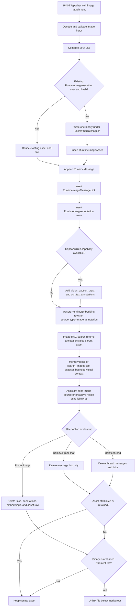

# Visual Memory Image Assets Implementation Plan

> **For agentic workers:** REQUIRED SUB-SKILL: Use superpowers:subagent-driven-development (recommended) or superpowers:executing-plans to implement this plan task-by-task. Steps use checkbox (`- [ ]`) syntax for tracking.

**Goal:** Make chat images first-class, indexed visual memory assets that Anima can retrieve, cite, proactively ask about, and delete correctly.

**Architecture:** Move image binaries from chat-only attachment storage to a central user-scoped media store keyed by checksum. Add runtime image asset, message link, and annotation records; route chat attachments through those records; index image-derived text through existing runtime embeddings. Include capability-gated OCR/text extraction in the image indexing contract, while keeping the first version local-first and conservative: no mandatory OCR engine, no mandatory external image model, no full PDF/video media ingestion, and no automatic soul-memory promotion.

**Tech Stack:** Python 3.12, FastAPI, SQLAlchemy 2.0, Alembic runtime migrations, local filesystem under `ANIMA_DATA_DIR`, existing runtime PostgreSQL/SQLite fallback, pgvector-compatible `RuntimeEmbedding`, existing agent LLM adapters, React/Vite/Tauri desktop, TypeScript API client, pytest, Bun/Nx scripts.

---

## Scope

This plan covers image assets uploaded through chat. It keeps existing chat UX working while introducing a durable asset layer behind it. GIFs are handled as image assets when accepted by the existing chat image upload path, but frame-level GIF analysis is not part of v1. The work does not build a full gallery, face recognition, cloud sync, full PDF/video media ingestion, or automatic encrypted soul promotion.

## Core Production Path

The production core path is complete only when `VMI-001` through `VMI-006` are done. `VMI-007` is still required before closing the initiative, but it is migration/docs/final-validation work rather than the first usable production path.

Core path contract:

1. `VMI-001` creates stable image identity, provenance-link, and annotation tables.
2. `VMI-002` stores each user image once by checksum under the central media path.
3. `VMI-003` makes chat uploads create image assets and message links instead of chat-owned blobs.
4. `VMI-004` creates annotation rows and embeds every active annotation through `RuntimeEmbedding.source_type = "image_annotation"`.
5. `VMI-005` lets the agent retrieve, cite, and proactively reason over indexed image assets.
6. `VMI-006` gives users deletion/retention controls and guarantees orphaned transient binaries are cleaned up.

Do not treat image indexing as optional enrichment. Caption and OCR/text-extraction outputs are included when declared model/helper capability is available; base annotation rows and text embeddings are part of the core path even when those richer processors are unavailable.



## Planning Inputs

- PRD: `docs/prds/memory/visual-memory-image-assets-v1.md`
- Current chat image save path: `apps/server/src/anima_server/services/agent/attachments.py`
- Current chat attachment serialization: `apps/server/src/anima_server/services/agent/state.py`
- Current chat routes: `apps/server/src/anima_server/api/routes/chat.py`
- Current thread deletion route: `apps/server/src/anima_server/api/routes/threads.py`
- Existing PDF document storage/indexing reference: `apps/server/src/anima_server/services/documents/`
- Existing runtime document models: `apps/server/src/anima_server/models/runtime.py`
- Existing embedding store: `apps/server/src/anima_server/models/runtime_embedding.py`, `apps/server/src/anima_server/services/agent/pgvec_store.py`
- Desktop chat attachment flow: `apps/desktop/src/pages/chat/Chat.tsx`
- API client types: `packages/api-client/src/types.ts`, `packages/api-client/src/client.ts`

## File Map

| Area | Files |
| --- | --- |
| Runtime models | `apps/server/src/anima_server/models/runtime.py`, `apps/server/src/anima_server/models/__init__.py` |
| Runtime migration | `apps/server/alembic_runtime/versions/018_image_assets.py` |
| Image service package | new `apps/server/src/anima_server/services/images/` |
| Image storage | new `apps/server/src/anima_server/services/images/store.py` |
| Image capability/extraction | new `apps/server/src/anima_server/services/images/capabilities.py`, new `apps/server/src/anima_server/services/images/extractors.py` |
| Image indexing | new `apps/server/src/anima_server/services/images/indexing.py` |
| Image retrieval | new `apps/server/src/anima_server/services/images/rag.py` |
| Chat attachment bridge | `apps/server/src/anima_server/services/agent/attachments.py`, `state.py`, `persistence.py`, `service.py` |
| Chat and image APIs | `apps/server/src/anima_server/api/routes/chat.py`, new or extended `routes/images.py`, `routes/threads.py` |
| Proactive integration | `apps/server/src/anima_server/services/agent/proactive.py`, `memory_blocks.py`, `service.py` |
| Schemas | `apps/server/src/anima_server/schemas/chat.py`, new `schemas/images.py` if needed |
| Desktop/API client | `packages/api-client/src/types.ts`, `packages/api-client/src/client.ts`, `apps/desktop/src/pages/chat/Chat.tsx` |
| Tests | new `apps/server/tests/test_image_assets.py`, `test_image_indexing.py`, `test_chat_image_assets.py`, `test_image_deletion.py`, API client tests |
| Docs/tickets | this plan, PRD, `tickets/visual-memory-image-assets/` |

## Data Model

Add three runtime tables:

| Table | Purpose |
| --- | --- |
| `runtime_image_assets` | One row per user-owned image binary, deduped by `(user_id, sha256)` |
| `runtime_image_message_links` | Many-to-many provenance from `runtime_messages` to `runtime_image_assets` |
| `runtime_image_annotations` | Text rows derived from an image for retrieval: upload context, vision caption, tags, OCR/text extraction when supported |

Initial model fields:

```python
class RuntimeImageAsset(RuntimeBase):
    __tablename__ = "runtime_image_assets"

    id: Mapped[int] = mapped_column(BigInteger, primary_key=True, autoincrement=True)
    user_id: Mapped[int] = mapped_column(BigInteger, nullable=False, index=True)
    filename: Mapped[str | None] = mapped_column(String(255), nullable=True)
    mime_type: Mapped[str] = mapped_column(String(128), nullable=False)
    storage_path: Mapped[str] = mapped_column(String(512), nullable=False)
    sha256: Mapped[str] = mapped_column(String(64), nullable=False, index=True)
    size_bytes: Mapped[int] = mapped_column(BigInteger, nullable=False)
    width: Mapped[int | None] = mapped_column(Integer, nullable=True)
    height: Mapped[int | None] = mapped_column(Integer, nullable=True)
    status: Mapped[str] = mapped_column(String(24), nullable=False, server_default=text("'registered'"))
    retention_state: Mapped[str] = mapped_column(String(24), nullable=False, server_default=text("'transient'"))
    metadata_json: Mapped[dict[str, object] | None] = mapped_column(JSON, nullable=True)
    created_at: Mapped[datetime] = mapped_column(TIMESTAMPTZ, nullable=False, server_default=func.now())
    updated_at: Mapped[datetime] = mapped_column(TIMESTAMPTZ, nullable=False, server_default=func.now())
    indexed_at: Mapped[datetime | None] = mapped_column(TIMESTAMPTZ, nullable=True)
```

Use `RuntimeEmbedding.source_type == "image_annotation"` for image annotation embeddings. Do not introduce a second vector table.

Initial annotation kinds:

```text
upload_context
metadata
vision_caption
vision_tags
ocr_text
```

`ocr_text` is part of this v1 indexing contract. It is created only when the configured model/helper declares image text-extraction capability and returns text.

## Media Extension Boundary

Keep this plan image-first. Do not broaden `VMI-001` through `VMI-006` into full PDF/video/media ingestion.

- PDFs: use the existing `RuntimeDocument`/`RuntimeDocumentChunk` and `services/documents/` pipeline as the canonical PDF path. Future unified recall should merge document and image retrieval results at the source-pill/memory-block layer.
- GIFs: store and dedupe accepted `image/gif` uploads as image assets now. Future frame-aware indexing can add derivative annotations for representative frames without changing the dedupe/provenance/deletion contract.
- Video: future work needs a separate processor for keyframes, transcripts/audio extraction, timecoded annotations, derivative cleanup, and likely a generic `media_annotation` source type.
- Generic media: if PDF/video/audio become product scope, create a separate media PRD/ticket set before renaming or migrating image tables. Reuse the same principles: local storage, user ownership, checksum dedupe, provenance links, text annotations, runtime embeddings, source citations, and explicit deletion cleanup.

## Execution Order

### Task 1: Runtime Image Asset Schema

**Files:**
- Modify: `apps/server/src/anima_server/models/runtime.py`
- Modify: `apps/server/src/anima_server/models/__init__.py`
- Create: `apps/server/alembic_runtime/versions/018_image_assets.py`
- Test: `apps/server/tests/test_image_asset_models.py`

- [ ] **Step 1: Write migration/model tests**

Add tests that assert image asset, message link, and annotation rows can be inserted, linked to a runtime message, and deleted with expected cascade behavior.

- [ ] **Step 2: Run model tests to verify failure**

Run: `$env:ANIMA_CORE_REQUIRE_ENCRYPTION='false'; bun run test:server -- apps/server/tests/test_image_asset_models.py -q`

Expected: FAIL because models/tables do not exist.

- [ ] **Step 3: Add SQLAlchemy runtime models**

Add `RuntimeImageAsset`, `RuntimeImageMessageLink`, and `RuntimeImageAnnotation` to `runtime.py`, following the `RuntimeDocument` style.

- [ ] **Step 4: Generate and review runtime migration**

Run: `bun run db:server:revision -- "add image assets"`

Expected: Alembic creates a runtime migration under `apps/server/alembic_runtime/versions/`.

- [ ] **Step 5: Tighten migration manually if autogenerate misses indexes**

Ensure unique constraints:

```text
uq_runtime_image_assets_user_sha256
uq_runtime_image_message_links_message_attachment
uq_runtime_image_annotations_asset_kind_hash
```

- [ ] **Step 6: Run model tests**

Run: `$env:ANIMA_CORE_REQUIRE_ENCRYPTION='false'; bun run test:server -- apps/server/tests/test_image_asset_models.py -q`

Expected: PASS.

### Task 2: Central Image Storage Service

**Files:**
- Create: `apps/server/src/anima_server/services/images/__init__.py`
- Create: `apps/server/src/anima_server/services/images/models.py`
- Create: `apps/server/src/anima_server/services/images/store.py`
- Modify: `apps/server/src/anima_server/services/agent/attachments.py`
- Test: `apps/server/tests/test_image_assets.py`

- [ ] **Step 1: Write storage tests**

Cover MIME validation, magic-byte validation, dedupe by `(user_id, sha256)`, safe path resolution, and deletion of orphaned transient assets.

- [ ] **Step 2: Run tests to verify failure**

Run: `$env:ANIMA_CORE_REQUIRE_ENCRYPTION='false'; bun run test:server -- apps/server/tests/test_image_assets.py -q`

Expected: FAIL because `services.images.store` does not exist.

- [ ] **Step 3: Create registration dataclasses**

Define `ImageAssetRegistration`, `ImageAnnotationInput`, and result types in `services/images/models.py`.

- [ ] **Step 4: Implement central storage helpers**

Store image bytes at:

```text
users/<user_id>/media/images/<first_two_sha_chars>/<sha256>.<ext>
```

Resolve only paths under `settings.data_dir / "users" / str(user_id) / "media" / "images"`.

- [ ] **Step 5: Bridge current chat attachment decoding**

Keep validation logic in `agent/attachments.py`, but have the chat path call the new store to create or reuse `RuntimeImageAsset` rows.

- [ ] **Step 6: Run storage tests**

Run: `$env:ANIMA_CORE_REQUIRE_ENCRYPTION='false'; bun run test:server -- apps/server/tests/test_image_assets.py -q`

Expected: PASS.

### Task 3: Chat Ingestion And Public Attachment Compatibility

**Files:**
- Modify: `apps/server/src/anima_server/services/agent/state.py`
- Modify: `apps/server/src/anima_server/services/agent/persistence.py`
- Modify: `apps/server/src/anima_server/services/agent/service.py`
- Modify: `apps/server/src/anima_server/api/routes/chat.py`
- Modify: `apps/server/src/anima_server/services/agent/thread_manager.py`
- Test: `apps/server/tests/test_chat_image_assets.py`

- [ ] **Step 1: Write compatibility tests**

Cover new messages with image assets, chat history serialization, authenticated file fetch, and legacy `content_json.attachments` fallback.

- [ ] **Step 2: Run tests to verify failure**

Run: `$env:ANIMA_CORE_REQUIRE_ENCRYPTION='false'; bun run test:server -- apps/server/tests/test_chat_image_assets.py -q`

Expected: FAIL because chat still serializes storage paths directly.

- [ ] **Step 3: Extend `StoredAttachment` public shape**

Add optional `asset_id` while preserving existing `id`, `kind`, `mimeType`, `filename`, `sizeBytes`, and `url` fields.

- [ ] **Step 4: Persist message-image links after user message creation**

After `append_user_message()` returns the `RuntimeMessage`, insert `RuntimeImageMessageLink` rows for prepared image assets.

- [ ] **Step 5: Update public attachment URLs**

Return URLs that can fetch by message attachment route for compatibility and/or direct image route:

```text
/api/chat/messages/{message_id}/attachments/{asset_or_attachment_id}
```

The route must verify message ownership and link ownership before returning the file.

- [ ] **Step 6: Keep legacy attachments readable**

If a historical message has only `content_json.attachments`, use the existing resolver so old transcripts do not break.

- [ ] **Step 7: Run compatibility tests**

Run: `$env:ANIMA_CORE_REQUIRE_ENCRYPTION='false'; bun run test:server -- apps/server/tests/test_chat_image_assets.py -q`

Expected: PASS.

### Task 4: Image Annotation And Indexing Pipeline

**Files:**
- Create: `apps/server/src/anima_server/services/images/capabilities.py`
- Create: `apps/server/src/anima_server/services/images/extractors.py`
- Create: `apps/server/src/anima_server/services/images/indexing.py`
- Create: `apps/server/src/anima_server/services/images/rag.py`
- Modify: `apps/server/src/anima_server/services/agent/service.py`
- Modify: `apps/server/src/anima_server/services/agent/openai_compatible_client.py` only if adapter reuse needs a helper
- Test: `apps/server/tests/test_image_indexing.py`

- [ ] **Step 1: Write indexing tests with mocked embedding, mocked vision captioner, and mocked text-extraction capability**

Cover context annotation, caption annotation, OCR/text-extraction annotation when capability is declared, skipped caption/text extraction when capability is unavailable, embedding upsert, and status changes.

- [ ] **Step 2: Run tests to verify failure**

Run: `$env:ANIMA_CORE_REQUIRE_ENCRYPTION='false'; bun run test:server -- apps/server/tests/test_image_indexing.py -q`

Expected: FAIL because image indexing does not exist.

- [ ] **Step 3: Implement image processing capability contract**

Define a small adapter-facing contract that can answer whether the configured model/helper supports:

```python
vision_caption: bool
image_text_extraction: bool
```

Do not infer text-extraction quality from generic vision support alone. Tests should mock these capabilities explicitly.

- [ ] **Step 4: Implement annotation replacement**

Create one annotation for upload context immediately. Add caption/tags and OCR/text-extraction annotations only when the configured model/helper declares the capability and returns text.

- [ ] **Step 5: Implement embedding upsert**

Use `PgVecStore.upsert_source()` with:

```python
source_type="image_annotation"
category="image"
importance=3
```

- [ ] **Step 6: Add indexing call after successful user message persistence**

Index synchronously only for cheap context annotations. Schedule vision captioning as a background task so chat latency stays protected.

- [ ] **Step 7: Implement image search helper**

Return image assets plus the best matching annotation snippets for a query and optional thread/document filters.

- [ ] **Step 8: Run indexing tests**

Run: `$env:ANIMA_CORE_REQUIRE_ENCRYPTION='false'; bun run test:server -- apps/server/tests/test_image_indexing.py -q`

Expected: PASS.

### Task 5: Agent Retrieval And Proactive Image Use

**Files:**
- Modify: `apps/server/src/anima_server/services/agent/memory_blocks.py`
- Modify: `apps/server/src/anima_server/services/agent/proactive.py`
- Modify: `apps/server/src/anima_server/services/agent/service.py`
- Modify: `apps/server/src/anima_server/services/agent/tools.py`
- Test: `apps/server/tests/test_image_retrieval_context.py`
- Test: `apps/server/tests/test_proactive_image_memory.py`

- [ ] **Step 1: Write retrieval/proactive tests**

Cover automatic retrieval of image annotations, source pills for image references, user isolation, and no proactive prompt for unindexed or deleted assets.

- [ ] **Step 2: Run tests to verify failure**

Run: `$env:ANIMA_CORE_REQUIRE_ENCRYPTION='false'; bun run test:server -- apps/server/tests/test_image_retrieval_context.py apps/server/tests/test_proactive_image_memory.py -q`

Expected: FAIL because image retrieval is not integrated.

- [ ] **Step 3: Add image retrieval block**

Add a compact prompt block for high-confidence image matches:

```text
Relevant images:
- image:<id> "<filename or label>" (<date>): <annotation snippet>
```

- [ ] **Step 4: Add a tool or helper for explicit visual recall**

Expose a bounded `search_images` tool or internal helper that returns image ids, labels, snippets, and attachment URLs. Keep it user-scoped.

- [ ] **Step 5: Add proactive image candidate selection**

Select recent indexed images with useful unresolved context and emit a proactive notice with image source pills. Avoid prompting repeatedly for the same asset by recording metadata.

- [ ] **Step 6: Run retrieval/proactive tests**

Run: `$env:ANIMA_CORE_REQUIRE_ENCRYPTION='false'; bun run test:server -- apps/server/tests/test_image_retrieval_context.py apps/server/tests/test_proactive_image_memory.py -q`

Expected: PASS.

### Task 6: User Controls, Deletion, And Desktop/API Client Updates

**Files:**
- Modify: `apps/server/src/anima_server/api/routes/threads.py`
- Create or modify: `apps/server/src/anima_server/api/routes/images.py`
- Modify: `apps/server/src/anima_server/main.py`
- Modify: `packages/api-client/src/types.ts`
- Modify: `packages/api-client/src/client.ts`
- Modify: `apps/desktop/src/pages/chat/Chat.tsx`
- Test: `apps/server/tests/test_image_deletion.py`
- Test: `packages/api-client/tests/client.test.ts`

- [ ] **Step 1: Write deletion/API tests**

Cover delete thread cleanup, forget global image, remove chat link, and orphaned transient asset unlinking.

- [ ] **Step 2: Run tests to verify failure**

Run: `$env:ANIMA_CORE_REQUIRE_ENCRYPTION='false'; bun run test:server -- apps/server/tests/test_image_deletion.py -q`

Expected: FAIL because thread deletion only deletes DB messages today.

- [ ] **Step 3: Add image API endpoints**

Add endpoints for authenticated image fetch, link removal, asset forgetting, and optional retention-state update.

- [ ] **Step 4: Update thread deletion cleanup**

Before deleting messages, collect linked transient image assets. After commit, unlink only orphaned files that are not retained by another message or marked durable.

- [ ] **Step 5: Update API client types and methods**

Add `imageAssetId`, `retentionState`, and image deletion/fetch helpers without breaking existing `ChatAttachment`.

- [ ] **Step 6: Add minimal desktop controls**

In chat history, expose image actions through the existing attachment preview surface: remove from chat and forget image. Keep pending-image removal unchanged.

- [ ] **Step 7: Run API and desktop checks**

Run:

```powershell
$env:ANIMA_CORE_REQUIRE_ENCRYPTION='false'; bun run test:server -- apps/server/tests/test_image_deletion.py -q
bun test packages/api-client/tests/client.test.ts
bun run lint
```

Expected: PASS.

### Task 7: Legacy Backfill, Docs, And Final Validation

**Files:**
- Create: `apps/server/src/anima_server/services/images/backfill.py`
- Create or modify: `apps/server/tests/test_image_backfill.py`
- Modify: `docs/architecture/agent/agent-runtime.md`
- Modify: `docs/architecture/memory/memory-system.md`
- Modify: `docs/architecture/agent/document-processing.md` if image/document indexing relationship needs a note
- Modify: tickets under `tickets/visual-memory-image-assets/`

- [ ] **Step 1: Write backfill tests**

Create fixture messages with legacy `content_json.attachments` and assert backfill creates assets, links, and preserves fetch behavior.

- [ ] **Step 2: Run tests to verify failure**

Run: `$env:ANIMA_CORE_REQUIRE_ENCRYPTION='false'; bun run test:server -- apps/server/tests/test_image_backfill.py -q`

Expected: FAIL because backfill does not exist.

- [ ] **Step 3: Implement idempotent backfill helper**

Scan user-owned runtime messages with legacy attachments, register assets from existing storage paths, link messages, and skip missing files with a report.

- [ ] **Step 4: Update architecture docs**

Document the central media store, asset/link/annotation tables, indexing flow, proactive behavior, and deletion semantics.

- [ ] **Step 5: Run full validation**

Run:

```powershell
git diff --check
$env:ANIMA_CORE_REQUIRE_ENCRYPTION='false'; bun run test
bun run lint
bun run build
bun run db:server:current
```

Expected: all pass, or any environment-sensitive failure is recorded in the ticket validation section with exact output.

## Milestones

| Milestone | Delivers | Stop condition |
| --- | --- | --- |
| M1 | Runtime schema and central store | New uploads create deduped image assets |
| M2 | Chat compatibility | Existing chat render/fetch behavior works through assets |
| M3 | Core indexing | Every active image annotation has a current embedding and retrieval returns parent image assets |
| M4 | Proactive use | Agent can retrieve, cite, and proactively ask about indexed images |
| M5 | Production deletion safety | Thread and image deletion clean links, annotations, embeddings, rows, and orphaned files correctly |
| M6 | Backfill/docs | Legacy attachments can migrate and docs explain the model |

## Test Strategy

- Unit tests for path safety, MIME validation, dedupe, annotation hashing, and deletion decisions.
- Migration/model tests for new runtime tables and cascades.
- API tests for authenticated image fetch and user isolation.
- Agent-service tests for chat ingestion, public attachment serialization, and legacy fallback.
- Retrieval tests with mocked embedding vectors.
- Capability tests proving OCR/text extraction creates an `ocr_text` annotation and embedding only when support is declared.
- Proactive tests with deterministic candidate selection.
- API client tests for new endpoint helpers and backward-compatible attachment types.
- Desktop typecheck through `bun run lint`.

## Verification Commands

Use focused tests while executing each ticket, then final validation:

```powershell
git diff --check
$env:ANIMA_CORE_REQUIRE_ENCRYPTION='false'; bun run test
bun run lint
bun run build
bun run db:server:current
```

## Commit Strategy

Use one commit per completed ticket or tightly related group:

- `memory: add runtime image asset schema`
- `memory: store chat images as central assets`
- `chat: link messages to image assets`
- `memory: index image annotations`
- `agent: retrieve visual memory context`
- `chat: add image deletion controls`
- `docs: document visual memory image assets`

## Risks

| Risk | Mitigation |
| --- | --- |
| Chat upload latency increases | Only context annotation runs inline; vision captioning runs in background |
| Deletion removes a reused image | Delete files only after checking remaining links and retention state |
| Existing chat history breaks | Keep legacy `content_json.attachments` fallback until backfill is proven |
| Vision or text-extraction capability unavailable | Index filename/message context and leave caption/OCR status pending/skipped |
| Plan overgeneralizes into media platform | Keep v1 image-first; document PDF/video/GIF extension seams and open separate media tickets when those become scope |
| Image memory feels invasive | Default new assets to transient until retention policy is explicit |
| Prompt grows too large | Include only top image snippets; use explicit search tool for deeper recall |

## Execution Handoff

Recommended execution mode: subagent-driven, one child ticket at a time, with review after each ticket. Start with `VMI-001` because all later work depends on the runtime schema and asset boundaries.
