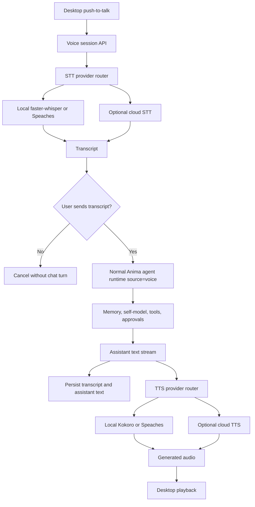

# Voice Foundation v1 Implementation Plan

**Goal:** Add local-first voice-to-voice chat around the existing Anima runtime, with push-to-talk capture, STT/TTS provider abstraction, transcript-first memory, local defaults, explicit cloud opt-ins, diagnostics, and privacy-safe storage behavior.

**Architecture:** Keep voice as an interface shell around the normal agent loop. Desktop captures microphone audio and plays generated audio. The server owns provider selection, transcription, agent streaming, TTS, event streaming, persistence, memory, tool rules, and failure behavior. The transcript is the canonical user message; raw audio is transient by default.

**Tech Stack:** Python 3.12, FastAPI, SQLAlchemy runtime models only if needed, existing agent streaming services, local filesystem/transient temp handling, React/Vite/Tauri desktop, TypeScript API client, local STT via faster-whisper or OpenAI-compatible local endpoint, local TTS via Kokoro or OpenAI-compatible local endpoint, optional OpenAI-compatible cloud voice adapters, pytest, Bun/Nx scripts.

---

## Scope

This plan covers half-duplex voice-to-voice in desktop chat:

- press or click to record;
- submit audio to the server;
- transcribe audio through a selected STT provider;
- review, edit, cancel, or send transcript;
- run the transcript through the normal Anima chat runtime with `source="voice"`;
- synthesize assistant speech through a selected TTS provider;
- play generated audio and allow stopping playback;
- preserve privacy defaults and surface provider diagnostics.

This plan does not add always-on listening, wake word detection, full-duplex barge-in, voice cloning, durable acoustic emotion inference, mobile voice, or native speech-to-speech models that bypass Anima's runtime.

## Core Production Path

The production path is complete when `VCE-001` through `VCE-007` are done:

1. `VCE-001` creates provider contracts, settings, and typed voice session events.
2. `VCE-002` implements the local STT lane with faster-whisper plus OpenAI-compatible local endpoint support.
3. `VCE-003` implements the local TTS lane with Kokoro plus OpenAI-compatible local endpoint support.
4. `VCE-004` exposes the server voice session API that chains STT, transcript review/send, normal agent streaming, and TTS.
5. `VCE-005` adds desktop push-to-talk, transcript review, response streaming, playback, and stop controls.
6. `VCE-006` adds explicit opt-in cloud adapters for STT/TTS without changing the local-first defaults.
7. `VCE-007` adds settings, health checks, latency diagnostics, privacy controls, and failure-state tests.

`VCE-008` closes the initiative with documentation, smoke testing, packaging notes, and final validation.

## Planning Inputs

- PRD: `docs/prds/voice/voice-foundation-v1.md`
- Current chat route: `apps/server/src/anima_server/api/routes/chat.py`
- Current agent service: `apps/server/src/anima_server/services/agent/service.py`
- Current streaming helpers: `apps/server/src/anima_server/services/agent/streaming.py`
- Current LLM provider pattern: `apps/server/src/anima_server/services/agent/llm.py`
- Current chat schemas: `apps/server/src/anima_server/schemas/chat.py`
- Current desktop chat UI: `apps/desktop/src/pages/chat/Chat.tsx`
- Existing browser speech precedent: `apps/desktop/src/pages/journal/speech.ts`
- API client package: `packages/api-client/src/client.ts`, `packages/api-client/src/types.ts`

## File Map

| Area | Files |
| --- | --- |
| Voice service package | new `apps/server/src/anima_server/services/voice/` |
| Provider contracts | new `services/voice/providers.py`, `services/voice/settings.py`, `services/voice/events.py` |
| STT adapters | new `services/voice/stt/` |
| TTS adapters | new `services/voice/tts/` |
| Voice session orchestration | new `services/voice/session.py` |
| API route | new `apps/server/src/anima_server/api/routes/voice.py`, route registration where app routers are mounted |
| Schemas | new `apps/server/src/anima_server/schemas/voice.py` |
| Desktop UI | `apps/desktop/src/pages/chat/Chat.tsx`, likely new `apps/desktop/src/pages/chat/voice/` helpers/components |
| API client | `packages/api-client/src/client.ts`, `packages/api-client/src/types.ts` |
| Tests | new `apps/server/tests/test_voice_providers.py`, `test_voice_session.py`, desktop/API-client tests where available |
| Docs/tickets | this plan, `docs/prds/voice/voice-foundation-v1.md`, `tickets/voice-foundation-v1/` |

## Execution Order

### Task 1: Provider Contracts And Settings

**Ticket:** `VCE-001`

- Define STT, TTS, provider health, latency, and error contracts.
- Define voice settings schema with local defaults and cloud disabled by default.
- Define event payload types for `voice_session_started`, `transcript_final`, `agent_chunk`, `tts_started`, `audio_chunk`, `tts_done`, `voice_done`, and `voice_error`.
- Add unit tests for provider selection and fail-closed defaults.

### Task 2: Local STT Adapter

**Ticket:** `VCE-002`

- Implement faster-whisper adapter behind the STT contract.
- Implement OpenAI-compatible local STT endpoint adapter for Speaches-style servers.
- Add audio input validation, transient temp handling, model/endpoint config, and health checks.
- Test successful transcription, provider unavailable, invalid audio, and confidence/timing metadata.

### Task 3: Local TTS Adapter

**Ticket:** `VCE-003`

- Implement Kokoro adapter behind the TTS contract.
- Implement OpenAI-compatible local TTS endpoint adapter for Speaches-style servers.
- Support chunk/file output shape compatible with desktop playback.
- Test successful synthesis, provider unavailable, unsupported voice, and timing metadata.

### Task 4: Voice Session API

**Ticket:** `VCE-004`

- Add the voice session route and orchestration service.
- Chain STT to transcript review/send to normal agent streaming to TTS.
- Persist transcript and assistant text through the normal chat path with `source="voice"`.
- Ensure STT failure creates no chat turn and TTS failure preserves the text answer.
- Add contract tests for state transitions and emitted events.

### Task 5: Desktop Voice Chat UI

**Ticket:** `VCE-005`

- Add push-to-talk capture, recording state, cancel, transcript review/edit, send, and playback controls.
- Stream assistant text while TTS prepares audio.
- Allow stopping playback without deleting the completed text response.
- Show listening, transcribing, thinking, speaking, unavailable, and error states.
- Smoke-test desktop chat with a mocked voice session response.

### Task 6: Cloud Opt-In Adapters

**Ticket:** `VCE-006`

- Add explicit cloud enablement gates.
- Implement OpenAI Audio STT/TTS as the first cloud adapter.
- Keep Deepgram, Cartesia, and ElevenLabs as provider slots or documented follow-ups unless implementing them is intentionally selected.
- Verify local providers remain default without cloud credentials.

### Task 7: Diagnostics And Privacy Controls

**Ticket:** `VCE-007`

- Add settings UI/API fields for STT provider, TTS provider, model/endpoint, voice, cloud enablement, and raw audio retention.
- Add provider test actions for record/transcribe/synthesize/playback.
- Report latency breakdown for upload/receive, STT, agent first token, TTS, and playback-ready.
- Verify raw microphone audio is transient by default and generated audio is not persisted by default.

### Task 8: Documentation And Final Validation

**Ticket:** `VCE-008`

- Update docs with provider setup, local model notes, privacy behavior, and troubleshooting.
- Record manual smoke-test flow for local voice-to-voice.
- Run focused backend tests, desktop type/build checks, health check, and any available voice-specific smoke tests.
- Update parent ticket completion status and remaining follow-up risks.

## Validation Plan

Run the smallest useful checks for each ticket, then final initiative validation:

- Provider unit tests: `bun run test:server -- apps/server/tests/test_voice_providers.py -q`
- Voice session tests: `bun run test:server -- apps/server/tests/test_voice_session.py -q`
- Backend suite for final pass: `bun run test`
- Desktop/API checks for UI changes: `bun run build`
- Health smoke test with server running: `GET /health`
- Manual smoke test: record short utterance, review transcript, send, stream text, hear audio, stop playback, verify transcript persisted and raw audio did not persist.

## Rollout Notes

- Default local provider mode should not require cloud credentials.
- Large model weights should not be committed to the repo.
- Cloud provider keys stay in local environment/runtime config only.
- Piper, F5-TTS, voice cloning, and native speech-to-speech models require separate licensing/product review before becoming bundled defaults.
- If provider packages are too heavy for the base server install, add optional extras or external endpoint mode before bundling.
