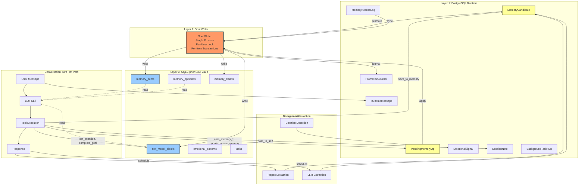
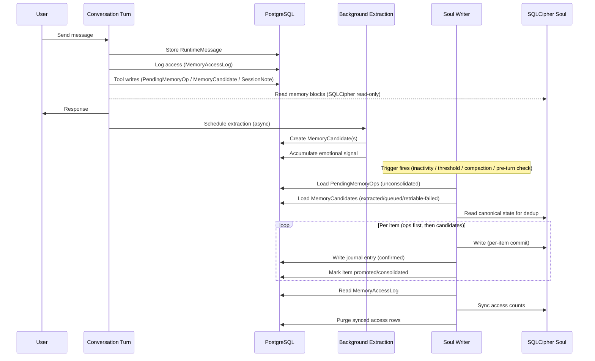
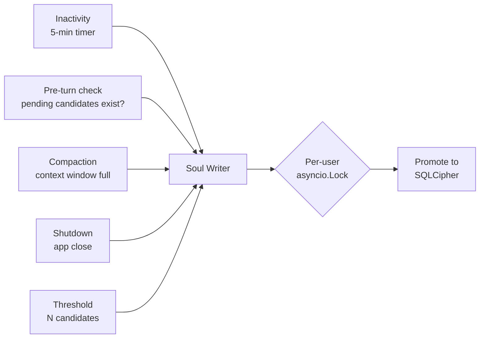
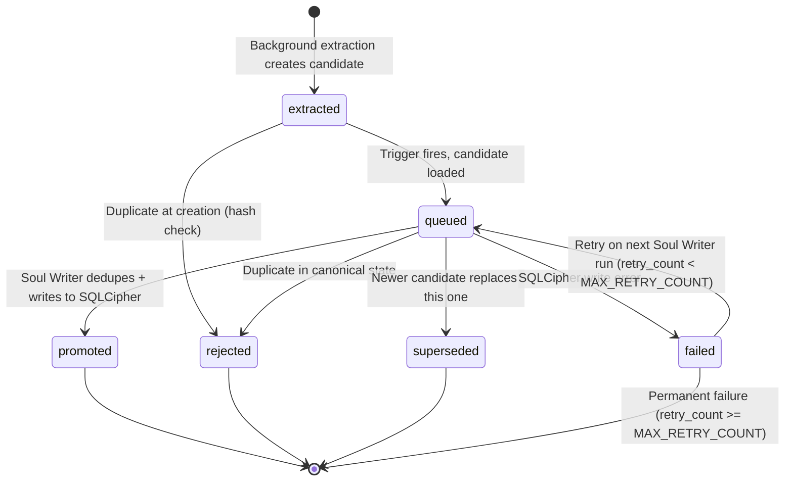
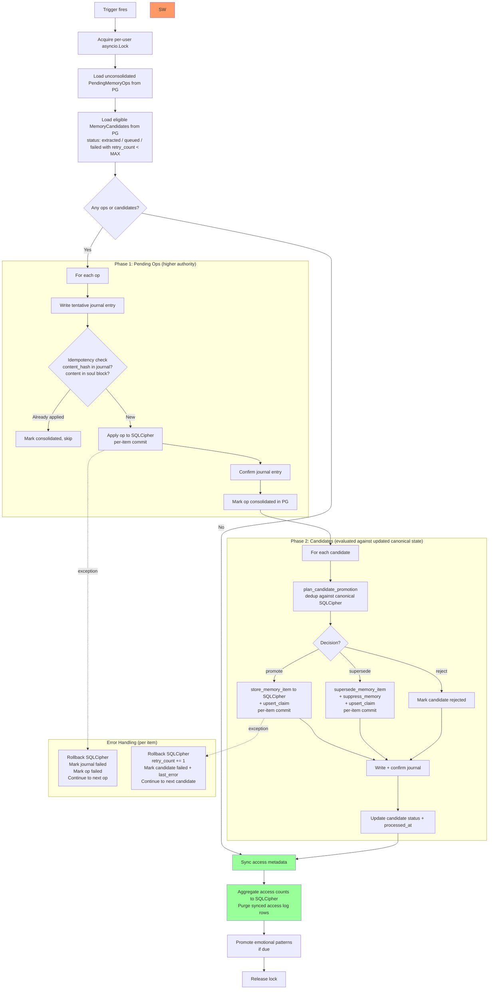

# Soul Writer Architecture — Signal-Based Memory Promotion

**Date**: 2026-03-29
**Status**: Approved (Revision 6 — Final)
**Priority**: P0 — Foundational Architecture
**Supersedes**: `docs/superpowers/specs/2026-03-29-soul-write-serialization-design.md` (obsoleted)
**Reviews**: Codex (GPT-5.4) x5, Opus (Software Architect) x3

---

## Problem

The current memory system writes to SQLCipher (soul DB) on every conversation turn. SQLCipher uses SQLite's single-writer model. When multiple background tasks fire concurrently, they cause `database is locked` errors, silent data loss from read-modify-write races in `append_to_soul_block()`, and wasted LLM extraction calls on trivial messages.

The root cause is architectural: SQLCipher is treated as a concurrent runtime store when it should be a settled identity vault written to infrequently and deliberately.

---

## Architecture Overview



---

## Complete Current SQLCipher Write Surface

**Foreground (hot path — during conversation turn):**

| Operation | Function | Where | Frequency |
|-----------|----------|-------|-----------|
| Access tracking | `touch_memory_items()` | `memory_blocks.py` | Every turn (prompt assembly) |
| Feedback corrections | `apply_memory_correction()` | `feedback_signals.py` | Every turn (turn prep) |
| Growth log writes | `record_feedback_signals()` | `feedback_signals.py` | Every turn (turn prep) |
| Session notes | `note_to_self()` / `dismiss_note()` | `tools.py` → `session_memory.py` | Per tool call |
| Save to memory | `save_to_memory()` → `promote_session_note()` | `tools.py` → `session_memory.py` | Per tool call |
| Set intention | `set_intention()` / `complete_goal()` | `tools.py` → `intentions.py` | Per tool call |
| Core memory edits | `core_memory_append/replace()` | `tools.py` → PendingMemoryOp (PG) | Per tool call |
| Task CRUD | `create_task()` / `complete_task()` | `tools.py` → Task model | Per tool call |
| Emotional pattern promotion | `_promote_runtime_emotional_patterns()` | `consolidation.py` (inside `consolidate_turn_memory_with_llm`) | Every turn |

**Background (per-turn, fire-and-forget):**

| Operation | Function | Frequency |
|-----------|----------|-----------|
| Daily log | `add_daily_log()` | Every turn |
| Regex extraction | `consolidate_turn_memory()` | Every turn |
| LLM extraction | `consolidate_turn_memory_with_llm()` | Every turn |
| Pending ops promotion | `consolidate_pending_ops()` | Every turn |
| Embedding backfill | `_backfill_user_embeddings()` | Every turn |
| Structured claims | `upsert_claim()` (dual-write) | Every turn |
| Memory suppression | `suppress_memory()` (on supersession) | Per conflict |

**Inactivity/sleep path (currently: every 3rd turn OR on 5-min idle → NEW: idle-only):**

Under the new architecture, ALL orchestrator tasks move to idle-only triggers. `SLEEPTIME_FREQUENCY` (the per-N-turns counter) is removed — orchestrator tasks only run when Soul Writer triggers fire (inactivity, compaction, pre-turn check, shutdown, threshold). This eliminates per-turn background SQLCipher writes from the orchestrator entirely.

| Operation | Function | New Trigger |
|-----------|----------|-------------|
| KG entity/relation upserts | `knowledge_graph.py` | Soul Writer trigger (idle-only) |
| Heat decay | `sleep_agent.py` | Soul Writer trigger (idle-only) |
| Episode generation | `episodes.py` | Soul Writer trigger (idle-only) |
| Contradiction scan | `sleep_tasks.py` | Soul Writer trigger (heat-gated, idle-only) |
| Profile synthesis | `sleep_tasks.py` | Soul Writer trigger (heat-gated, idle-only) |
| Deep monologue | `inner_monologue.py` | Soul Writer trigger (24h-gated, idle-only) |
| Emotional pattern promotion | `promote_emotional_patterns()` | Soul Writer trigger (idle-only) |
| Forgetting/suppression | `forgetting.py` | Soul Writer trigger (idle-only) |

**User-initiated (API/UI — infrequent, intentional):**

| Operation | Function | Frequency |
|-----------|----------|-----------|
| Memory CRUD | `api/routes/memory.py` | User action |
| Profile/directive edits | `api/routes/consciousness.py`, `soul.py` | User action |
| Vault import/export/reset | `vault.py` | User action |
| User creation/seeding | `auth.py` | Once |

---

## Three-Layer Architecture

### Layer 1: PostgreSQL Runtime (live mind)

```
Stores:
  - RuntimeMessage (conversation history)
  - MemoryCandidate (extracted observations awaiting promotion)
  - PendingMemoryOp (agent-commanded identity writes)
  - PromotionJournal (audit trail)
  - MemoryAccessLog (access tracking, replaces touch_memory_items)
  - SessionNote (moved from SQLCipher — ephemeral scratch state)
  - EmotionalSignal (aggregated per-session)
  - RuntimeBackgroundTaskRun (task tracking)

All automated conversation-path writes go here.
PG's MVCC model handles concurrent reads/writes naturally.
```

### Layer 2: Soul Writer (single process, serialized)

```
Responsibilities:
  - Only automated component that writes to SQLCipher
  - Reads candidates + ops from PG
  - Dedupes against canonical SQLCipher state
  - Creates structured claims alongside promoted items
  - Triggers suppress_memory on superseded items
  - Promotes in per-item transactions (idempotent)
  - Syncs access metadata from PG to SQLCipher
  - Aggregates + flushes emotional signals
  - Runs on signal, not on schedule

Does NOT contain:
  - Extraction logic (that's background extraction's job)
  - Scoring logic (that's the extractor's job)
  - Semantic judgment (that's store_memory_item's job)
```

### Layer 3: SQLCipher Soul Vault (settled identity)

```
Stores:
  - self_model_blocks (identity, persona, human understanding)
  - memory_items (facts, preferences, goals, relationships)
  - memory_claims (structured claim dedup layer)
  - memory_episodes (episodic memories)
  - emotional_patterns (enduring patterns)
  - tasks (operational state — exempt from Soul Writer)

Written to ONLY by:
  - Soul Writer (automated promotion)
  - Inactivity/sleep tasks (serialized, idle-only)
  - User-initiated API writes (intentional, infrequent)
  - Task CRUD tools (operational, exempt — see exemptions)
```

### Write Boundary Rules

The invariant: **no automated conversation-path code writes to SQLCipher during the turn hot path or in per-turn background tasks.**

Explicitly **exempt** (with justification):

| Exemption | Justification |
|-----------|---------------|
| User-initiated API writes | Deliberate user actions through UI, infrequent, non-concurrent with agent loop |
| User creation/seeding | One-time provisioning |
| Task CRUD tools | Operational state, not identity memory. Low frequency. Moving to PG is a future optimization. |
| `set_intention()` / `complete_goal()` tools | Read-modify-write on structured markdown sections. Low frequency (user-triggered). PendingMemoryOp cannot replicate section-aware logic. Follow-up: model intentions as discrete PG rows. |
| Inactivity/sleep tasks | Run ONLY during idle periods (Soul Writer triggers). KG, episodes, contradiction scan, profile synthesis, deep monologue, forgetting all run sequentially after Soul Writer completes. `SLEEPTIME_FREQUENCY` per-turn counter is removed. |

---

## Data Flow



---

## Promotion Triggers



| Trigger | When | Why |
|---------|------|-----|
| **Pre-turn check** | Before prompt assembly on every turn | If pending candidates exist from any thread, promote them so current turn sees fresh state. Handles multi-window, thread switching, concurrent tabs. Fast no-op if nothing pending. |
| **Inactivity** | 5-min timer (existing `reflection.py`) | User stopped talking, safe to reflect |
| **Compaction** | Context window filling up | Information about to be lost from active context |
| **Shutdown** | App close / server stop | Don't lose pending candidates |
| **Threshold** | N candidates accumulated (default 15) | Safety net — triggers inline during extraction if queue grows too large |

### Why "pre-turn check" replaces thread-switch tracking

Thread-switch detection (`_last_active_thread` dict) is fragile:
- Fails when multiple windows are already open (no "switch" event)
- Fails when extraction is async and hasn't finished before the switch
- Process-local dict loses state on restart

The pre-turn check is simpler and handles all cases:
```sql
SELECT COUNT(*) FROM memory_candidates
WHERE user_id = ?
  AND (
    status IN ('extracted', 'queued')
    OR (status = 'failed' AND retry_count < MAX_RETRY_COUNT)
  )
```
- If 0 → skip (no latency added)
- If > 0 → run Soul Writer before prompt assembly (fast — no LLM, just dedup + write)
- Works with multiple windows, concurrent tabs, fast switching
- No state to track, no dict to lose on restart

### Extraction timing guarantee

Background extraction is async (fires after the turn). A candidate from Turn N may not exist in PG when Turn N+1 starts. This is acceptable:
- Turn N+1's conversation context already contains Turn N's messages
- The candidate will be promoted on Turn N+2 (or inactivity, or threshold)
- No data loss — just a 1-turn delay for cross-thread visibility in the worst case

---

## Candidate Lifecycle



---

## Read Path

**SQLCipher only.** `build_runtime_memory_blocks()` reads from SQLCipher for canonical memory blocks.

**Changes from current:**

| Component | Current | New |
|-----------|---------|-----|
| `touch_memory_items()` | Writes to SQLCipher (access tracking) | Writes to PG `memory_access_log` |
| `get_memory_items_scored()` | Reads access metadata from SQLCipher only | Reads SQLCipher + PG access log for recent touches not yet synced |
| `build_merged_block_content()` | Patches in PendingMemoryOps | Unchanged — still patches PendingMemoryOps on read |

No read-gap during conversation because:
- **Current session**: LLM has the full conversation history
- **Cross-thread**: Pre-turn check promotes pending candidates before prompt assembly
- **Between sessions**: Inactivity promotion handles the boundary

---

## Hot-Path Tool Writes — Migration to PG

### `save_to_memory()` → MemoryCandidate (user_explicit)

Currently calls `promote_session_note()` which calls `add_memory_item` → direct SQLCipher write. Change `save_to_memory` AND `promote_session_note` to create a `MemoryCandidate` with `importance_source=user_explicit` in PG. Soul Writer promotes it unconditionally (highest authority). `PendingMemoryOp` is wrong here — it's block-scoped (`target_block`), not item-scoped. `MemoryCandidate` is item-scoped.

### `note_to_self()` / `dismiss_note()` → PG session notes

`SessionNote` currently inherits from `Base` (SQLCipher). Move to `RuntimeBase` (PG). Session notes are ephemeral per-conversation scratch state. Migration requires:
- Change base class from `Base` to `RuntimeBase`
- Move model to a runtime model file
- `thread_id` FK currently references SQLCipher `threads` table — must reference PG `RuntimeThread` instead
- Alembic migration on both engines (drop from SQLCipher, create on PG)
- Update `session_memory.py` to use runtime DB session

### `set_intention()` / `complete_goal()` → Exempt (Phase 6), PG rows (follow-up)

Currently can fall back to legacy soul `SelfModelBlock` writes via `add_intention()` / `complete_intention()` in `intentions.py`. These functions do **read-modify-write cycles on structured markdown** — they parse section headers, check duplicates, and insert at specific positions. A `PendingMemoryOp` with `append`/`replace` cannot replicate this logic.

**Phase 6**: Exempt these as conversation-path writes. They are low-frequency (user-triggered, not automated), intentional, and the contention risk is negligible.

**Follow-up spec**: Model intentions as discrete PG rows (`RuntimeIntention` table) that get rendered into a memory block on read, same as how `SessionNote` works. This removes the read-modify-write pattern entirely.

### `record_feedback_signals()` / `apply_memory_correction()` → Split by scope

These are two distinct operations with different scopes:

**Growth log entries** (`append_growth_log_entry` in `self_model.py`): Block-scoped — appends text to the `growth_log` section of `self_model_blocks`. → PendingMemoryOp with `op_type="append"`, `target_block="growth_log"`. Correct primitive.

**Memory corrections** (`apply_memory_correction` in `feedback_signals.py`): Item-scoped — calls `supersede_memory_item()` to replace one `memory_items` row with a corrected version. PendingMemoryOp is **wrong** here (it's block-scoped, targets `target_block`, not individual items). → MemoryCandidate with `importance_source="correction"` and metadata linking to the item being corrected (`supersedes_item_id` field). Soul Writer handles the supersession atomically during promotion.

### `_promote_runtime_emotional_patterns()` → Soul Writer

Currently runs inside `consolidate_turn_memory_with_llm()` (per-turn conversation path). Move to Soul Writer — emotional pattern promotion runs during Soul Writer triggers, not per-turn. The patterns are already stored in PG runtime (`current_emotions`), and `promote_emotional_patterns()` is the function that writes to SQLCipher soul. This should only happen during Soul Writer runs.

### `touch_memory_items()` → PG `memory_access_log`

Writes `last_referenced_at`, `reference_count`, and heat to SQLCipher during prompt assembly. Redirect to PG `memory_access_log` table. Soul Writer syncs aggregated counts back to SQLCipher during promotion runs.

**Important**: `sync_access_metadata()` must run even when no candidates/ops are pending. The Soul Writer early-return check must not skip access sync.

---

## New PG Tables

### `memory_candidates`

```sql
CREATE TABLE memory_candidates (
    id                  SERIAL PRIMARY KEY,
    user_id             INTEGER NOT NULL,
    content             TEXT NOT NULL,
    category            TEXT NOT NULL,  -- validated: fact/preference/goal/relationship
    importance          INTEGER NOT NULL DEFAULT 3,  -- 1-5
    importance_source   TEXT NOT NULL DEFAULT 'llm',
        -- regex / llm / predict_calibrate / user_explicit / correction
    supersedes_item_id  INTEGER,  -- if set, this candidate corrects/replaces a specific memory_items row
    source              TEXT NOT NULL,  -- regex / llm / predict_calibrate / tool / feedback
    source_message_ids  INTEGER[],  -- RuntimeMessage IDs that produced this
    extraction_model    TEXT,
    content_hash        TEXT NOT NULL,
        -- sha256(user_id:category:normalized_content)
    status              TEXT NOT NULL DEFAULT 'extracted',
        -- extracted / queued / promoted / rejected / superseded / failed
    last_error          TEXT,
    retry_count         INTEGER NOT NULL DEFAULT 0,
    created_at          TIMESTAMPTZ NOT NULL DEFAULT now(),
    processed_at        TIMESTAMPTZ
);

CREATE UNIQUE INDEX uq_memory_candidates_active_hash
    ON memory_candidates(content_hash)
    WHERE status NOT IN ('rejected', 'superseded', 'failed');
    -- Prevents duplicate active candidates with same hash.
    -- Terminal-state rows are excluded so a rejected candidate
    -- can be re-extracted later if context changes.

CREATE INDEX ix_memory_candidates_user_status
    ON memory_candidates(user_id, status);
```

### `promotion_journal`

```sql
CREATE TABLE promotion_journal (
    id                  SERIAL PRIMARY KEY,
    user_id             INTEGER NOT NULL,
    candidate_id        INTEGER REFERENCES memory_candidates(id),
    pending_op_id       INTEGER,
    decision            TEXT NOT NULL,
        -- promoted / rejected / superseded / merged
    reason              TEXT,
    target_table        TEXT,  -- memory_items / self_model_blocks
    target_record_id    TEXT,
    content_hash        TEXT,
    extraction_model    TEXT,
    journal_status      TEXT NOT NULL DEFAULT 'tentative',
        -- tentative / confirmed / failed
    created_at          TIMESTAMPTZ NOT NULL DEFAULT now()
);

CREATE INDEX ix_promotion_journal_user ON promotion_journal(user_id);
CREATE INDEX ix_promotion_journal_hash
    ON promotion_journal(content_hash, decision);
CREATE INDEX ix_promotion_journal_status
    ON promotion_journal(journal_status);
```

### `memory_access_log`

```sql
CREATE TABLE memory_access_log (
    id              SERIAL PRIMARY KEY,
    user_id         INTEGER NOT NULL,
    memory_item_id  INTEGER NOT NULL,  -- logical reference to SQLCipher memory_items.id (NOT an FK — cross-DB)
    -- Orphaned rows (item deleted/suppressed) cleaned up by 7-day TTL sweep
    accessed_at     TIMESTAMPTZ NOT NULL DEFAULT now(),
    synced          BOOLEAN NOT NULL DEFAULT FALSE  -- marked TRUE before SQLCipher write, deleted after
);

CREATE INDEX ix_memory_access_log_user_item
    ON memory_access_log(user_id, memory_item_id);
CREATE INDEX ix_memory_access_log_unsynced
    ON memory_access_log(user_id) WHERE synced = FALSE;
```

**Pruning strategy**: Access log rows are marked `synced=TRUE` before SQLCipher write, then deleted after successful SQLCipher commit. If crash occurs between mark and delete, replay skips `synced=TRUE` rows (idempotent). A TTL sweep prunes rows older than 7 days regardless of sync status (orphan cleanup). Estimated volume: ~40 rows/minute at peak, purged after each Soul Writer run.

**Crash idempotency**: The sync follows a snapshot-mark-apply-delete pattern:
1. Aggregate `synced=FALSE` rows by `memory_item_id` → count + max(accessed_at) (snapshot delta)
2. Mark those rows `synced=TRUE` in PG
3. Apply delta to SQLCipher `memory_items.reference_count += count`, `last_referenced_at = max`
4. Commit SQLCipher
5. Delete `synced=TRUE` rows from PG
Crash between 2-4: SQLCipher unchanged. Rows are `synced=TRUE`. Next run sees no `synced=FALSE` rows → delta=0 → no double-count. Stale rows deleted by TTL.
Crash between 4-5: SQLCipher updated. Next run: delta=0 (no new unsynced). Deletes stale rows.

---

## PendingMemoryOp Idempotency Fix

Current problem: if Soul Writer crashes after applying an `append` op to SQLCipher but before marking it consolidated in PG, reconciliation replays the append, duplicating content.

Fix: Add `content_hash` to `PendingMemoryOp`.

```sql
ALTER TABLE pending_memory_ops ADD COLUMN content_hash TEXT;
```

**Hash input definition**: `sha256(f"{user_id}:{target_block}:{op_type}:{content}")`. This ensures different op types on the same block produce different hashes, and the same operation produces the same hash on replay.

**Backfill strategy**: Existing unconsolidated ops (pre-migration) have `content_hash = NULL`. Soul Writer treats `NULL` hash as "no replay protection" — these legacy ops use the belt-and-suspenders content check only. New ops always have a hash set at creation time.

Before applying an op, Soul Writer checks:
1. Is the op already consolidated? (existing check)
2. If `content_hash` is not NULL: does the journal contain a `confirmed` entry with this hash? (catches crash-replay)
3. For `append` ops: does the soul block already contain the content being appended? (belt-and-suspenders, also covers legacy NULL-hash ops)

If any check passes, skip the op and mark consolidated. This makes all op types idempotent, including `append`.

---

## Structured Claims (`upsert_claim`) — Migration

Currently, every `store_memory_item` call in `consolidation.py` is followed by a `upsert_claim()` dual-write to `MemoryClaim` in SQLCipher. This is unaddressed in previous spec revisions.

**Fix**: Move `upsert_claim()` into Soul Writer's promotion logic. When Soul Writer promotes a candidate to `memory_items`, it also calls `upsert_claim()` in the same per-item transaction. This keeps the dual-write atomic and removes `upsert_claim` from the background consolidation path.

```python
# Inside Soul Writer, after successful store_memory_item:
if decision.action == "promote" and new_item is not None:
    upsert_claim(
        soul_db,
        user_id=user_id,
        content=candidate.content,
        category=candidate.category,
        importance=candidate.importance,
        source_kind="extraction",
        extractor=candidate.source,
        memory_item_id=new_item.id,
        evidence_text=candidate.content,  # the extracted content serves as evidence
    )
```

---

## Memory Suppression on Supersession

Currently, `consolidation.py` calls `suppress_memory()` from `forgetting.py` whenever a memory is superseded. The Soul Writer spec's `plan_candidate_promotion` handles the "supersede" decision but did not trigger suppression.

**Fix**: Soul Writer calls `suppress_memory()` when executing a supersession:

```python
# Inside Soul Writer execute_promotion, when action == "supersede":
if decision.action == "supersede" and decision.old_item is not None:
    new_item = supersede_memory_item(soul_db, old_item_id=decision.old_item.id, ...)
    suppress_memory(soul_db, memory_id=decision.old_item.id,
                    superseded_by=new_item.id, user_id=user_id)
```

---

## Deleted

### `MemoryDailyLog` table and all readers

Raw transcript dump. Redundant with `RuntimeMessage` in PG.

**Model and write path:**
- Delete `MemoryDailyLog` model from `models/agent_runtime.py`
- Delete `add_daily_log()` from `memory_store.py`
- Remove all `add_daily_log()` calls from `consolidation.py`
- Alembic migration to drop the `memory_daily_logs` table

**Readers to migrate to `RuntimeMessage`:**

| Reader | File | Migration |
|--------|------|-----------|
| Episode generation | `episodes.py` | Query `RuntimeMessage` by user_id + date range |
| Conversation search | `conversation_search.py` | Remove `_search_daily_logs()` branch |
| Inner monologue | `inner_monologue.py` | Query `RuntimeMessage` for recent turns |
| Chat journal stats | `api/routes/chat.py` | Count distinct dates from `RuntimeMessage` |
| Manual consolidate | `api/routes/chat.py` | Read recent `RuntimeMessage` rows |
| Vault export | `vault.py` | Remove `memoryDailyLogs` from export format |
| Vault import | `vault.py` | Skip `memoryDailyLogs` in import; ignore in old snapshots |
| Batch segmenter | `batch_segmenter.py` | Query `RuntimeMessage` |
| Tests | `test_agent_consolidation.py`, `test_active_recall.py`, `test_batch_segmenter.py`, `test_agent_reflection.py`, `test_agent_episodes.py` | Update fixtures |

---

## EmotionalSignal Aggregation

`record_emotional_signal()` already writes to PG `current_emotions` when runtime DB is available. Change to per-session aggregation:

- During conversation: accumulate emotional observations in-memory (not persisted per-turn). **Trade-off**: lost on crash. Acceptable — patterns are cumulative over hundreds of signals; losing one session's observations is negligible.
- On Soul Writer trigger: synthesize one aggregated signal per conversation window
- `_promote_runtime_emotional_patterns()` moves from per-turn consolidation to Soul Writer
- TTL: prune signals older than 30 days from PG
- Enduring patterns (`CoreEmotionalPattern` in soul) promoted during Soul Writer runs via existing `promote_emotional_patterns()` logic

---

## Soul Writer Flow



### `plan_candidate_promotion` — Dedup against canonical state

```python
def plan_candidate_promotion(soul_db, candidate, user_id) -> PromotionDecision:
    """Decide what to do with a candidate.
    Reads canonical SQLCipher state — NOT the promotion journal.
    Journal is for audit, not dedup. Canonical state is ground truth."""

    # 0. High-authority fast paths — user_explicit and correction skip normal dedup
    if candidate.importance_source == "user_explicit":
        return PromotionDecision(action="promote",
                                 reason="user_explicit authority — always promote")

    if candidate.importance_source == "correction" and candidate.supersedes_item_id:
        # Verify target item still exists and is active
        target = soul_db.get(MemoryItem, candidate.supersedes_item_id)
        if target is not None and not getattr(target, "suppressed", False):
            return PromotionDecision(action="supersede",
                                     old_item=target,
                                     reason=f"correction supersedes item {target.id}")
        else:
            # Target already gone — fall back to plain promote (don't lose the correction)
            return PromotionDecision(action="promote",
                                     reason="correction target missing — promoting as new memory")

    # 1. Dedup against canonical SQLCipher memory_items
    #    Reuses existing store_memory_item write-analysis logic
    #    (exact match check, slot pattern check, similarity check)
    #    Note: store_memory_item returns a MemoryWriteAnalysis with .action
    #    and .matched_item fields. The function name in code is
    #    store_memory_item(..., allow_update=True, defer_on_similar=True)
    #    which performs the analysis without writing.
    # store_memory_item already returns MemoryWriteAnalysis (memory_store.py:76)
    # with .action ("added"/"duplicate"/"superseded"/"similar") and .matched_item.
    # dry_run=True returns the same analysis without calling db.add()/db.flush().
    write_analysis = store_memory_item(
        soul_db, user_id=user_id, content=candidate.content,
        category=candidate.category, importance=candidate.importance,
        source="extraction", allow_update=True, defer_on_similar=True,
        dry_run=True,
    )

    if write_analysis.action == "duplicate":
        return PromotionDecision(action="rejected",
                                 reason="duplicate in canonical state")

    if write_analysis.action == "superseded":
        return PromotionDecision(action="supersede",
                                 old_item=write_analysis.matched_item,
                                 reason=f"supersedes item {write_analysis.matched_item.id}")

    if write_analysis.action == "similar":
        # Narrow slot match only (uses _FACT_SLOT_PATTERNS from memory_store.py:
        # age, birthday, occupation, employer, location, name, gender).
        # Freeform categories: append, don't replace.
        from anima_server.services.agent.memory_store import _match_fact_slot  # same package, private but stable
        if _match_fact_slot(candidate.content) is not None:
            return PromotionDecision(action="supersede",
                                     old_item=write_analysis.matched_item,
                                     reason=f"slot match supersedes item {write_analysis.matched_item.id}")
        else:
            return PromotionDecision(action="promote",
                                     reason="similar but no structured slot — append")

    # 2. New memory — promote
    return PromotionDecision(action="promote", reason="new memory")
```

### Authority weighting

| Source | Authority | Behavior |
|--------|-----------|----------|
| `user_explicit` | Highest | Always promote, override conflicts |
| `correction` | High | Always promote, supersedes the specific item referenced by `supersedes_item_id` |
| `predict_calibrate` | High | Promote, respect dedup |
| `llm` | Medium | Promote, respect dedup + slot match |
| `regex` | Low | Promote only if no conflict |

### Access metadata sync (runs every Soul Writer invocation)

```python
async def sync_access_metadata(user_id: int) -> int:
    """Aggregate PG access log → SQLCipher memory_items. Always runs.

    Crash-idempotent via mark-then-apply-then-delete pattern.
    """
    # 1. Aggregate synced=FALSE rows by memory_item_id → count + max(accessed_at)
    #    (snapshot the delta before marking)
    # 2. Mark those rows synced=TRUE in PG (idempotent)
    # 3. Apply delta to SQLCipher: memory_items.reference_count += count,
    #    memory_items.last_referenced_at = max(accessed_at)
    # 4. Update heat scores via update_heat_on_access
    # 5. Commit SQLCipher
    # 6. Delete synced=TRUE rows from PG
    #
    # Crash between 2-5: SQLCipher unchanged. Rows are synced=TRUE.
    #   Next run: no synced=FALSE rows → delta=0 → no-op.
    #   Synced=TRUE rows deleted in step 6 (or by TTL sweep).
    # Crash between 5-6: SQLCipher updated. Rows still synced=TRUE.
    #   Next run: delta=0 again (no new synced=FALSE). Deletes stale rows.
    # Returns number of items synced
```

---

## Reconciliation on Startup

```python
async def reconcile_soul_writer(user_id: int):
    """Repair PG state after crash or failed confirmation."""

    # 1. Tentative journal entries — check if SQLCipher has the data
    tentative = load_tentative_journal_entries(user_id)
    for entry in tentative:
        if target_exists_in_sqlcipher(entry):
            confirm_journal_entry(entry)
        else:
            mark_journal_entry_failed(entry, "target not found after crash")

    # 2. Unconsolidated PendingMemoryOps — check for crash-replayed appends
    stale_ops = load_unconsolidated_ops(user_id)
    for op in stale_ops:
        if op.content_hash and journal_has_confirmed(op.content_hash):
            mark_op_consolidated(op)  # already applied, just mark it
        elif op.op_type == "append" and content_already_in_block(op):
            mark_op_consolidated(op)  # belt-and-suspenders for appends

    # 3. Queued candidates that were never processed
    stale_queued = load_candidates_by_status(user_id, "queued",
                                              older_than=minutes(30))
    for candidate in stale_queued:
        revalidate_and_requeue_or_reject(candidate)

    # 4. Orphaned access log entries (older than 7 days, never synced)
    purge_old_access_log_entries(user_id, older_than=days(7))
```

---

## Background Extraction (modified)

```python
async def run_background_extraction(
    user_id: int,
    user_message: str,
    assistant_response: str,
):
    """Per-turn extraction. Writes ONLY to PG. Never touches SQLCipher."""

    # 1. Regex extraction → MemoryCandidate rows in PG
    extracted = extract_turn_memory(user_message)
    for fact in extracted.facts:
        create_memory_candidate(user_id, content=fact, category="fact",
                                importance=3, importance_source="regex",
                                source="regex")
    for pref in extracted.preferences:
        create_memory_candidate(user_id, content=pref, category="preference",
                                importance=3, importance_source="regex",
                                source="regex")

    # 2. LLM extraction → MemoryCandidate rows in PG
    if settings.agent_provider != "scaffold":
        llm_result = await extract_memories_via_llm(
            user_message=user_message,
            assistant_response=assistant_response,
        )
        for item in llm_result.memories:
            create_memory_candidate(user_id, content=item["content"],
                                    category=item.get("category", "fact"),
                                    importance=item.get("importance", 3),
                                    importance_source="llm", source="llm")

        # 3. Emotional signal accumulation (in-memory, aggregated on trigger)
        if llm_result.emotion:
            accumulate_emotional_observation(user_id, llm_result.emotion)

    # 4. Check threshold trigger
    candidate_count = count_eligible_candidates(user_id)
    if candidate_count >= CANDIDATE_THRESHOLD:
        await run_soul_writer(user_id)
```

### `create_memory_candidate` — dedup at creation

```python
def create_memory_candidate(user_id, *, content, category, importance,
                             importance_source, source,
                             supersedes_item_id=None) -> MemoryCandidate | None:
    """Create a candidate with hash-based dedup at insertion time.

    Uses optimistic insert with IntegrityError catch to handle concurrent
    extractors racing on the same content. The partial unique index on
    content_hash (active statuses only) prevents duplicates at the DB level.
    """
    normalized = normalize_fragment(content)
    content_hash = sha256(f"{user_id}:{category}:{normalized}")

    candidate = MemoryCandidate(
        user_id=user_id, content=content, category=category,
        importance=importance, importance_source=importance_source,
        source=source, content_hash=content_hash, status="extracted",
        supersedes_item_id=supersedes_item_id,
    )
    try:
        with pg_db.begin_nested():  # savepoint — rollback only this insert, not the whole batch
            pg_db.add(candidate)
            pg_db.flush()
        return candidate
    except IntegrityError:
        # Savepoint already rolled back — other inserts in this extraction pass are safe
        return None  # concurrent duplicate — safe to skip
```

---

## Trigger Wiring

### Pre-turn check (in `service.py`)

```python
# Before prompt assembly on every turn
async def check_and_promote_pending(user_id: int) -> None:
    """Promote pending candidates if any exist. Fast no-op if nothing pending."""
    count = pg_db.scalar(
        select(func.count(MemoryCandidate.id)).where(
            MemoryCandidate.user_id == user_id,
            or_(
                MemoryCandidate.status.in_(["extracted", "queued"]),
                and_(
                    MemoryCandidate.status == "failed",
                    MemoryCandidate.retry_count < SOUL_WRITER_MAX_RETRY_COUNT,
                ),
            ),
        )
    )
    if count and count > 0:
        await run_soul_writer(user_id)
```

### Inactivity (existing `reflection.py`)

```python
async def run_reflection(user_id, ...):
    await run_soul_writer(user_id)
    # ... then KG, episodes, heat decay, etc. (see updated canonical state)
```

### Compaction (in `service.py`)

```python
if compaction_result is not None:
    await run_soul_writer(user_id)
```

### Shutdown (in server lifecycle)

```python
async def on_shutdown():
    for user_id in get_active_user_ids():
        await run_soul_writer(user_id)
    await drain_background_memory_tasks()
```

### Threshold (in background extraction)

Checked inline after extraction. If count >= CANDIDATE_THRESHOLD, triggers Soul Writer.

---

## Inactivity/Sleep Path Writers

These run during the sleeptime orchestrator. Under the new architecture, Soul Writer runs **first**, then these tasks execute against freshly promoted soul state:


All of these write directly to SQLCipher but are:
- Serialized by the orchestrator (sequential, never concurrent)
- Gated by inactivity (only run when user is idle)
- Gated by heat/frequency thresholds
- Not in the conversation hot path

---

## Migration Plan

### Tables to create (PG, via Alembic on runtime engine)
- `memory_candidates`
- `promotion_journal`
- `memory_access_log`

### Tables to move to PG (from SQLCipher)
- `session_notes` (change base class `Base` → `RuntimeBase`, update FK from `threads` → `RuntimeThread`)

### Tables to delete (SQLCipher, via Alembic on soul engine)
- `memory_daily_logs`

### Schema changes
- `pending_memory_ops`: add `content_hash TEXT` column

### Functions to modify

| File | Change |
|------|--------|
| **consolidation.py** | `schedule_background_memory_consolidation` → calls `run_background_extraction` (PG only) |
| **consolidation.py** | `run_background_memory_consolidation` → replaced by `run_background_extraction` |
| **consolidation.py** | `consolidate_turn_memory` → no longer called per-turn; regex creates candidates in PG |
| **consolidation.py** | `consolidate_turn_memory_with_llm` → no longer called per-turn; LLM creates candidates in PG |
| **consolidation.py** | Remove `add_daily_log` calls, `upsert_claim` dual-writes, `_promote_runtime_emotional_patterns` |
| **memory_store.py** | Delete `add_daily_log()` |
| **memory_store.py** | `touch_memory_items()` → accepts `runtime_db` parameter, writes to PG `memory_access_log` instead of mutating SQLCipher `memory_items` |
| **memory_blocks.py** | `build_facts/preferences/goals/relationships_memory_block` must pass `runtime_db` to `touch_memory_items()` (already available as parameter). `get_memory_items_scored()` must accept optional `runtime_db` to read PG access log for recent unsynced touches. |
| **reflection.py** | Call `run_soul_writer` before `run_sleeptime_agents` |
| **sleep_agent.py** | `_task_consolidation` → delegates to Soul Writer |
| **sleep_agent.py** | Remove `_commit_with_retry` |
| **soul_blocks.py** | Rename from `soul_writer.py` → `soul_blocks.py`. Contains existing CRUD: `set_soul_block`, `append_to_soul_block`, `replace_in_soul_block`, `full_replace_soul_block`. Update all 7 import sites. |
| **soul_writer.py** | New file. Soul Writer orchestrator: `run_soul_writer`, `plan_candidate_promotion`, `reconcile_soul_writer`, `sync_access_metadata`. Calls `soul_blocks.py` functions for actual SQLCipher writes. |
| **service.py** | Add pre-turn `check_and_promote_pending`; compaction trigger |
| **tools.py** | `save_to_memory` → creates MemoryCandidate(user_explicit) |
| **tools.py** | `set_intention` / `complete_goal` → **exempt** (low-frequency, see exemptions table). Follow-up: model as discrete PG rows. |
| **session_memory.py** | Move `SessionNote` to PG; update `promote_session_note` → create MemoryCandidate |
| **feedback_signals.py** | `append_growth_log_entry` → PendingMemoryOp(`target_block="growth_log"`). `apply_memory_correction` → MemoryCandidate(`importance_source="correction"`, `supersedes_item_id=<item_id>`) |
| **episodes.py** | Read from `RuntimeMessage` instead of `MemoryDailyLog` |
| **conversation_search.py** | Remove `_search_daily_logs()` branch |
| **inner_monologue.py** | Read from `RuntimeMessage` instead of `MemoryDailyLog` |
| **api/routes/chat.py** | Journal stats + manual consolidate → use `RuntimeMessage` |
| **vault.py** | Remove `memoryDailyLogs` from export/import |
| **batch_segmenter.py** | Read from `RuntimeMessage` |
| **pending_ops.py** | Add `content_hash` to `PendingMemoryOp` creation |

### Functions modified (minor)
- `store_memory_item()` — add `dry_run=True` parameter for write-analysis-only mode (returns `MemoryWriteAnalysis` without mutating DB). Called by Soul Writer for dedup decisions.

### Functions unchanged
- `append_to_soul_block()`, `replace_in_soul_block()`, `full_replace_soul_block()` — renamed file (`soul_blocks.py`), called by Soul Writer for pending ops
- `build_runtime_memory_blocks()` — read path from SQLCipher
- `build_merged_block_content()` — pending ops read-patching
- `extract_turn_memory()` — regex logic unchanged, writes to PG now
- `extract_memories_via_llm()` — LLM logic unchanged, writes to PG now
- `core_memory_append()`, `core_memory_replace()` — already PendingMemoryOp in PG
- KG, episodes (writes), contradiction scan, profile synthesis, deep monologue, forgetting — exempt inactivity tasks
- `suppress_memory()` — called by Soul Writer now (not consolidation)
- `upsert_claim()` — called by Soul Writer now (not consolidation)

---

## Configuration

```python
# New settings
SOUL_WRITER_CANDIDATE_THRESHOLD: int = 15
SOUL_WRITER_EMOTIONAL_TTL_DAYS: int = 30
SOUL_WRITER_RECONCILE_STALE_MINUTES: int = 30
SOUL_WRITER_ACCESS_LOG_TTL_DAYS: int = 7
SOUL_WRITER_MAX_RETRY_COUNT: int = 3
```

Removed settings:
- `SLEEPTIME_FREQUENCY` — replaced by Soul Writer triggers (orchestrator tasks now idle-only)

Existing settings unchanged:
- `REFLECTION_DELAY_SECONDS = 300` (inactivity trigger)
- `agent_background_memory_enabled` (global toggle)

---

## Phased Implementation

### Phase 1: Foundation (no behavior change)
- Create PG tables (`memory_candidates`, `promotion_journal`, `memory_access_log`)
- Add `content_hash` column to `pending_memory_ops`
- **Invariant**: All existing code still works. New tables are empty.

### Phase 2: MemoryDailyLog removal
- Migrate all readers to `RuntimeMessage`
- Delete `MemoryDailyLog` model, `add_daily_log()`, table
- **Invariant**: No code references `MemoryDailyLog`. All readers use `RuntimeMessage`.

### Phase 3: Access tracking migration
- `touch_memory_items()` writes to PG `memory_access_log`
- `get_memory_items_scored()` reads from both SQLCipher + PG access log
- `sync_access_metadata()` function created (standalone, not yet wired to Soul Writer)
- **Invariant**: Access tracking works, just targets PG. Sync not yet automated.

### Phase 4+5: Background extraction + Soul Writer core (ship together)
- **First**: Rename `soul_writer.py` → `soul_blocks.py`, update all 7 import sites. Create new `soul_writer.py` orchestrator.
- `store_memory_item()` gets `dry_run=True` parameter for write-analysis-only mode
- `run_background_extraction` replaces `consolidate_turn_memory` / `consolidate_turn_memory_with_llm`
- Extraction writes `MemoryCandidate` rows to PG, NOT `memory_items` to SQLCipher
- Remove `SLEEPTIME_FREQUENCY`, `bump_turn_counter`, `should_run_sleeptime`, `_turn_counters`
- `run_soul_writer()` with per-item transactions, dedup, claims, suppression
- Pre-turn check trigger in `service.py`
- Inactivity trigger in `reflection.py`
- Compaction trigger in `service.py`
- Shutdown trigger
- Threshold trigger in extraction
- Reconciliation on startup
- Access metadata sync wired into Soul Writer
- **Invariant**: Full Soul Writer architecture operational. Candidates flow from extraction → PG → Soul Writer → SQLCipher.

### Phase 6: Tool write redirection + SessionNote migration
- `save_to_memory` / `promote_session_note` → MemoryCandidate(user_explicit)
- `apply_memory_correction` → MemoryCandidate(importance_source="correction", supersedes_item_id=...)
- `record_feedback_signals` (growth log appends) → PendingMemoryOp(target_block="growth_log")
- `_promote_runtime_emotional_patterns` → Soul Writer
- Move `SessionNote` from `Base` (SQLCipher) to `RuntimeBase` (PG) — update FK from `threads` → `RuntimeThread`, Alembic on both engines
- Existing session notes in SQLCipher: abandoned (ephemeral, acceptable loss)
- `set_intention` / `complete_goal` → **exempt** (read-modify-write on structured markdown, low frequency, see exemptions table)
- **Invariant**: Automated memory extraction, save_to_memory, memory corrections, feedback signals, emotional patterns, and session notes all route through PG. Only exempt writes (task CRUD, set_intention, complete_goal) touch SQLCipher on the conversation path.

### Phase 7: Cleanup
- Remove `_commit_with_retry` from `sleep_agent.py`
- Remove old consolidation code paths
- Remove `upsert_claim` from consolidation (now in Soul Writer)
- Remove `suppress_memory` from consolidation (now in Soul Writer)
- Clean up stale worktrees
- Fix pip editable install
- **Invariant**: Codebase clean. No dead code paths.

---

## Trade-offs

| Decision | Gain | Cost |
|----------|------|------|
| PG for all automated conversation-path writes | No SQLCipher contention | More PG storage |
| Single Soul Writer | No concurrent write races, clear audit trail | Promotion latency (seconds to minutes) |
| Pre-turn check trigger | Handles multi-window, thread switching, concurrent tabs | One PG COUNT query per turn |
| Per-item transactions | One bad item never kills the batch | More commits (fast under single-writer lock) |
| Delete MemoryDailyLog | Removes redundancy, one less per-turn write | Must migrate 8+ readers |
| Move `touch_memory_items` to PG | Removes most frequent hot-path write | Periodic sync needed |
| Move session notes to PG | Removes tool-driven hot-path writes | Table migration + FK changes |
| Claims + suppression in Soul Writer | Atomic with promotion, consistent | Soul Writer does more per item |
| PendingMemoryOp content_hash | Idempotent append replay | Schema change on existing table |
| Exempt inactivity + user-initiated writes | Pragmatic scope | Not fully centralized |

---

## Test Plan

1. **Soul Writer idempotency**: Promote a candidate, simulate crash before PG confirmation, rerun. Verify no duplicate in SQLCipher.
2. **PendingMemoryOp append idempotency**: Apply an append op, simulate crash before mark-consolidated, rerun. Verify content not duplicated.
3. **Pre-turn check trigger**: Create candidates on Thread A. Send message on Thread B. Verify candidates promoted before Thread B's prompt assembly.
4. **Multi-window concurrency**: Simulate rapid messages on two threads. Verify Soul Writer lock prevents concurrent runs, all candidates eventually promoted.
5. **Pending ops before candidates**: Create a PendingMemoryOp and a conflicting MemoryCandidate. Verify op applied first, candidate evaluated against updated state.
6. **Per-item error isolation**: Create 3 candidates, make 2nd fail. Verify 1st and 3rd promoted, 2nd marked failed.
7. **Candidate dedup at creation**: Create two identical candidates. Verify only one inserted (unique constraint).
8. **Canonical state dedup**: Create a candidate matching an existing SQLCipher memory_item. Verify rejected.
9. **Cross-category non-collision**: "likes cats" as preference and fact. Verify both promoted.
10. **Authority weighting**: regex vs user_explicit for same slot. Verify user_explicit wins.
11. **Claims created during promotion**: Promote a candidate. Verify `MemoryClaim` row created in same transaction.
12. **Suppression on supersession**: Promote a candidate that supersedes existing item. Verify `suppress_memory` called.
13. **Access log sync**: Accumulate access logs. Run Soul Writer. Verify counts synced to SQLCipher, log rows purged.
14. **Access log runs without candidates**: No candidates pending but access logs exist. Verify sync still runs.
15. **MemoryDailyLog removal**: All readers migrated. Episodes, search, monologue, chat routes work with RuntimeMessage.
16. **Emotional aggregation**: 5 turns → 0 per-turn rows, 1 aggregated row after Soul Writer.
17. **Tool write redirection**: `save_to_memory` and `note_to_self` write to PG. `set_intention`/`complete_goal` remain exempt (write directly to SQLCipher — confirmed low-frequency, intentional).
18. **SessionNote on PG**: Create/dismiss session notes. Verify writes go to PG runtime engine.
19. **Reconciliation**: Create tentative journal entries + unconsolidated ops. Restart. Verify state repaired.
20. **Failed candidate retry**: Create a candidate that fails once. Verify `retry_count` incremented. Verify Soul Writer retries on next run. Verify permanent failure after `MAX_RETRY_COUNT`.
21. **Memory correction via candidate**: Trigger `apply_memory_correction`. Verify MemoryCandidate created with `importance_source="correction"` and `supersedes_item_id`. Verify Soul Writer supersedes the correct item.
22. **Access log crash idempotency**: Mark rows synced, simulate crash before PG delete. Verify next run skips already-synced rows (no double-count).
23. **Candidate insert race**: Simulate concurrent extractors creating the same hash. Verify IntegrityError caught, no crash, one candidate created.
24. **SLEEPTIME_FREQUENCY removed**: Verify orchestrator tasks only run on Soul Writer triggers, not per-turn counter.
25. **dry_run mode**: `store_memory_item(dry_run=True)` returns `MemoryWriteAnalysis` without writing. Verify no SQLCipher mutation.
26. **No regression**: All existing tests pass. Memory blocks render correctly.

---

## Acceptance Criteria

1. Zero `database is locked` errors during normal conversation flow.
2. No automated conversation-path code writes to SQLCipher during turn hot path or per-turn background tasks.
3. SQLCipher writes come ONLY from: Soul Writer, inactivity/sleep tasks (serialized, idle-only), user-initiated API actions, task CRUD (exempt), and `set_intention`/`complete_goal` tools (exempt — see exemptions table).
4. Every extracted memory reaches the soul (no data loss) — just not instantly.
5. Soul Writer is idempotent: crash + rerun produces the same result (including append ops).
6. Promotion journal captures every decision with reason and content hash.
7. Structured claims (`upsert_claim`) created atomically during promotion.
8. Superseded items suppressed (`suppress_memory`) atomically during promotion.
9. Reconciliation on startup repairs any inconsistent state from crashes.
10. Pre-turn check handles multi-window, thread switching, and concurrent tabs.
11. Memory access tracking synced from PG to SQLCipher periodically (even without pending candidates).
12. `MemoryDailyLog` fully removed — all readers migrated to `RuntimeMessage`.
13. `SLEEPTIME_FREQUENCY` removed — orchestrator tasks only run on Soul Writer triggers.
14. All existing tests pass (updated for new write targets where needed).
